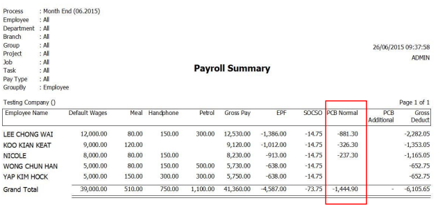

:::note Example
Given an example with this Month (June) with **PCB amount** of **RM1444.90**.
:::

## Setup

1. Right click on the particular Month End process and click **PCB Receipt**

    

2. The Following screen will be seen

    

    >1 Enter the Receipt Date.
    >
    >2 Enter the Receipt No.
    >
    >3 Press calculate amount to show the total amount of PCB u paid that month.

    

    The **TOTAL** PCB Normal amount of the employees which is **RM 1444.90**.

3. Go to **Payroll** > **Government Reports** > **Print Income Tax PCB 2(II)**

    

4. Preview the employees Tax PCB 2(II). The following result will show in the report:

    
