## Bulk Email With Password

:::note

- This feature is not applicable for **Export to Email Client** or **Export to PDF**.
- If there are multiple records (e.g., 10 records) in one PDF to be emailed to a single recipient, the system cannot generate a password as it cannot determine which password to apply.

:::

### Prerequisites

:::info
To use this feature, the user's computer must be configured with a Windows email client.
:::

### Setup

1. Navigate to **Human Resource** > **Maintain Employee**.

2. Enter the PDF password and the email address.

   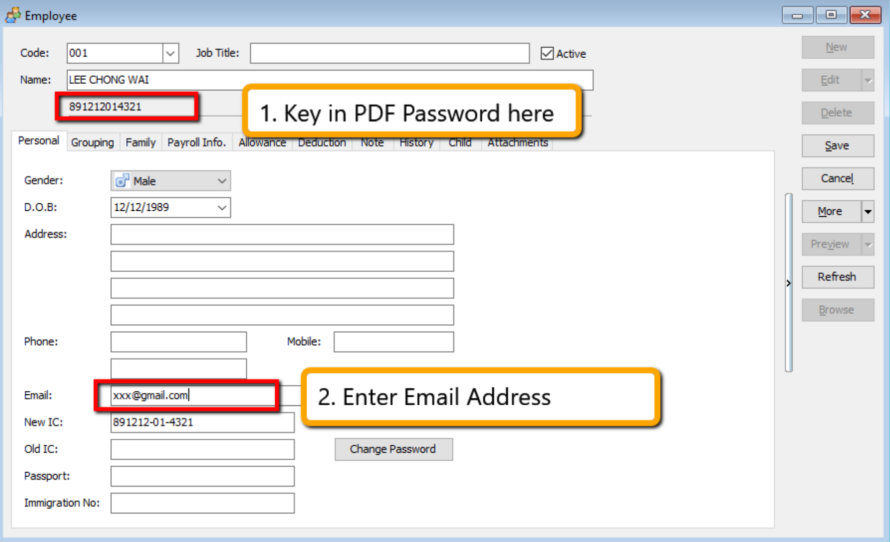

3. Next, go to **Payroll** > **Print Payslip**. Select the Month End Payslip, click **Apply**, and then **Preview**.

4. Click the 🔽 arrow beside the Excel export icon and select **Export to Email Client (Batch)**.

   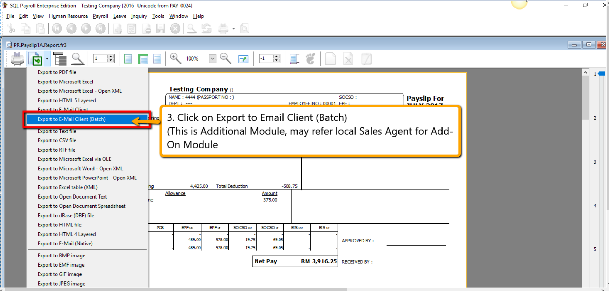

   :::tip
   For testing purposes, you can activate the module by going to **File** > **Customize Payroll Module** and checking **Batch Email**.
   :::

   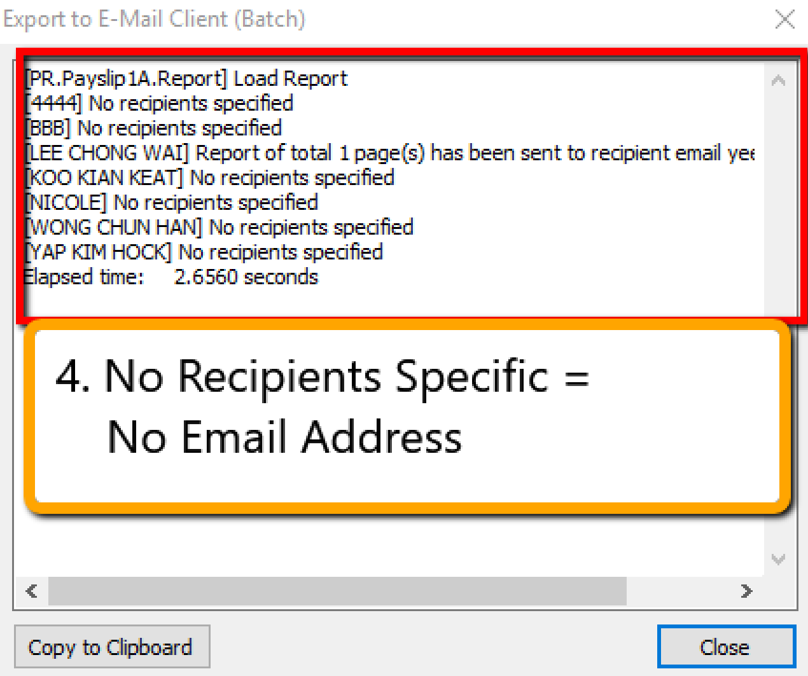

   :::warning Error
   If you haven't configured your Windows email client, you will see the error message below. Ensure your email client is configured before proceeding.
   :::

   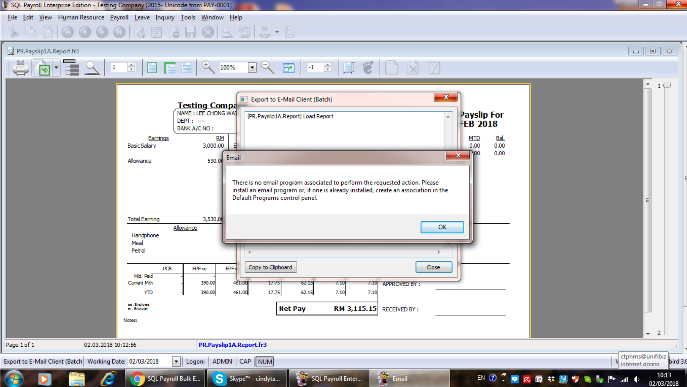

### Steps to Use IC as PDF Password

1. Navigate to **Human Resource** > **Maintain Employee**.

2. Click on one employee record, hold the `Shift` key on your keyboard, and click the last record to highlight all employees.

3. Click the 🔽 arrow beside **More** and select **Batch Edit**.

4. In the columns section, click **Field Chooser** and select **Name2** and **New IC**.

5. Save the structure, then copy the **New IC** values and paste them into the **Name2** column.

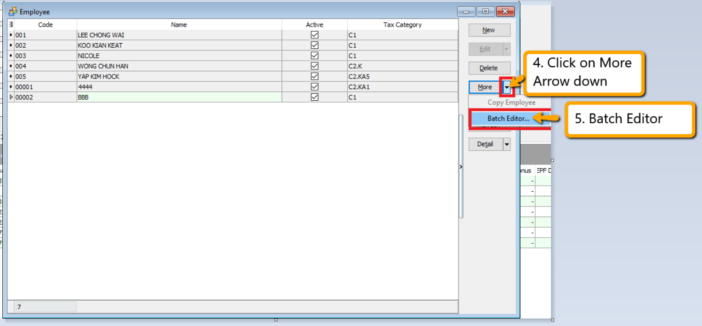

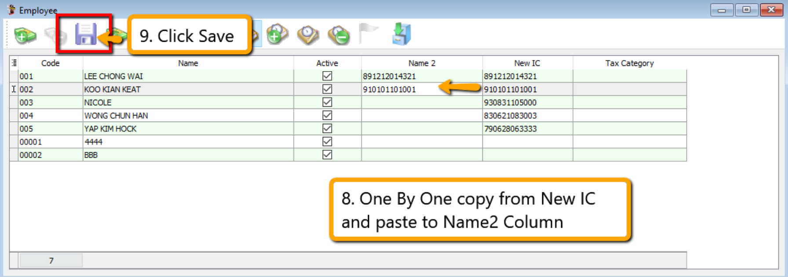

## Employee Login

:::info
This guide explains how to configure and create an account for the employee in SQL Payroll which allows employees to view their details.
:::

1. In SQL Payroll, navigate to **Human Resource** > **Maintain Employee**.

2. Click **Change Password**.

   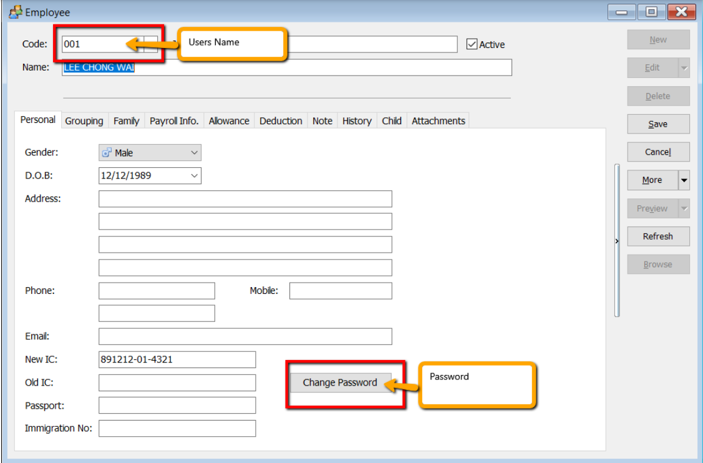

3. Enter a new password for the employee.

   

4. Next, instruct the employee to open SQL Payroll and log in using the **Employee Code** and **Password** configured previously. That's it! 🥳

   

5. Below is an example of the employee view:

   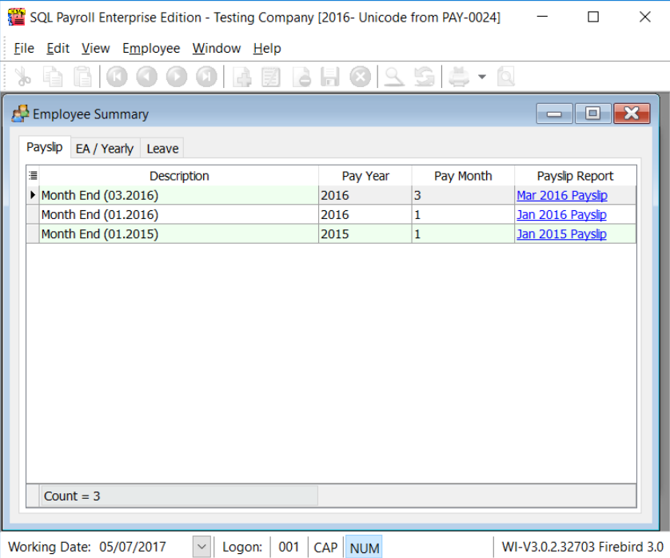

## Print Letter

:::info
This guide explains how to print Appointment, Confirmation, and Increment letters.
:::

1. Navigate to the **Maintain Employee** panel.

   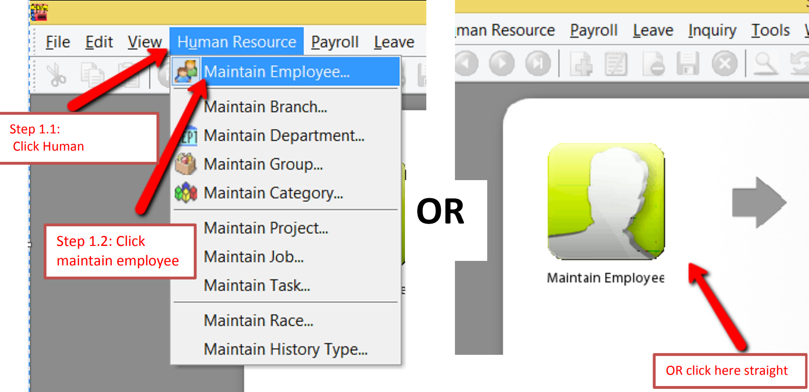

2. Select an employee.

   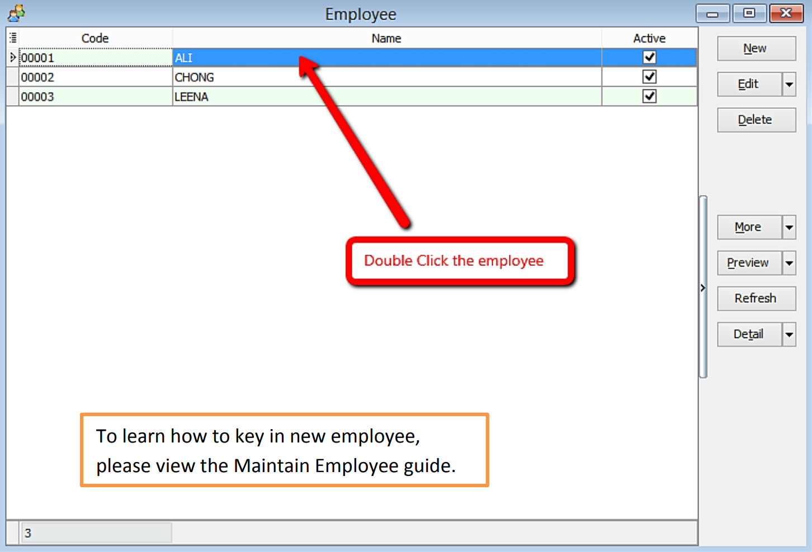

3. Click **Preview Reports**.

   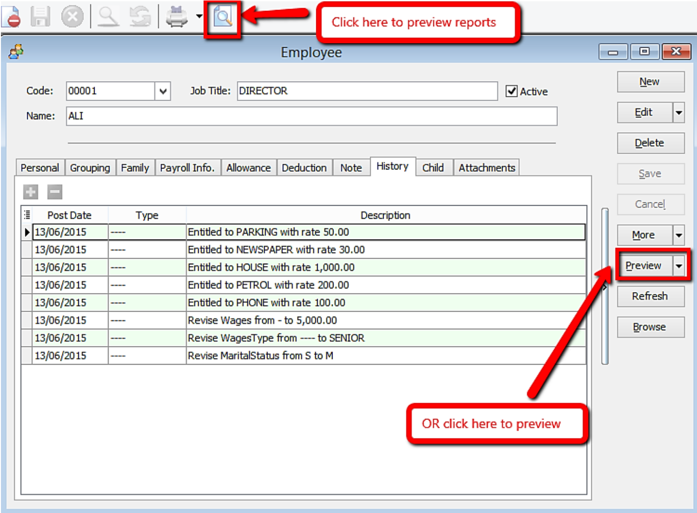

4. Double-click the desired report to select it.

   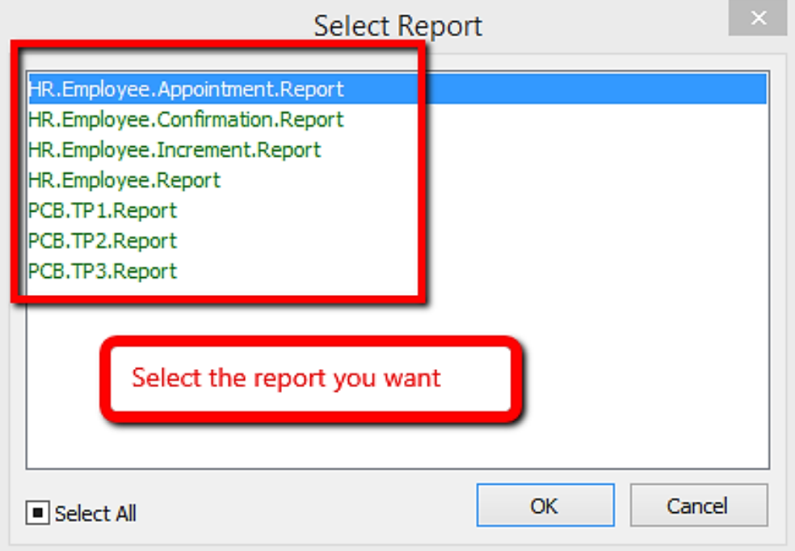

5. Below is an example of an appointment letter:

   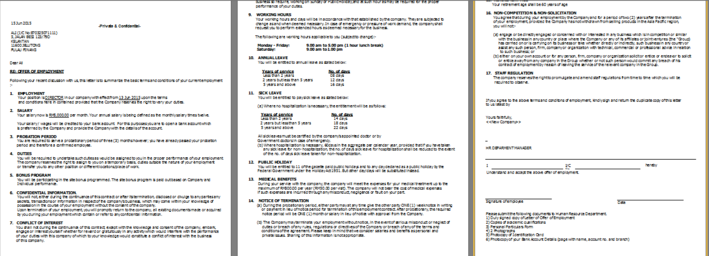

### Increment Letter

:::note
For the increment letter, ensure that an increment is recorded in **History** for the report to generate correctly.
:::

1. Navigate to **Human Resource** > **Maintain Employee**.

   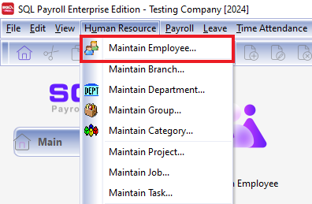

2. Alternatively, click **Maintain Employee** on the homepage.

   

3. Open the employee details and click the **History** tab.

   

4. Click **Preview Reports**.

   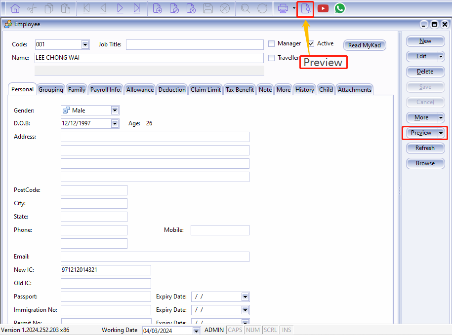

5. Select the report you wish to print.

   

#### Increment Letter Setup in History

## Maintain Employee with MyKad Reader

1. Connect your Smart Card Reader to your computer.

2. The reader's light will turn red when successfully connected.

   

3. Insert the MyKad into the reader.

4. The reader's light will turn blue when the MyKad is successfully read.

   

5. In SQL Payroll, open a **New Employee** profile and click **Read MyKad**.

   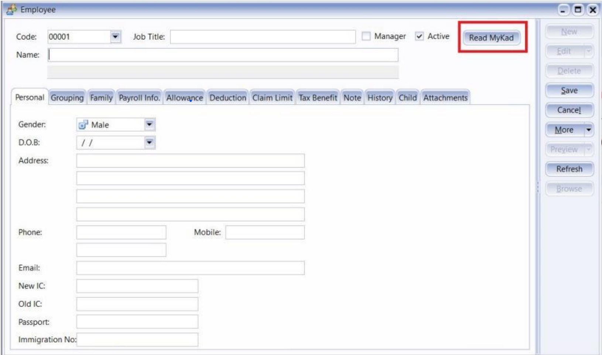

6. Select **Reader Devices** and click **Read Card**.

   

7. Click **Read MyKad**.

   

8. The system will automatically fill in the MyKad details:

   - **(NAME, ADDRESS, ID Number, D.O.B, GENDER)**

   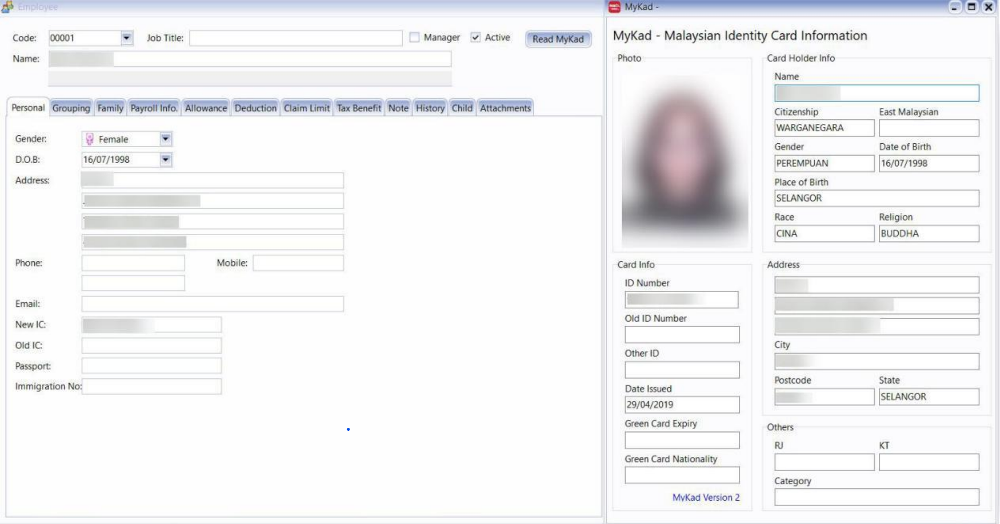

## Recurring Zakat

1. Go to **Maintain Employee**.

   

2. Select the respective employee and go to the **Deduction** tab.

   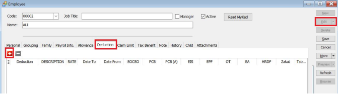

3. Enter a deduction and check the **Zakat** box. Note that other contribution checkboxes will be automatically unchecked.

   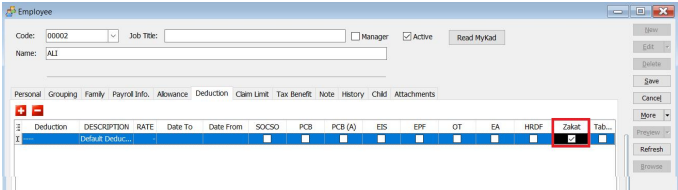

4. Enter the **Rate** and set the contribution period in the **Date From** and **Date To** columns.

   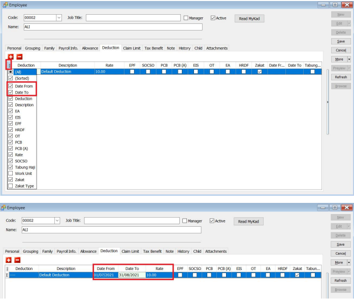

5. Save and process the month-end payroll. The amount will appear in **Gross Zakat**.

   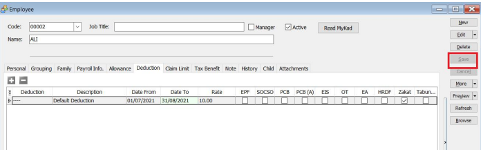

   

## Loan

:::note NOTE:
This is a **Paid Module**
:::

This module is for companies that provide loans to employees, which are repaid through salary deductions with interest.

## Maintain Loan

This section allows users to set up loans for selected employees.

Assume the following scenario:

| Field Name                  | Properties        |
|-----------------------------|-------------------|
| Employee Code               | 0010              |
| Loan Amount                 | 50,000            |
| Loan Interest               | 2,000             |
| Number of Repayment (Months)| 60                |
| First Repayment Date        | 01 Mar 2013       |

### Loan Amount & Interest Amount

1. Click **New** and enter the details as follows:

   

2. Click the **Schedule | Generate...** button.

   

3. Click **OK** to confirm.

4. Click **Save**.

### Auto Repayment

1. Process payroll as usual (refer to [New Payroll](../payroll/guide.md#create-payroll)).

2. In the selected employee's paysheet, click **Loan**.

   

### Advanced Repayments

1. In the **Transaction** tab:

   

## Print Loan Repayment History

This generates/prints the Ledger/History of loans given by the company for selected or all employees.

