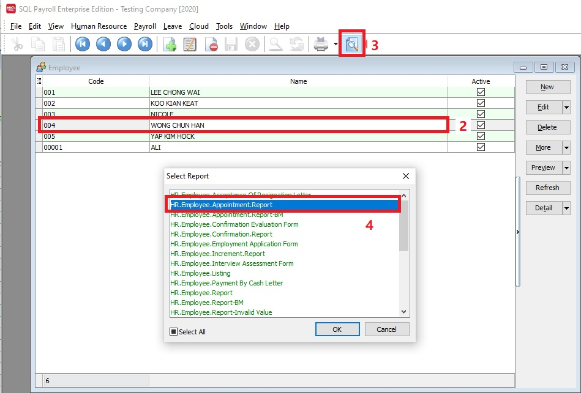

## 1. Where I can get/modify the appointment letter?

**Issue:**

Where to get the appointment letters

**Solution:**

1. Go to **Human Resource | Maintain Employee**..., you can found the following common use employee letters:

   - Acceptance of Resignation Letter
   - Appointment Letter
   - Confirmation Letter
   - Employment Application Form
   - Increment Letter
   - Interview Assessment Form
   - and more...

2. **Highlight** the employee.
3. Click **preview**.
4. Select the **HR.Employee Appointment Report**.

