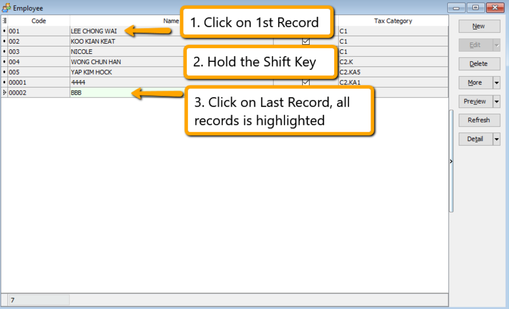
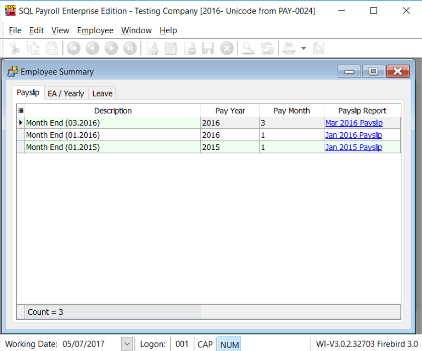
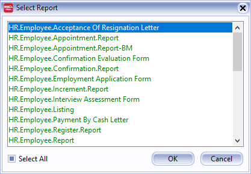
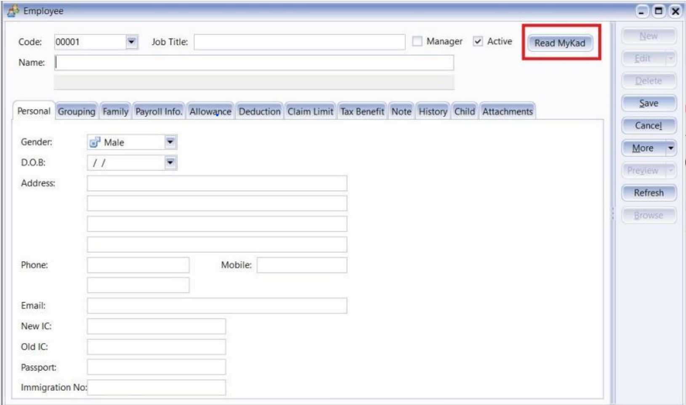
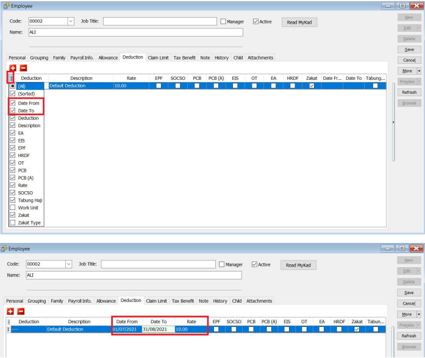
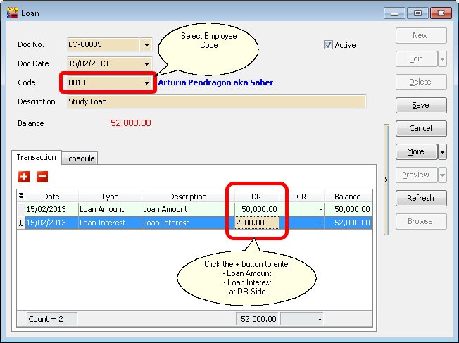
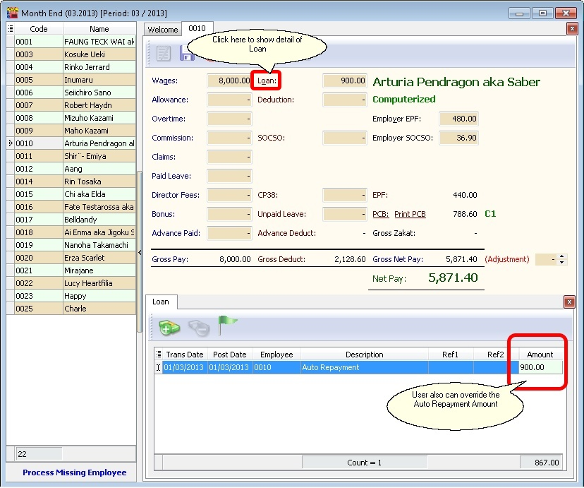
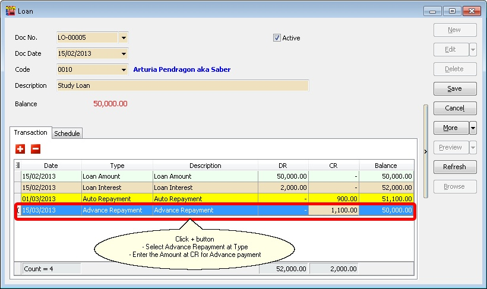

## Bulk Email With Password

:::note

- Not applicable for Export Email Client or Export to PDF
- For Email Client, 10 records in one PDF, email to 1 recipient, system unable to generate password due to not sure which password should get

:::

### Prerequisites

:::info
In order to use this, user’s computer must configure with window email first
:::

### Setup

1. Navigate to **Human Resource** > **Maintain Employee**

2. Key in the PDF password and enter the email address

   

3. Next, go to **Payroll** > **Print Payslip**. Choose the month End Payslip, Apply and Preview

4. Click on the 🔽 beside the excel export, click on **Export to Email Client (Batch)**

   

   :::tip
   For Testing purpose, you may activate the module at File > Customize Payroll Module and ticked **Batch Email**
   :::

   

   :::warning Error
   If you haven't configure your window email, you will see an error message as below. Make sure yo have configure your window email before doing these steps.
   :::

   

### Simple Steps To use IC as PDF Password

1. Navigate to **Human Resource** > **Maintain Employee**

2. Click on one employee record, hold the `Shift` key in the keyboard and click on the last record to highlight all

3. Click on 🔽 button beside More, select Batch Edit

4. From the columns, click on field Chooser and select **Name2**, **New IC**

5. Save the structure, copy and paste the New IC value to Name2 column

## Employee Login

:::info
This guide explains how to configure and create an account for the employee in SQL Payroll which allow the employee to view their details
:::

### Setup

1. In SQL Payroll, go to **Human Resource** > **Maintain Employee**

2. Click on **Change Password**

   

3. Enter a new password for the employee

   

4. Next, ask the employee to open SQL Payroll, login into it by using the **Employee Code** and **Password** configured previously. That's it! 🥳

   

5. Finally, here's an example of employee view

   

## Print Letter

:::info
This guide explains how to print Appointment, Confirmation, Increment letter
:::

### Setup

1. Navigate to the **Maintain Employee** panel

   

2. Select the employee

   

3. Click preview reports

   

4. Select the report you want by double clicking it

   

5. This is the example of the appointment letter

   

#### Increment Letter

:::note
For increment letter, make sure increment is set in **history** in order for the report to work
:::

1. Navigate to **Human Resource** > **Maintain Employee**

   

2. Alternatively, you can click on the **Maintain Employee** available in the homepage

   

3. Go to the employee details, click on History from the tab view

   

4. Click preview reports

   

5. Select the report you want to print

   

#### Increment letter setup in history

## Maintain Employee with MyKad Reader

### Setup

1. Link your Smart Card Reader to your computer

2. Reader will turn red light when you success link to your computer

   

3. Put MyKard into reader

4. Reader will show blue light when success read your MyKad

   

5. Open your SQL Payroll New Employee Profile > **Read MyKad**

   

6. Select **Reader Devices** > **Click Read Card**

   

7. Click **Read MyKad**

   

8. Inside System will auto fill up MyKard Detail

   - **(NAME , ADDRESS , ID Number, D.O.B, GENDER)**

   

## Recurring Zakat

### Setup

1. Go to **Maintain Employee**:

   

2. Select the respective employee and go to Deduction

   

3. Enter a deduction and tick Zakat check box. You will notice that the other contribution checkbox will be unticked

   

4. Key in Rate and set the period of contribution in the Date From and Date To column.

   

5. Save and process your month end. You will see the amount in your Gross Zakat

   

   

## Loan

:::note NOTE:
This is a **Paid Module**
:::

For company which also provide a loan for their employee(s) that is expected to be paid back by deduct from the salary with interest.

## Maintain Loan

At here allow the user to setting up the loan for the Selected Employee...

### Setup

Assuming we had the following scenario:

| Field Name                  | Properties        |
|-----------------------------|-------------------|
| Employee Code               | 0010              |
| Loan Amount                 | 50,000            |
| Loan Interest               | 2,000             |
| Number of Repayment (Months)| 60                |
| First Repayment Date        | 01 Mar 2013       |

#### Loan Amount & Interest Amount

1. Click **New** & Enter As Following.

2. Click **Schedule | Generate**... Button.

3. Click **Ok** button to confirm.
4. Click **Save**.

#### Auto Repayment

1. Go to process as normal at [New Payroll](/usage/payroll/general#create-payroll).
2. At the Selected Employee Paysheet Click **Loan**.

#### Advanced Repayments

1. At **Transaction** Tab

## Print Loan Repayment History

This is to generate/print the Ledger/History of Loan given by company for the selected/All Employees Report...

