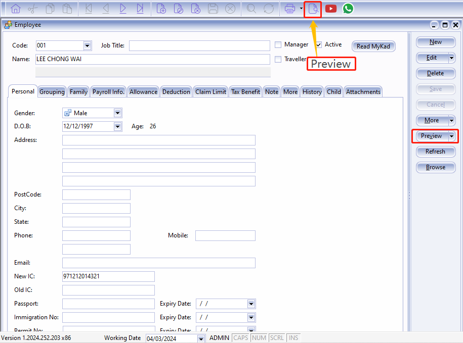

## Introduction

:::info
This guide explains how to print Appointment, Confirmation, Increment letter
:::

## Setup

1. Navigate to the **Maintain Employee** panel

   

2. Select the employee

   

3. Click preview reports

   

4. Select the report you want by double clicking it

   

5. This is the example of the appointment letter

   

### Increment Letter

:::note
For increment letter, make sure increment is set in **history** in order for the report to work
:::

1. Navigate to **Human Resource** > **Maintain Employee**

   

2. Alternatively, you can click on the **Maintain Employee** available in the homepage

   

3. Go to the employee details, click on History from the tab view

   

4. Click preview reports

   

5. Select the report you want to print

   

#### Increment letter setup in history

