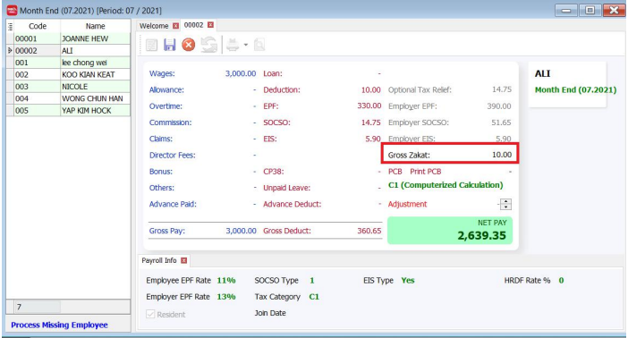

## Setup

1. Go to **Maintain Employee**:

   

2. Select the respective employee and go to Deduction

   

3. Enter a deduction and tick Zakat check box. You will notice that the other contribution checkbox will be unticked

   

4. Key in Rate and set the period of contribution in the Date From and Date To column.

   

5. Save and process your month end. You will see the amount in your Gross Zakat

   

   
