## Introduction

The Leave module is used to monitor employee leave, manage the company calendar, and print attendance reports. It consists of four sections:

1. **Maintenance**
2. **Leave Entitlement Processor**
3. **Leave Application**
4. **Reports**

## Leave Application

- **Records leave applied for by each employee. You can input any type of leave defined in Maintain Leave Type.**
- **You can assign a calendar to individual employees in Maintain Employee. This will load the employee's leave application.**
- It monitors leave applications based on the up-to-date leave entitlement.

    For example:

    1. **Annual Leave Entitlement = 12 days**
    2. **Average Annual Leave Entitlement = 1 day per month**
    3. **Annual Leave applied for a month:**
        - **January = 0 days**
        - **February = 1 day**
        - **March = 0 days**

    In this scenario, the total annual leave entitled up to April is 4 days (including April).

    This means the remaining annual leave is (4 – 1) = 3 days.

    If the employee applies for 4 days of leave in April, the system will prompt the warning: “You’ve taken 5.0 days of Annual Leave, but Annual Leave limit for April is 4.0 days.”

    You can then choose to Allow, Not Allow, or treat it as Unpaid Leave.
    :::

1. Navigate to **Leave** > **Leave Application**.

    

2. Select the year (e.g., 2015).

    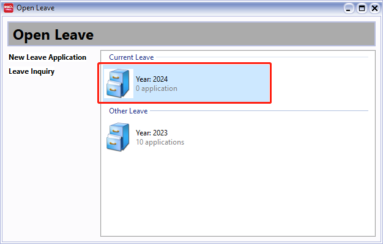

3. Select the employee (e.g., Lee Chong Wai).

    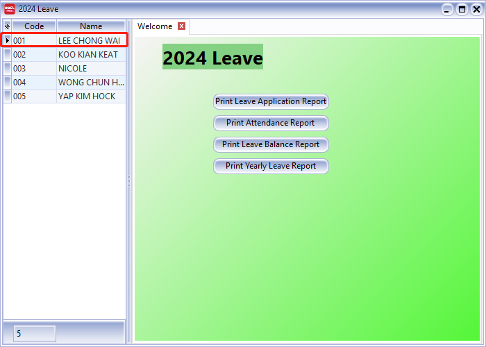

4. Click the **+** button. A row will appear where you can select the date, leave type, and number of days applied. Click **Save** once completed.

    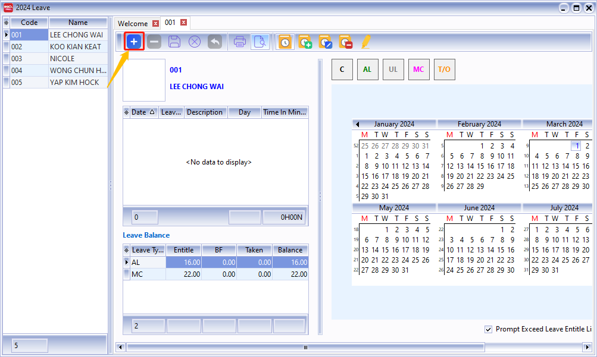
    

5. If the employee applies for half-day leave or hourly leave, use the **Day As Time** column (1 working day = 8 working hours).

    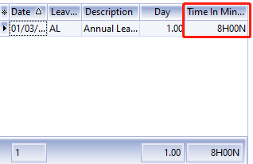

6. Enter the duration (e.g., 3 hours). The system will automatically calculate the number of days (e.g., 0.38 days).

    

### Hourly Leave Application

1. Go to **Leave** > **Leave Application** > **New Leave Application**.

    

2. Select the employee's name, then click **Apply Leave**.

    

3. Enable the **Day As Time** column.

    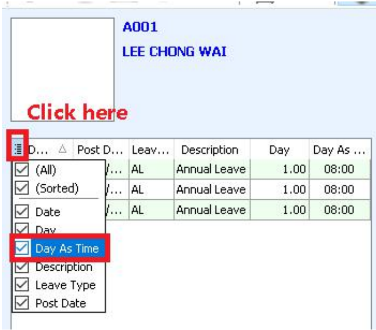

4. Select the leave type and date.

    - The **Day** column represents the number of days, while the **Day As Time** column represents the hours.
      :::tip Example:
      - Day = 1.00 (1 day of leave)
      - Day As Time = 8.00 (HH:MM, 8 hours in 1 day)
      :::

    

5. Apply Hourly Leave.

    - If a staff member wants to apply for 2 hours of Annual Leave, enter `02:00` in the **Day As Time** column and press **Enter**.

    - The **Day** column will automatically update to `0.25`.

    

6. Save.

    - Click the **Save** icon. The save is complete when the icon turns grey.

    

7. This method can be used for all leave types.

## Leave Entitlement Processor

**It processes annual leave entitlement for each employee based on their leave group.**

1. The leave entitlement process is typically performed once a year. Navigate to **Leave** > **Leave Entitlement Processor**.

    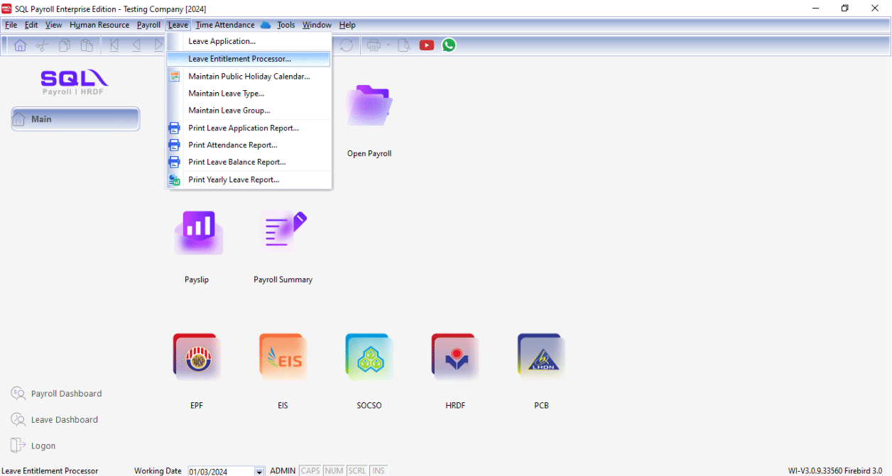

2. Select the Transaction Posting Year (e.g., 2015) and click **Process**.

    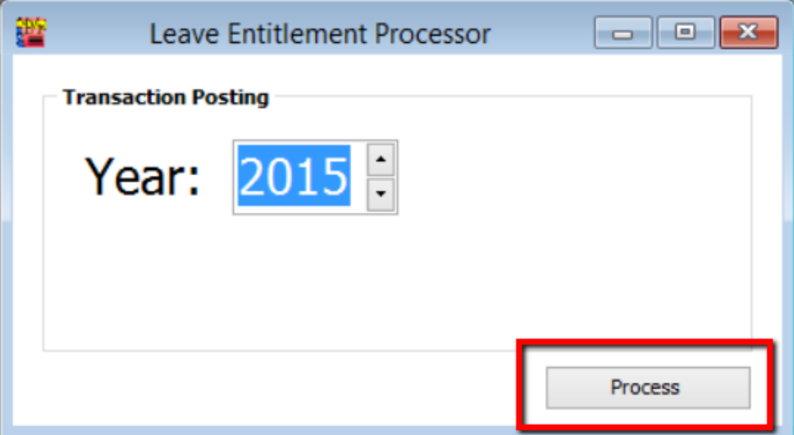

3. A table will display the leave entitlement for each employee for the selected year.

    

4. You can edit the number of days if necessary. Click **Save** when finished.

    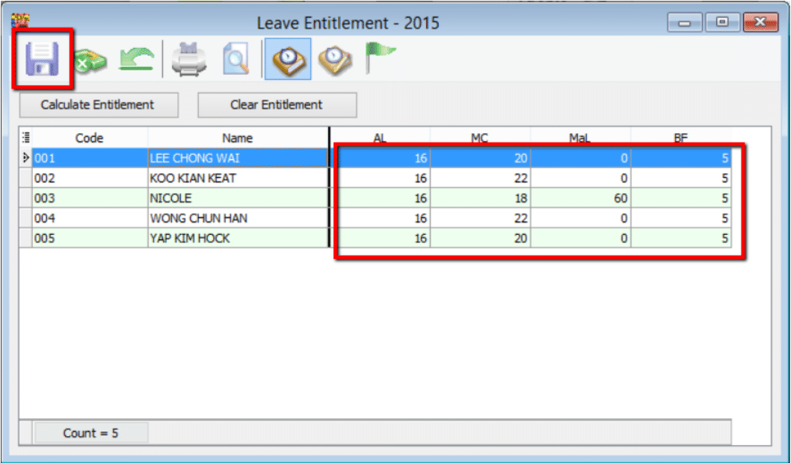

## Maintain Public Holiday Calendar

**Step 1:** Go to **Leave** > **Maintain Public Holiday Calendar...**. Select a calendar or create a new one.

    

**Step 2: Set public holidays**
You can import the default Malaysia public holiday calendar or set it manually.

Option 1: Click the **Global** icon, select a state, and click **OK**.

    

:::info
You can check or uncheck specific dates.
:::

Option 2: Click the **'P'** button and select a date.

**Step 3:** Click **Save**.

## Maintain Leave Type

**Maintain Leave Type** defines the types of leave, such as annual leave, medical leave, maternity leave, unpaid leave, etc. You can also configure settings such as:

- Is Entitled
- Is Unpaid
- Brought Forward

:::info
Before assigning a leave group to an employee, ensure that Leave Types and Leave Groups are maintained. **Leave Type** defines the nature of the leave, while **Leave Group** groups employees according to their leave entitlement.
:::

1. Navigate to **Leave** > **Maintain Leave Type**.

    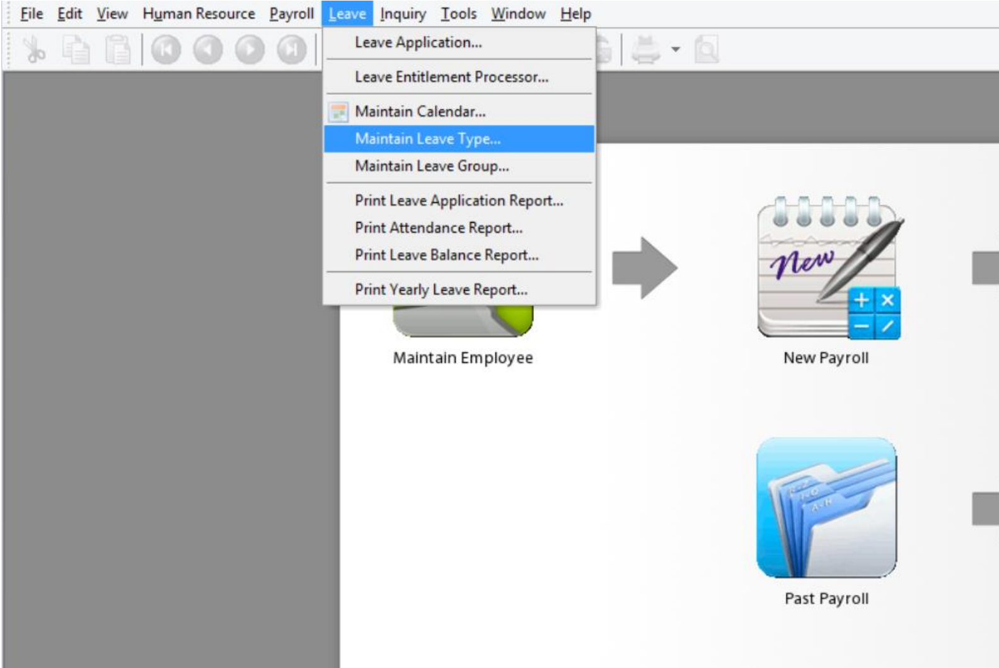

2. Click the **New** button in the top right corner to create a new leave type.

    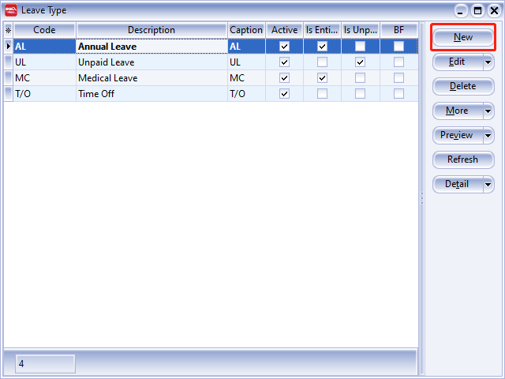

3. Assign a code for the leave type.

    :::tip Example
    `MaL` for Maternity Leave:

    - Check the relevant pay entitlement.
    - Click **Save**.
      :::

    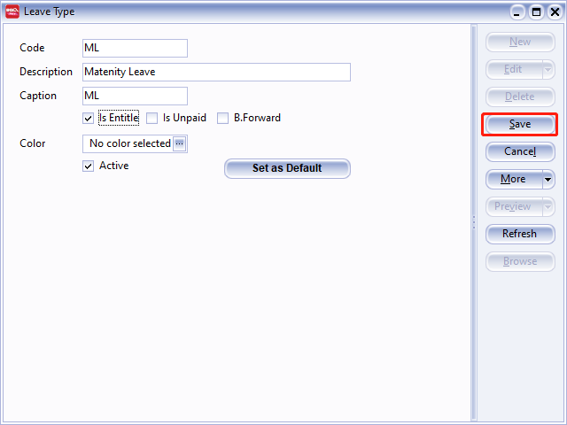

4. The new leave type is created.

    

### Brought Forward Leave

1. Ensure **Brought Forward (BF)** is checked in **Maintain Leave Type**.

    

    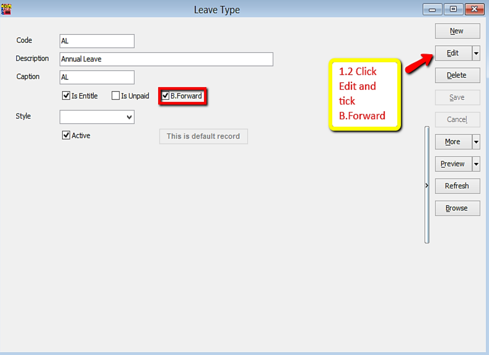

2. Ensure there is a calculation for the amount of leave brought forward in **Maintain Leave Group**.

    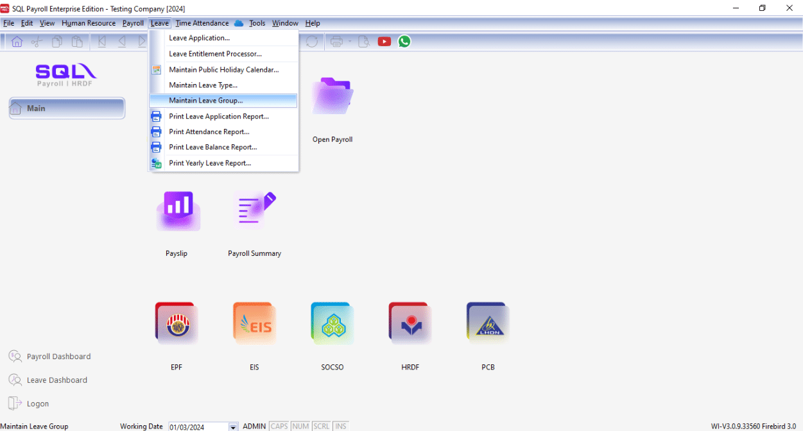

    

3. Enter leave entitlement (refer to [Leave Entitlement Processor](#leave-entitlement-processor)).

    

    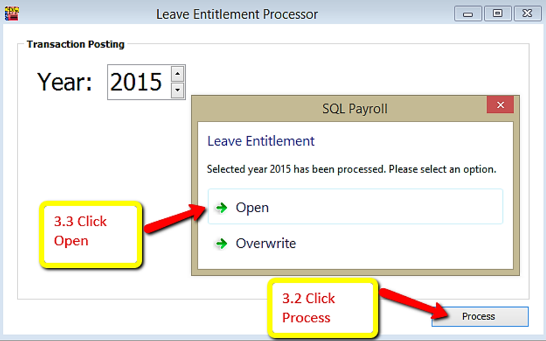

    

4. Apply leave for employees (refer to [Leave Application](#leave-application)).

    :::info
    Go to **Leave** > **Leave Application** and double-click **Current Leave**.
    :::

    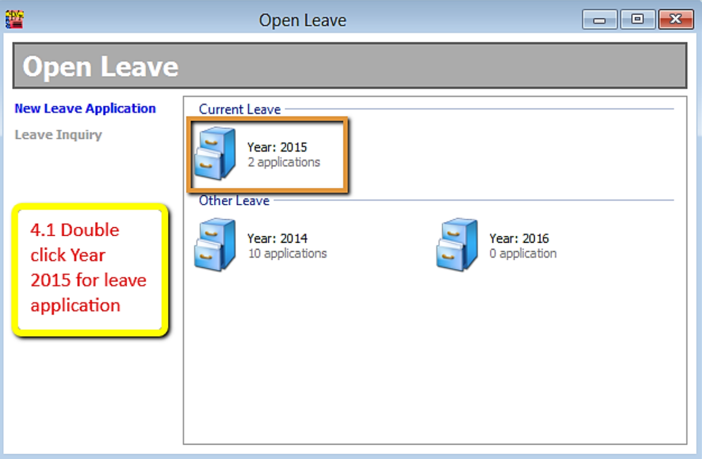

    

    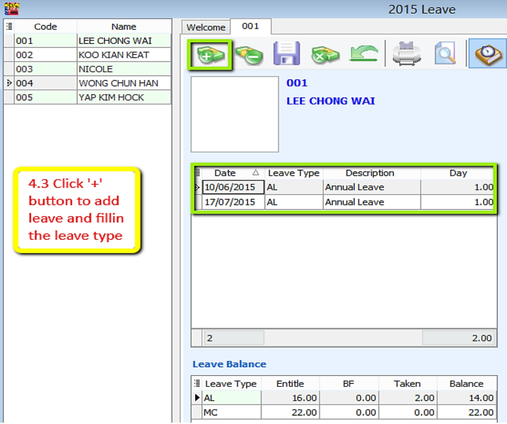

5. Preview the Leave Balance Report (**Leave** > **Print Leave Balance Report**).

    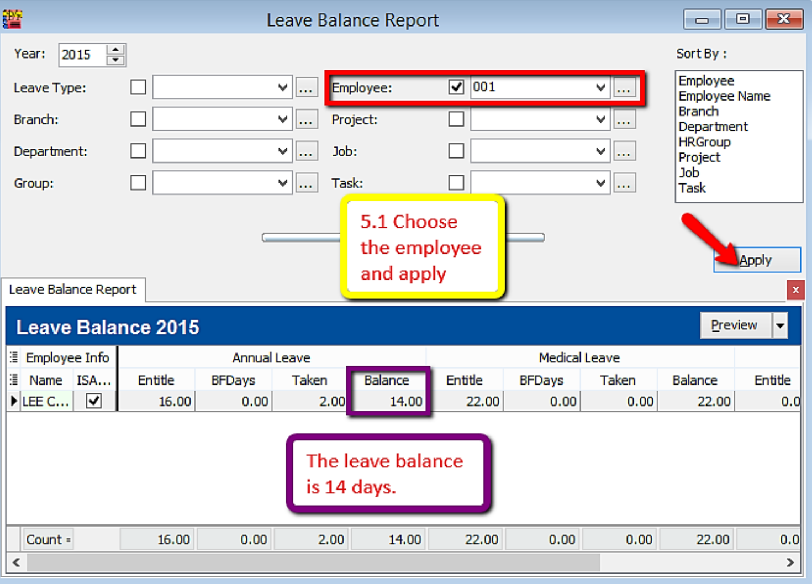

6. Open Leave Entitlement for the following year (e.g., 2016) and repeat Step 2.

    

## Maintain Leave Group

:::info Features

- Allows you to customize leave policies for different employee levels.
- You can customize scripts (under **Tools** > **Maintain Script**) and apply them to the leave group.

:::

1. Navigate to **Leave** > **Maintain Leave Group**.

    

2. Click the **New** button in the top right corner.

    

3. Assign a code for the new leave group.

    :::tip Example
    `FW` for Foreign Worker.

    Click the **+** button to select the entitled leave types for this group.
    :::

    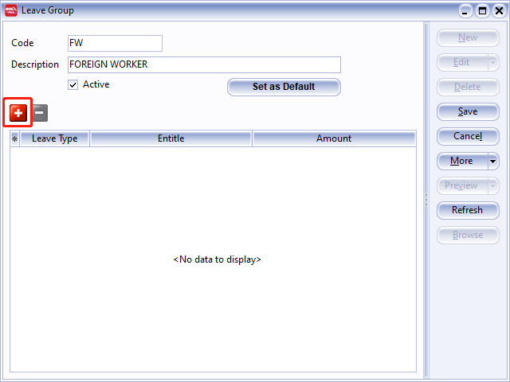

4. Taking **Annual Leave (AL)** as an example:

    - By default, the calculation for Annual Leave is:

    | Year of Service (Years) | Day of Leave Entitled (Days) |
    | ----------------------- | ---------------------------- |
    | 1 to 2                  | 8                            |
    | 3 to 4                  | 12                           |
    | >4                      | 16                           |

    

    If your company follows this default policy, go to the **Entitle** tab and select **Annual Leave Entitlement Policy**. The calculation will follow the default setting.

    

    Click **Save**.

5. If your company uses a different policy, click **Edit**, then click the **...** button beside the **Entitle** column to customize the calculation.

    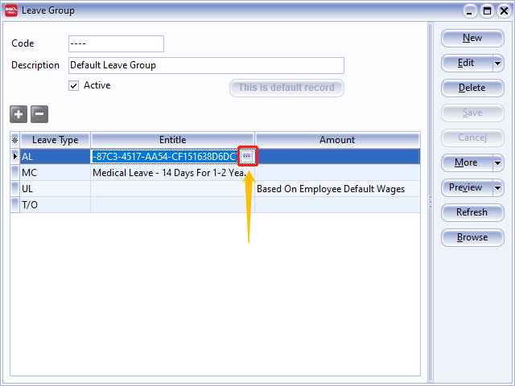

6. For example, if your company uses the following calculation:

    | Year of Service (Years) | Day of Leave Entitled (Days) |
    | ----------------------- | ---------------------------- |
    | 1 to 2                  | 8                            |
    | 3 to 5                  | 12                           |
    | >5                      | 18                           |

    Enter the table as follows:

    | Year From | Year To | Days |
    | --------- | ------- | ---- |
    | 1         | 2       | 8    |
    | 3         | 5       | 12   |
    | 1         | 99      | 18   |

    

7. Click **OK** to finish. 🥳

### Employee Leave Group Assignment

1. Navigate to **Human Resource** > **Maintain Employee**.

    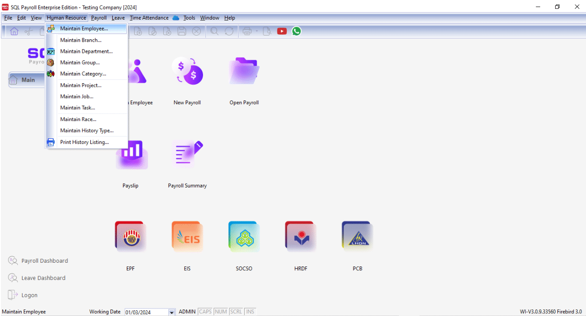

2. Select the relevant employee (e.g., Nicole) and click **Edit**.

    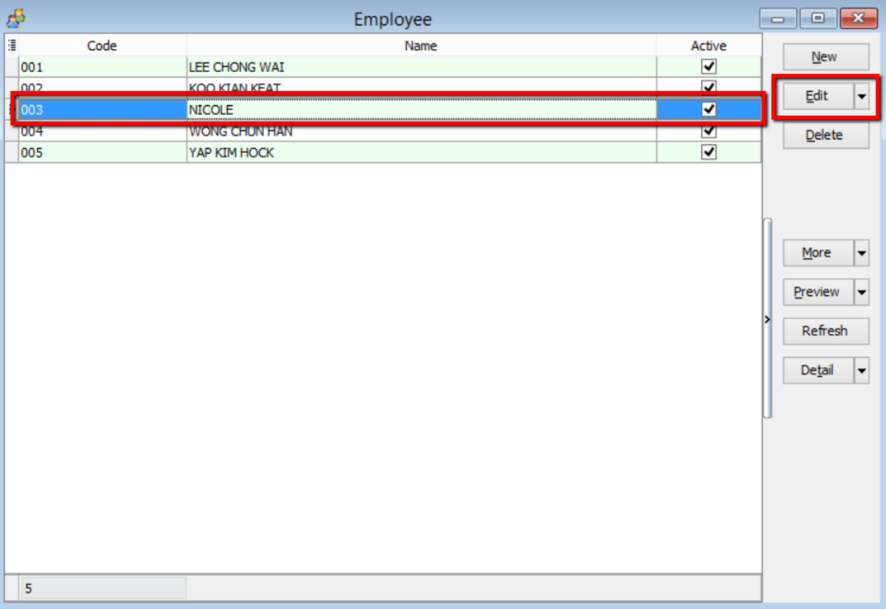

3. Click the **Grouping** tab. You will see **Leave Group** in the last panel.

    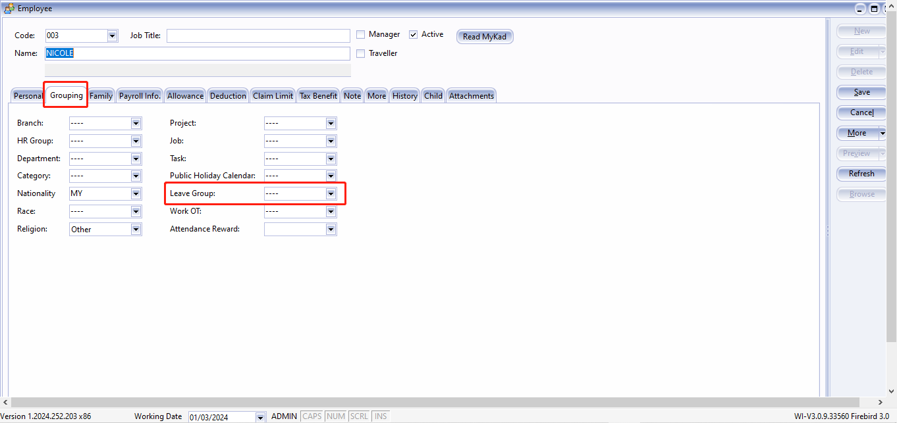

4. Assign the relevant leave group.

    :::tip Example
    Foreign Worker (FW).
    Click **Save**.
    :::

    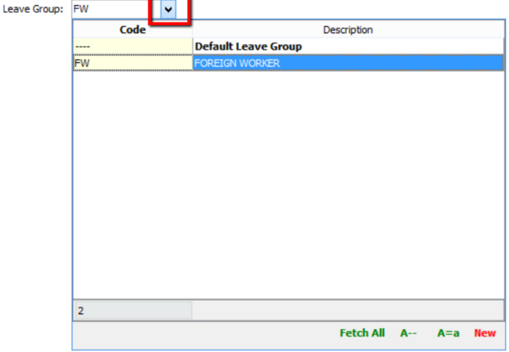
    

## Leave Report

| Report                   | Description                                                                                                |
| ------------------------ | ---------------------------------------------------------------------------------------------------------- |
| Leave Application Report | Generates detailed leave taken by each employee for a year.                                                |
| Attendance Report        | Generates attendance performance in percentage.                                                            |
| Leave Balance Report     | Analyzes the number of days taken for annual leave, medical leave, etc.                                    |
| Yearly Leave Report      | Generates a 12-month summary of total leave taken for each leave type (e.g., annual leave, unpaid leave).  |

### Print Leave Application Report

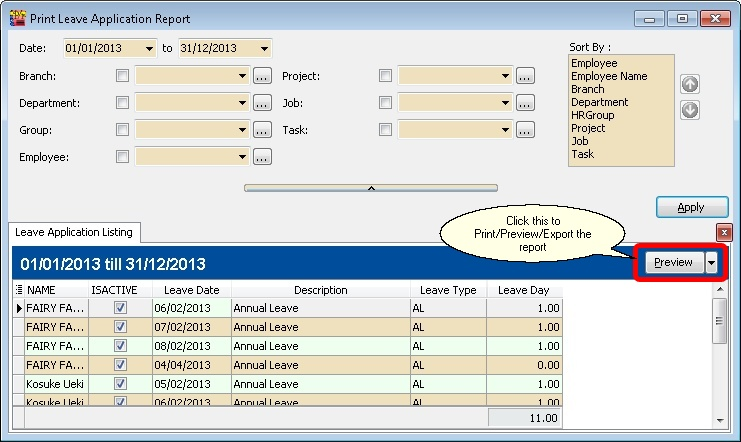

### Print Attendance Report

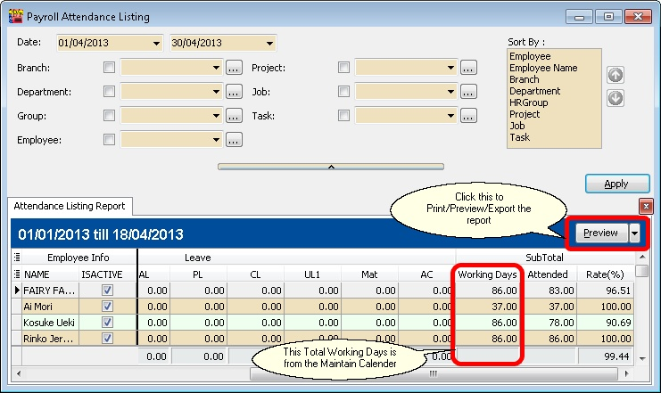

### Print Leave Balance Report

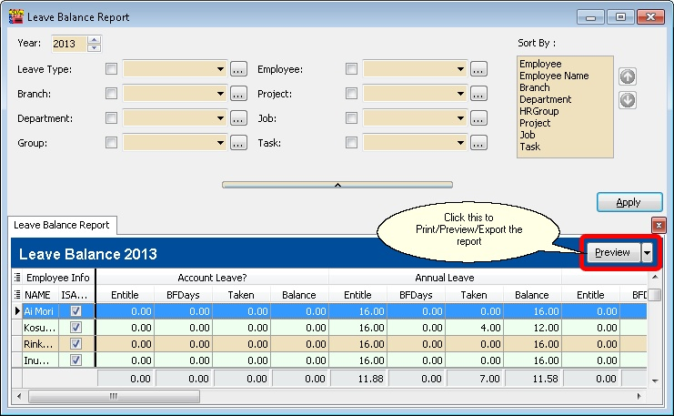

### Print Yearly Leave Report

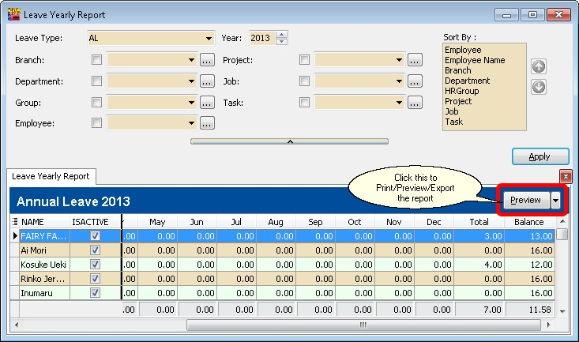
