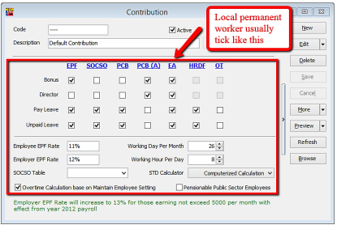
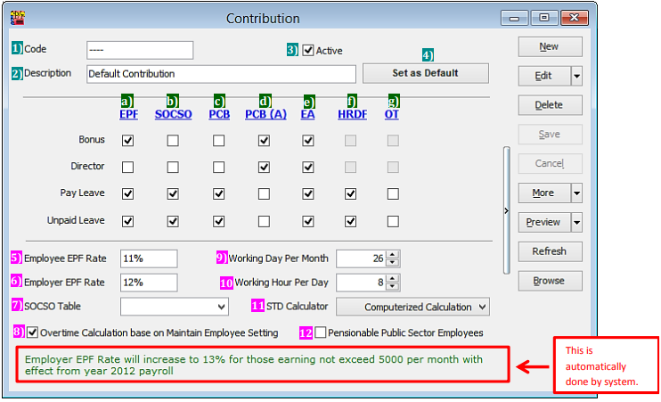

## Introduction

:::info
Learn how to set the Employee/Employer EPF rate, OT calculation and Tax calculation following this guide
:::

- Setting up maintain contribution helps you to categorise the type of contribution an employee received
- This would affect the types of contribution that they need to provide (EPF/SOCSO/PCB & etc)
- This is especially useful if you have different types of worker such as permanent worker, contract worker, foreign worker & etc

## Setup

1. Navigate to the **Maintain Contribution** panel

   

2. Click new to create new contribution

   

3. Key in the info and tick the contribution needed

## Common contribution setup

| Local Permanent Workers                                                                | Foreign Workers                                                        |
| -------------------------------------------------------------------------------------- | ---------------------------------------------------------------------- |
|  |  |

## Explanation of terms in Maintain Contribution panel

