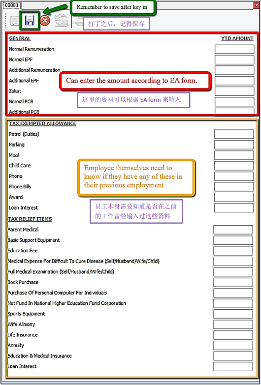

## Introduction

- Maintain employee’s opening balance is done when the respective employee enter the company in a month **later than January**.
- The previous PCB amount is **needed to key in so that the system can correctly calculate** the PCB amount that’s needed to pay every month.

## Setup

1. Navigate to the **Open Payroll**

   

2. Double click the year in Open Payroll

   

3. Double click the transaction under ‘Opening’

   

4. Select the employee by double clicking on the name

   

5. Key in all the employee’s opening balance information

   

## Mapping of SQL 'opening' to EA form

## Special note for additional EPF and additional PCB

- Additional EPF and additional PCB are used when additional remuneration (bonus, commission, paid leave) is given.
- In the EA form, normal EPF and additional EPF is group into one.
- However, SQL recommend users to split the amount for a more detail input.

