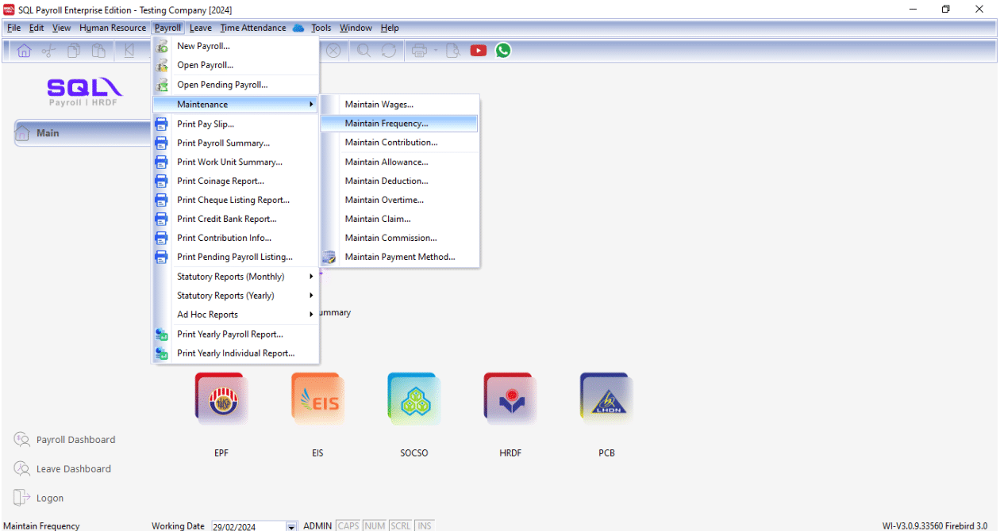
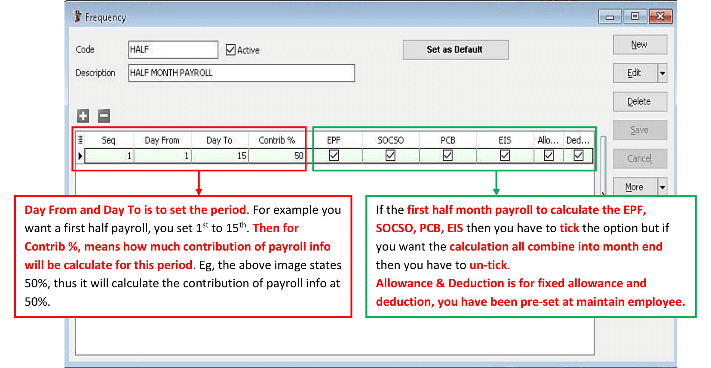
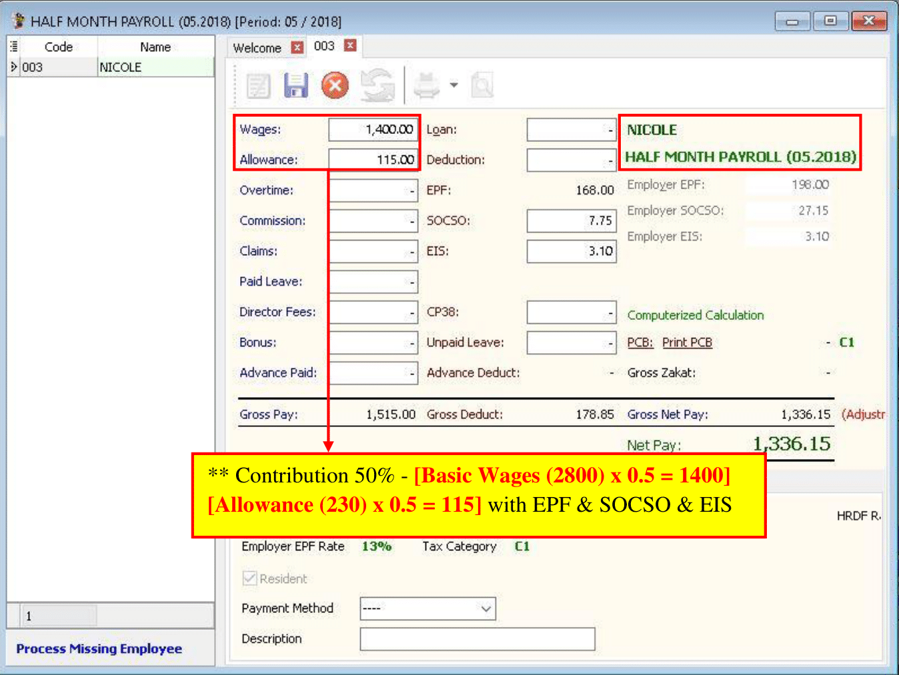
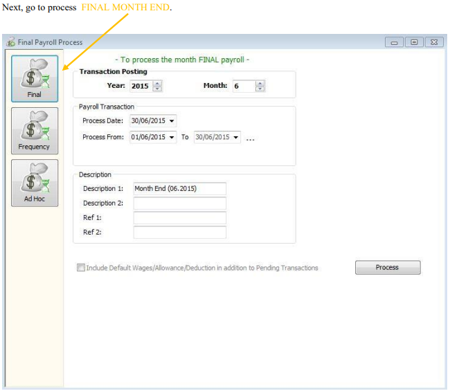
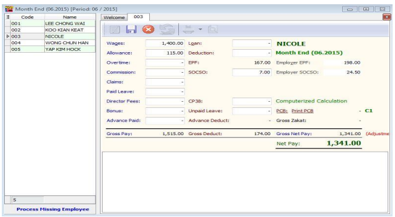

:::info
Frequency – Where one company will pay salary **twice or more times** in **a Month**.
:::

## Setup

1. Navigate to **Payroll** > **Maintenance** > **Maintain Frequency**

    

2. Press New and set accordingly to what you prefer.

    

3. Go to **Human Resource** > **Maintain Employee**, Select the particular Employee and then Go to **Payroll Info Tab** and set the Frequency According to the Maintenance Frequency respectively.

    

    

4. Go to **Payroll** > **New payroll** > **Frequency**

    

    1 Select the Frequency as you Set in Maintenance Frequency (EG: Half).

    2 The Employee/s that u have set as the Frequency type in Maintain Employee will show in this column

    3 Tick the Sequence that u wan to process.

    4 Click PROCESS

5. The following result below will show in the HALF MONTH FREQUENCY PAYROLL.

    

    

6. Select the Employee ( Nicole ) that you’ve process Frequency. The following is the result of Employee that had process Frequency.

   - Wages - [2800 (Basic) – 1400 (Frequency) = 1400 ]
   - Allowance - [ 230 (Fixed) – 115 (Frequency) = 115 ]

    
