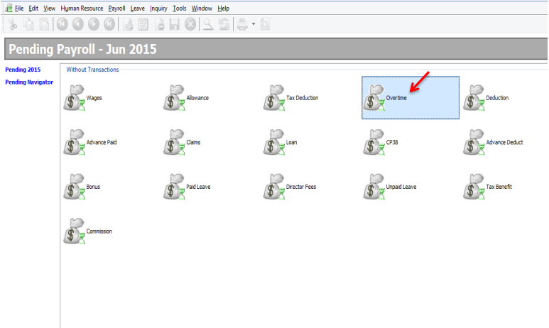
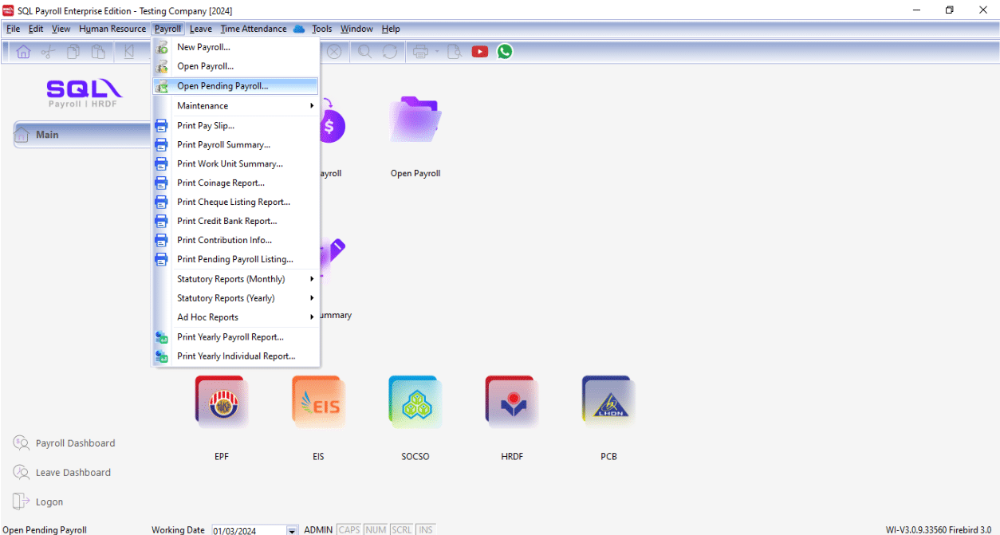

## Introduction

:::info Features

- Setting up maintain overtime helps you to categorize the type of overtime that company have.
- This would affect the types of contribution that they need to provide (EPF/SOCSO/PCB & etc)
- This setting will bring impact of the calculation of overtime.

:::

## Process Overtime After Month End

1. Click on **Payroll** > **Maintenance** > **Maintain Overtime**

   

2. In the list, you can find some default overtime settings. Click on **New** to generate a custom one

   

3. Key-in Overtime details as below

   

   - Insert the **Code** and **Description** of the overtime that you want to generate.
   - Insert the **Rate** of the overtime, eg : the overtime rate is 1.5 as per overtime amount or double, triple of the overtime amount.
   - **Unit Type** is to set the overtime calculation by hourly or by daily.
     -Set the contribution of overtime with EPF, SOCSO, PCB, EIS etc.

4. After that, when we need to process the payroll at the month end. Navigate to **Payroll** > **New Payroll**

   

5. Click **Final**, and click on **Process**

   

6. Click on any employee

   

7. Click on the "**Overtime**"

   

8. Click on the ➕ to add the info you want

   

9. Click on the "**Code**" to choose the overtime type

   

10. Key in the work unit as overtime hour, for example if Lee hong Wai overtime for 2 hours on that particular day, just key in numbering as 2 will do

    

11. Alternatively, you can click on the button beside Trans Date, and tick the column name Work Unit As Time

    

12. After call out the column of Work Unit As Time, you may key in he overtime minutes also (eg: 2 hours and 09 mins)
    

## Process Overtime Before Month End

1. Click on payroll, open pending payroll.

   

2. Double Click on **Overtime**

   

3. Click on Append icon

   

   

4. Select employee

   

5. Select **Overtime Code**

   

6. Tick and enable the **Work Unit As Time**

   

7. Enter the time in the work unit as time, for example Lee Chong Wai worked overtime for 2hours and 30minutes, key in as shown below

   

8. Repeat the same steps as shown above for the other overtime records and save after all done

   

9. During month end,

   

   

10. Double click on the employee’s name or code

    

11. Click on the blue **Overtime** words

    

12. The overtime records entered in pending payroll will be shown

    

## Import Excel Overtime Format into SQL Payroll

1. Prepare a table in Microsoft Excel as shown in the image below

   

   :::tip

   - **Date**: Trans Date
   - **Employee**: Code of Employee
   - **OT**: Code of Overtime that created in Maintain Overtime
   - **Unit**: Work Unit (count 2.50 = 150 minutes/2 and a half hours)
   :::

2. After done the table, go to file

   

3. Click on Save as

   

4. Select CSV file type

   

5. Click Save

   

6. Go to SQL Payroll > Payroll > Open Pending Payroll...

   

7. Double click on the Overtime

   

8. Click on the Import Data icon

   

9. Click on the … (3 dots button) to select your data source,

   

10. Select the csv file to import

    

11. Click on the Next button

    

12. Import from row 1, select Comma, select " for the text delimiter

    

13. Select the field for every column

    

14. Make sure you have select all the fields for the date, employee, code & workunit.

    

15. Change the Import from row to **2** and click the finish button

    

16. Click on the Close button after done importing the data

    

17. Click on the Save icon

    
