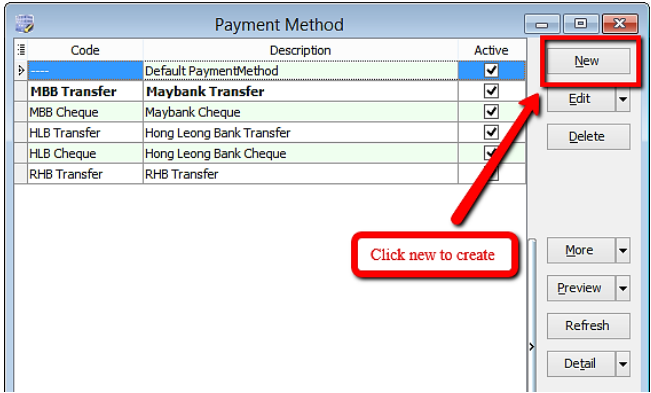
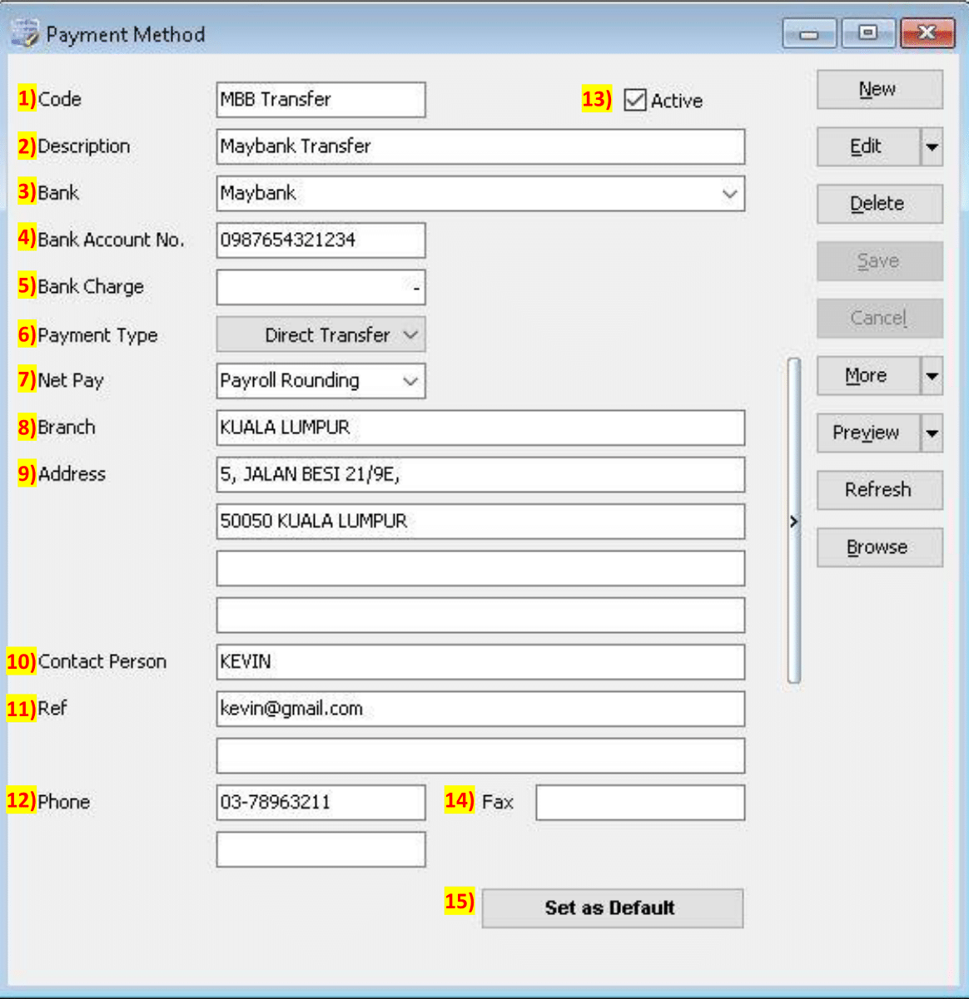

## Introduction

- Maintain Payment Method helps you to categorise how you want to pay your employee
- This is useful when you have different type of banks (MBB, HLB & etc) and method of paying (Cash, Cheque, Transfer)
- At here, we can also set the **auto rounding** so that all payout is round to the nearest 5 cent
    eg: Employee total pay = RM1234.**56**
    After auto rounding, it will become RM1234.**55**

## Setup

1. Navigate to the maintain payment method panel

    

2. Click new to create new payment method

    

3. Key in the information needed

    

    

## Explanation of auto rounding

### Without auto rounding

- After month end will show no adjustment.
- However, adjustment can be manually change by clicking the up/down arrow beside it

### With auto rounding

