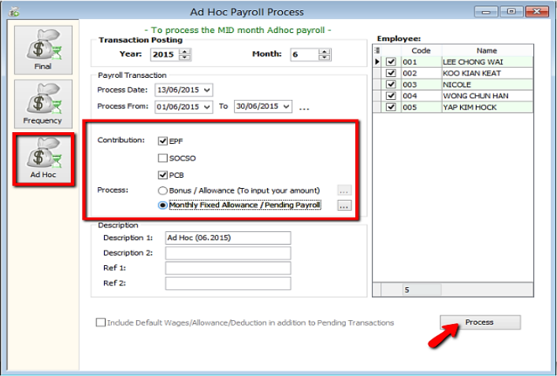

## Setup

1. Set the commission for employee

    - Navigate to **Payroll** > **Maintenance** > **Maintain Commission**
    - Create new for a new commission rate

    

2. Open pending payroll for commission

    - Payroll/Open pending payroll/Commission
    - Insert the employee and amount

    

3. Process month end

    1. Method 1 : Final Payroll Process

        - Navigate to **Payroll** > **New payroll** > **Process**

        

    2. Method 2 : Process Adhoc

       - Tick EPF & PCB & Monthly Fixed Allowance/Pending Payroll

       

    3. Tick Commission

    

4. Double click the employee that you gave commission

    

5. Refer to commission column

    
