## Process Overtime After Month End

1. Click on payroll > Maintenance > Maintain Overtime

    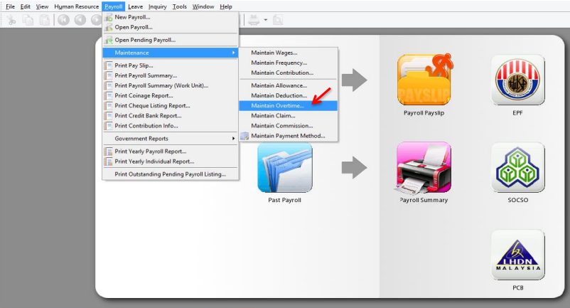

2. Click on New

    

3. Enter the code and description, key in the overtime rate, and select the unit type for hourly, and tick or untick those contribution, save after all done

    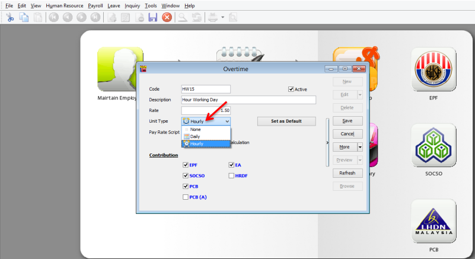

    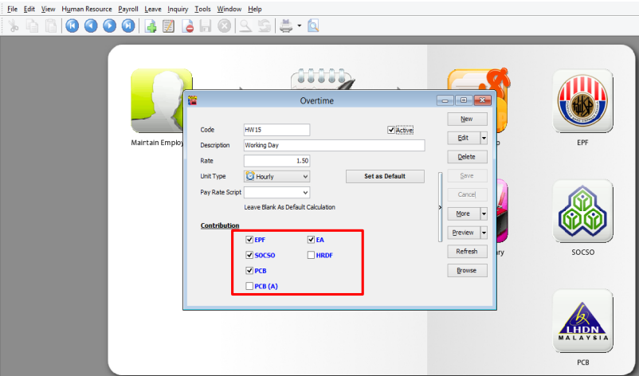

4. Repeat the same steps for other overtime type

    

5. After that, when we need to process the payroll at the month end

    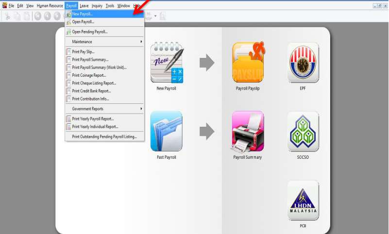

6. Click process.

    

7. **DOUBLE CLICK** on one of the employee

    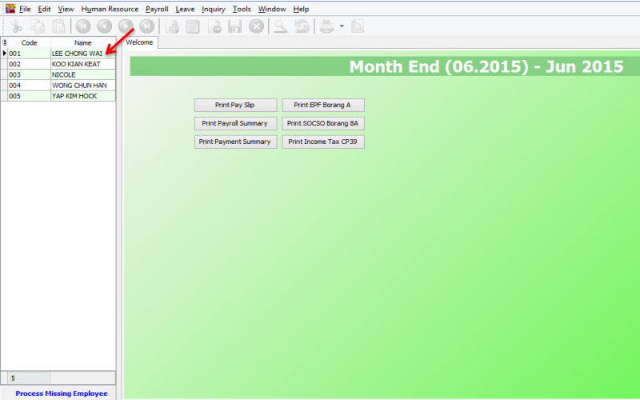

8. Click on the blue **OVERTIME** word

    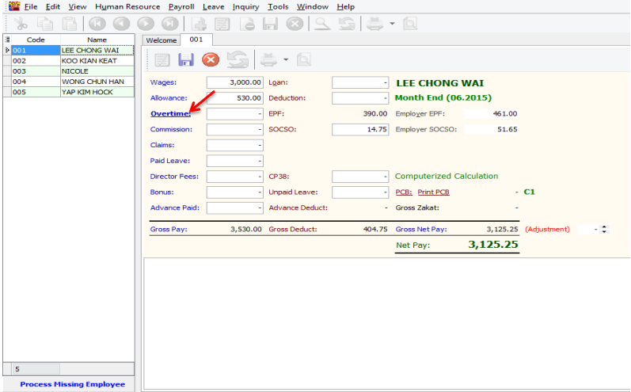

9. The details of the overtime info will de displayed at the bottom of the application

    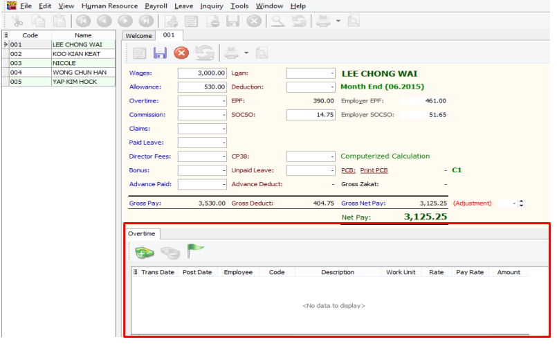

    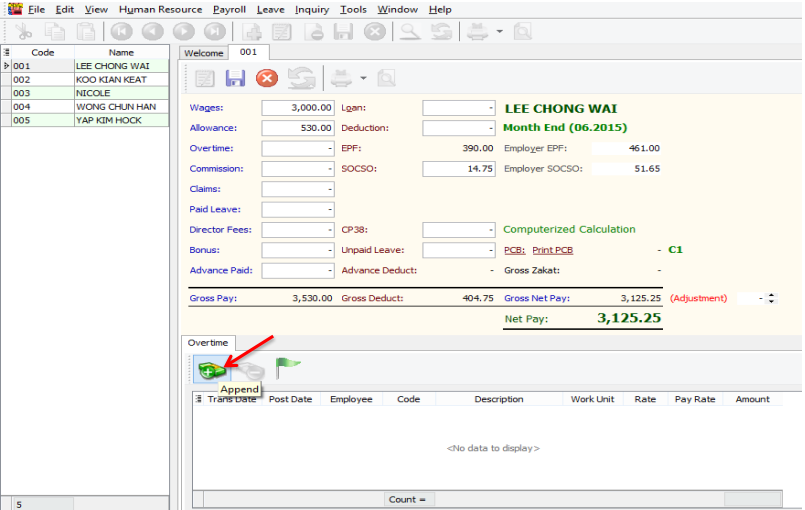

    - Trans Date = the date of overtime
    - Post Date = the date of process or the posting date

    

10. Select the code that you created

    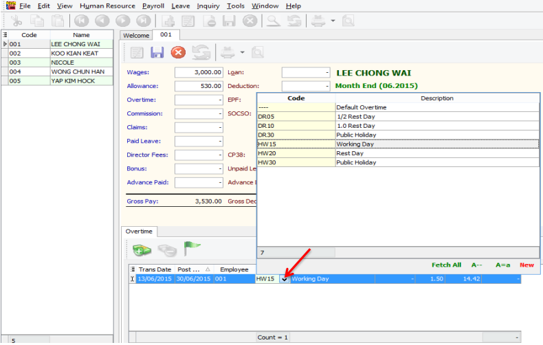

11. Enter the work unit as overtime hour, for example that day Lee Chong Wai overtime for 2 hours, enter 2 into the **Work Unit** column

    

12. Or, you also can click on the button beside Trans Date, and tick the column name Work Unit As Time

    

13. After call out the column of Work Unit As Time, you may key in the overtime in minutes

    

14. You may click on the append for second column, and repeat the same steps

    

15. Click on save, you may repeat the same steps for the other employees

    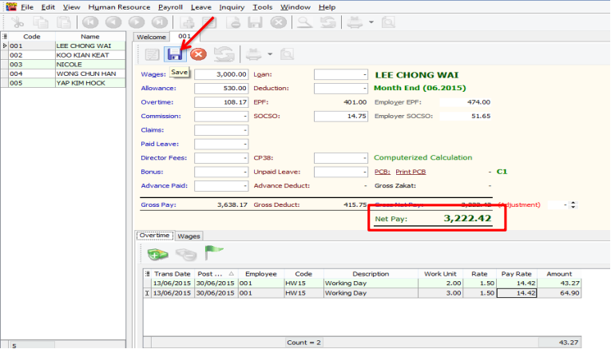

## Process Overtime Before Month End

1. Click on payroll, open pending payroll.

    

2. Double Click on **Overtime**

    

3. Click on Append icon

    

    

4. Select employee

    

5. Select **Overtime Code**

    

6. Tick and enable the **Work Unit As Time**

    

7. Enter the time in the work unit as time, for example Lee Chong Wai worked overtime for 2hours and 30minutes, key in as shown below

    

8. Repeat the same steps as shown above for the other overtime records and save after all done

    

9. During month end,

    

    

10. Double click on the employee’s name or code

    

11. Click on the blue **Overtime** words

    

12. The overtime records entered in pending payroll will be shown

    

## Import Excel Overtime Format into SQL Payroll

1. Prepare a table in Microsoft Excel as shown in the image below

    

    - Date = Trans Date
    - Employee = Code of Employee
    - OT = Code of Overtime that created in Maintain Overtime
    - Unit = Work Unit (count 2.50 = 150 minutes/2 and a half hours)

2. After done the table, go to file

    

3. Click on Save as

    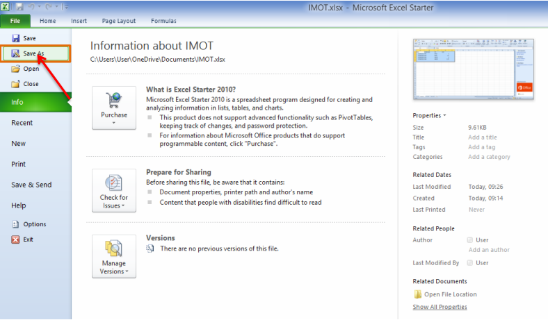

4. Select CSV file type

    

5. Click Save

    

6. Go to SQL Payroll > Payroll > Open Pending Payment...

    

7. Double click on the Overtime

    

8. Click on the Import Data icon

    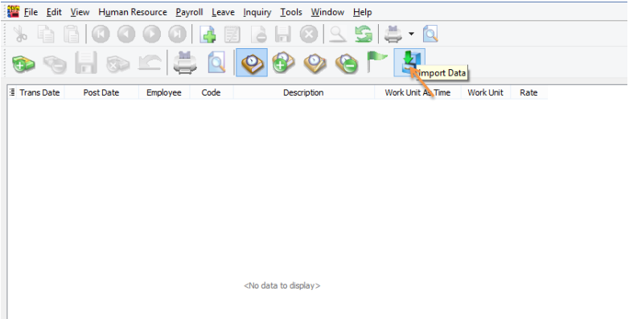

9. Click on the … (3 dots button) to select your data source,

    

10. Select the csv file to import

    

11. Click on the Next button

    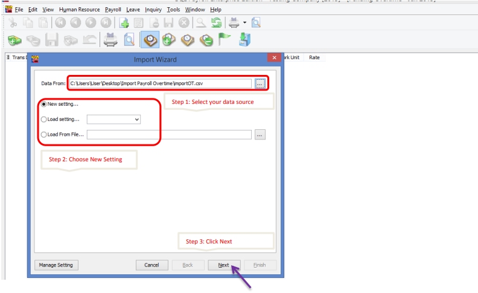

12. Import from row 1, select Comma, select * for the text delimiter

    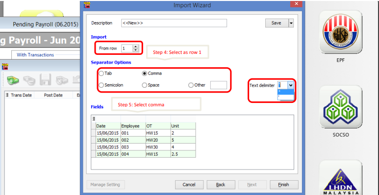

13. Select the field for every column

    

14. Make sure you have select all the fields for the date, employee, code & workunit.

    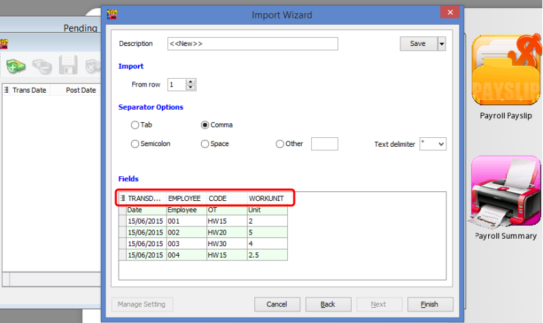

15. Change the Import from row to **2** and click the finish button

    

16. Click on the Close button after done importing the data

    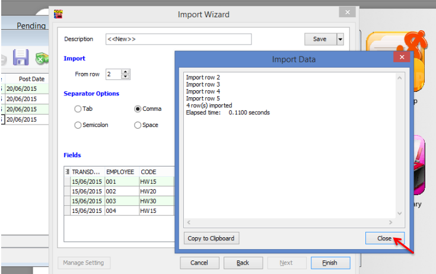

17. Click on the Save icon

    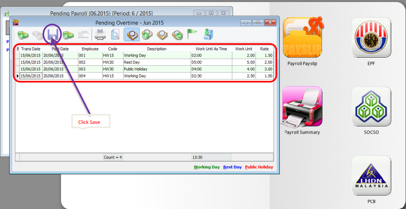
