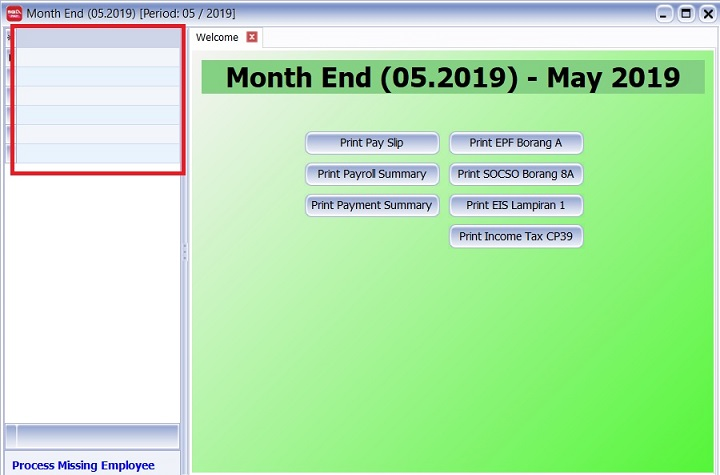
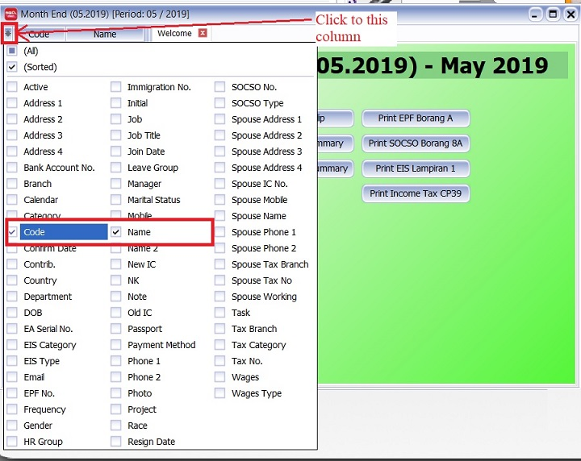
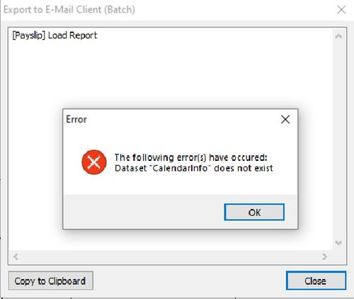
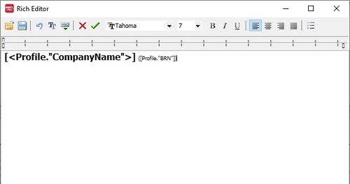
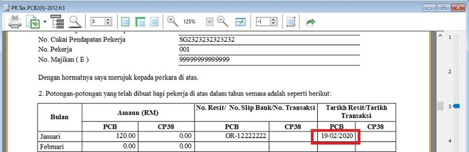

## How to solve when missing code and employee name columns in the month payroll screen?

**Issue:**

**Solution:**

## Error message dataset "CalendarInfo" does not exist when batch email using customize payslip format

**Issue:**

Error message prompt when try to **Export to E-Mail Client (Batch)** using **customize payslip format**.

**Solution:**

At payslip report designer,

    Change the [\<Profile."RegisterNo"\>] to [\<Profile."BRN"\>]

    

After correction, it will be look like the screenshot below.

    

## Where to define the company leave policy?

**Solution:**

1. Preset the leave policy at **Leave | Maintain Leave Group...**

## Why date format not display correctly in some payroll report?

**Issue:**

What is the faster solution to show the date format correctly?

Government Reports | Print Income Tax PCB 2 (II)

**Solution:**

1. Go to Control Panel.
2. Search for Region in Control Panel. 3. Click on Additional Settings...

4. Click to Date tab.
5. Change the Short Date Format to DD/MM/YYYY

6. Date format has display correctly now.

