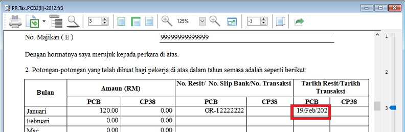
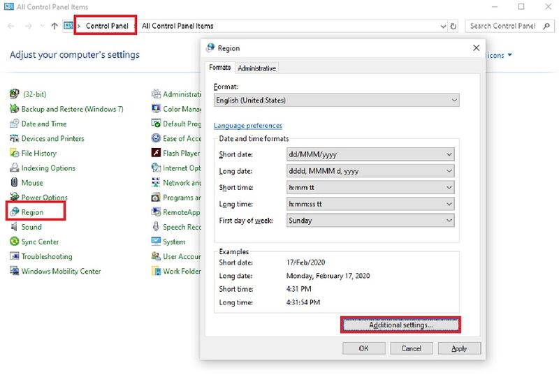

## 1. How do I restore missing Code and Employee Name columns in the Month Payroll screen?

**Issue:**

The **Code** and **Employee Name** columns are missing from the grid.

**Solution:**

Click on top left column header and make sure **Code** and **Name** columns are checked.

## 2. Error: Dataset "CalendarInfo" does not exist when batch emailing with a customized payslip format

**Issue:**

An error message appears when trying to **Export to E-Mail Client (Batch)** using a **customized payslip format**.

**Solution:**

In the Payslip Report Designer:

    Change `[<Profile."RegisterNo">]` to `[<Profile."BRN">]`

    

After the correction, it should look like the screenshot below.

    

## 3. Where can I define the company leave policy?

**Solution:**

1. Configure the leave policy at **Leave > Maintain Leave Group...**

## 4. Why is the date format displaying incorrectly in some payroll reports?

**Issue:**

The date format in reports (e.g., Government Reports > Print Income Tax PCB 2 (II)) is incorrect. How can I fix this?

**Solution:**

1. Go to **Control Panel**.
2. Search for **Region**.
3. Click on **Additional Settings...**

   

4. Click the **Date** tab.

5. Change the **Short Date Format** to `DD/MM/YYYY`.

6. The date format should now display correctly.

   

   

## 5. How to compare the Previous Month Payroll Of Employees?

**Issue:**

How do I generate a comparison of an employee's payroll against previous months?

**Solution:**

To compare an employee's payroll across past months, use the **Yearly Individual Report**.

1. Go to **Payroll** > **Print Yearly Individual Report**.

    

2. Set the month you want to compare. For example, to compare August 2021 with July 2021, set the **Month** to `8` and **Year** to `2021`.

3. Click **Apply**.

    

4. You will see the yearly earnings for each employee. Click on the employee’s name to see the breakdown.

    

5. Click the small **+** icon to expand the row and view details for allowances and overtime.

    

6. Click the **Preview** icon to generate a comparison report.

    

7. The report will show a comparison between the two months.

    

## 6. How to Enter Opening Balance in SQL Payroll?

**Issue:**

How do I enter the **Opening Balance** for employees in SQL Payroll?

**Solution:**

Entering an employee's opening balance is necessary when the employee joins the company in a month **later than January**.

The previous PCB amount **must be entered** so the system can correctly calculate the monthly PCB deduction.

1. Navigate to **Payroll** > **Open Payroll**.

   

2. Double-click the payroll year to open it.

   

3. Double-click the transaction section under "**Opening**".

   

4. Select the employee by double-clicking on their name.

   

5. Enter all the employee’s opening balance information.

   

   :::info
   - For the **General** section, enter information according to the EA form.
   - For other sections, verify if the employee had these contributions in their previous employment.
   :::

### Mapping SQL "Opening" to EA Form

### Special Note for Additional EPF and PCB

- Additional EPF and additional PCB are used when additional remuneration (bonus, commission, paid leave) is given.
- In the EA form, normal EPF and additional EPF is group into one.
- However, SQL recommend users to split the amount for a more detail input.

## 7. How to apply Recurring Payroll?

:::info
This allows you to repeat the same payment amounts (allowance, overtime, etc.) for the next month if you have already entered them for the current month's payroll.
:::

**Issue:**

How do I set up **recurring payroll** so that allowances, overtime, or advance payments auto-populate in the subsequent month's payroll?

**Solution:**

1. Right-click on the previous month’s payroll > **Open** > **Open Overtime**.

   

2. Select all Overtime entries by clicking on them while holding the **SHIFT** key.

   

3. Right-click and select **Copy**.

   

4. Go to **Payroll** > **Open Pending Payroll** and select **Overtime**.

   

5. Right-click in the white area and select **Paste**.

   

6. Select all the entries by clicking on them while holding the **SHIFT** key. Then, right-click and select **Batch Edit Value**.

   

7. Change the **Column** to "Post Date".

   

8. Enter the post date for the next month’s payroll and click **Execute**.

   

9. Click **OK** and close the window.

   

10. You will see that the Post Date has changed. Click **Save**. The changes are successfully saved when the icon turns grey.

    

11. When you process your next month’s payroll, it will capture these values.

    For example, September 2021’s month-end copied from August 2021:

    

12. Repeat the same steps for allowances.
