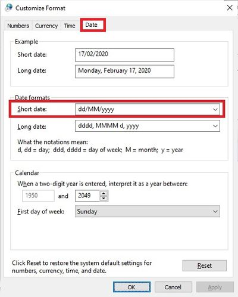

## 1. How to solve when missing code and employee name columns in the month payroll screen?

**Issue:**

**Solution:**

## 2. Error message dataset "CalendarInfo" does not exist when batch email using customize payslip format

**Issue:**

Error message prompt when try to **Export to E-Mail Client (Batch)** using **customize payslip format**.

**Solution:**

At payslip report designer,

    Change the [\<Profile."RegisterNo"\>] to [\<Profile."BRN"\>]

    

After correction, it will be look like the screenshot below.

    

## 3. Where to define the company leave policy?

**Solution:**

1. Preset the leave policy at **Leave | Maintain Leave Group...**

## 4. Why date format not display correctly in some payroll report?

**Issue:**

What is the faster solution to show the date format correctly?

Government Reports | Print Income Tax PCB 2 (II)

**Solution:**

1. Go to Control Panel.
2. Search for Region in Control Panel.
3. Click on Additional Settings...

   

4. Click to Date tab.

5. Change the Short Date Format to DD/MM/YYYY

5. Date format has display correctly now.

   

6. Date format has display correctly now.

   

## 5. How to compare the Previous Month Payroll Of Employees?

**Issue:**

What is the approach to compare the **previous month payroll of employees**?

**Solution:**

If you want to compare your employee past months payrolls you can use out Yearly Individual Report.

1. Go to **Payroll** > **Print Yearly Individual Report**.

    

2. Set which month you want to compare. If you want to compare August 2021 with July 2021, set the Month as 8 and Year as 2021.

3. Press Apply button.

    

4. You will see the yearly earning for each employee. Click on the employee’s name to see their breakdown.

    

5. Press the small + icon to expand the row and see the details for allowances and overtimes

    

6. Press the preview icon to generate a comparison report.

    

7. The report will compare in 2 months (Aug 2021 vs Jul 2021).

    

## 6. How to Enter Opening Balance in SQL Payroll?

**Issue:**

How to key in **Opening Balance** for employees in SQL Payroll?

**Solution:**

Maintain employee’s opening balance is done when the respective employee enter the company in a month **later than January**.

The previous PCB amount is **needed to key in so that the system can correctly calculate** the PCB amount that’s needed to pay every month.

1. Navigate to **Payroll** > **Open Payroll**

   

2. Double click on the payroll year to open it

   

3. Double click on the transaction section under "**Opening**"

   

4. Select the employee by double clicking on its name

   

5. Key in all the employee’s opening balance information

   

   :::info

   For the General part can enter information accordign to the EA form
   For others part Employee need to know whether they have any of it in previous employment
   :::

### Mapping of SQL "opening" to EA form

### Special note for additional EPF and PCB

- Additional EPF and additional PCB are used when additional remuneration (bonus, commission, paid leave) is given.
- In the EA form, normal EPF and additional EPF is group into one.
- However, SQL recommend users to split the amount for a more detail input.

## 7. How to apply Recurring Payroll?

:::info
This allow you to repeat the same amount of payment for the next month if you have already keyed in the advance payment, allowance or overtime for one month’s month end payroll
:::

**Issue:**

How to enable **recurring payroll** so that allowances/overtime/advance payments auto-populate in subsequent month’s payroll?

**Solution:**

1. Right click on previous month’s payroll > **Open** > **Open Overtime**

   

2. Highlight all the Overtimes by clicking on the entries while pressing down on the SHIFT button.

   

3. Right click and then Copy

   

4. Go to **Payroll** > **Open Pending Payroll** and select Overtime

   

5. Right-click on the white area and select paste

   

6. Select all the entries by clicking on it while pressing down on the SHIFT button. then right- click and select “batch edit value”.

   

7. Change the Column to “Post Date”

   

8. Key in the post date of you next month’s payroll and press Execute.

   

9. Press OK and Close the window.

   

10. You will see that the Post Date has change. Press Save. The changes have been successfully saved once the icon turns grey colour.

    

11. When you process your next month’s payroll. It will capture these values.

    For example, in September 2021’s month end copied from August 2021:

    

12. Repeat the same steps for allowances, and advance payments.
