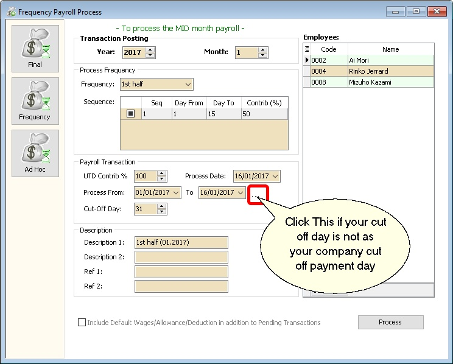
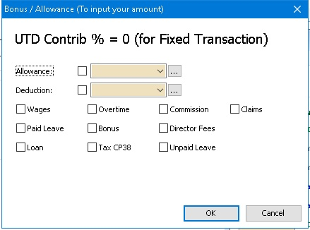
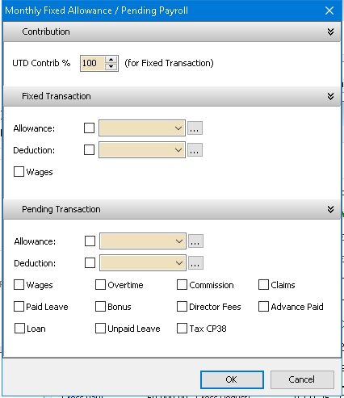

## Create Payroll

### Final Process

Enable to process the Month Pay Salary and Final Pay Salary.

1. Click into **Payroll** and look for **New Payroll**.

   :::tip
   Certain company their payroll cut off date will not in the month end, some of the company will according to the 26th of the month, so you can preset your own company payroll cut off date through the "..." button.
   :::

   

2. Click on the **Process** option.

### Frequency Process

To process mid month salary payroll. The salary payout is based on average % of the Fixed Salary.

Not the last Pay of the Month.

### Ad Hoc Process

To process Mid Month Ad Hoc Payroll

Default this option
- All(PCB,Socso,EPF) Contribution for Fixed Transaction will be 0
- Value will be 0 (Zero) & user need to self enter a value for All/Selected Employee

In this option allow the user to self control the Contribution (default 100%) for Fixed Transaction.

In other word if (eg Bonus with PCB (A) only just set Contribution to 0%)

## Open Payroll

:::info
Once you have created the payroll and you wish to view whatever you have did, then you can make some amendment.
:::

1. Navigate to **Payroll** > **Open Payroll**. Alternatively, access it from the home page by clicking **Open Payroll**

   

2. Select employee, double click your employee name to check on its individual’s amount

   

   :::info
   You can process 2 month end in the same day also. Initially, you can choose to tick those first batch employees.

   While processing the 2nd batch, you can tick the 2nd batch of users.

   Example:

   **BATCH 1**

   

   

   **BATCH 2**

   

   
   :::

## Open Pending Payroll

:::tip
Before you process the month end, you can use open pending payroll to key-in all others add hoc info like extra allowance, overtime, claim etc.
:::

1. Go to **Payroll** > **Open Pending Payroll**.

    

2. Double Click on the info that you want to input, eg: Overtime.

    

3. Insert the overtime info accordingly

    1. Press on the ➕ button to add new overtime.

        

    2. Insert the info accordingly like employee, overtime code, work unit etc

        

    3. Once update accordingly then save.

        

4. Once finish the update you may process the month end and observe the result.

    
