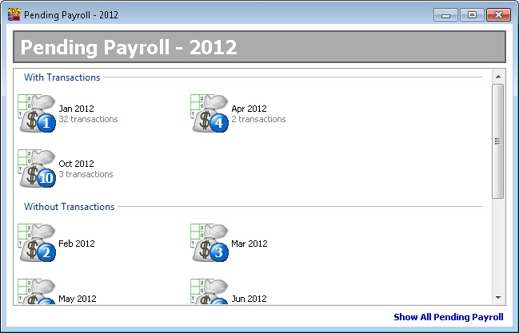
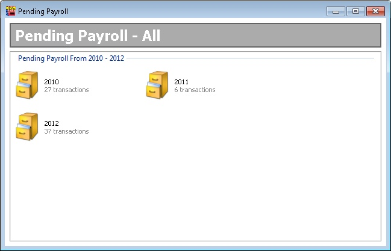
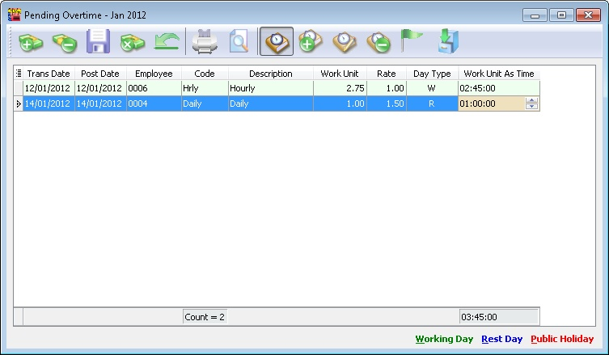
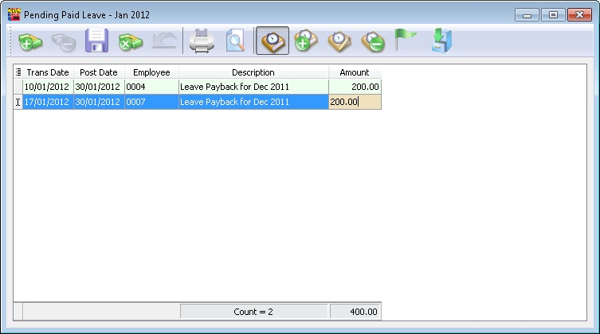
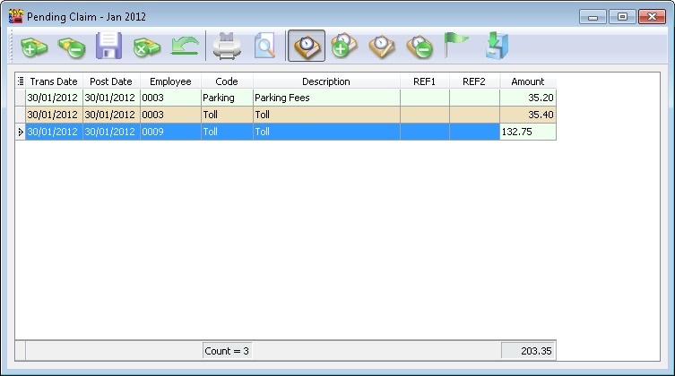
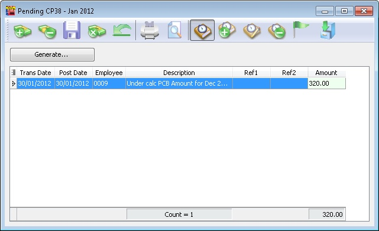
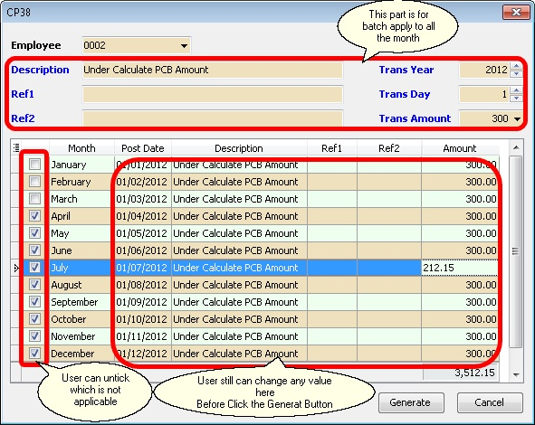
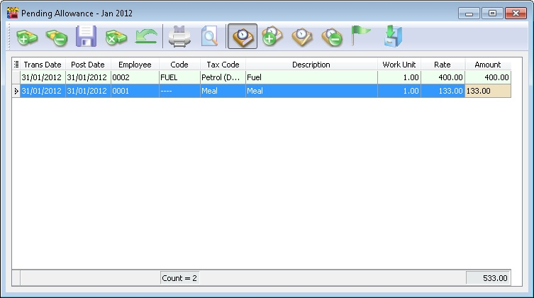
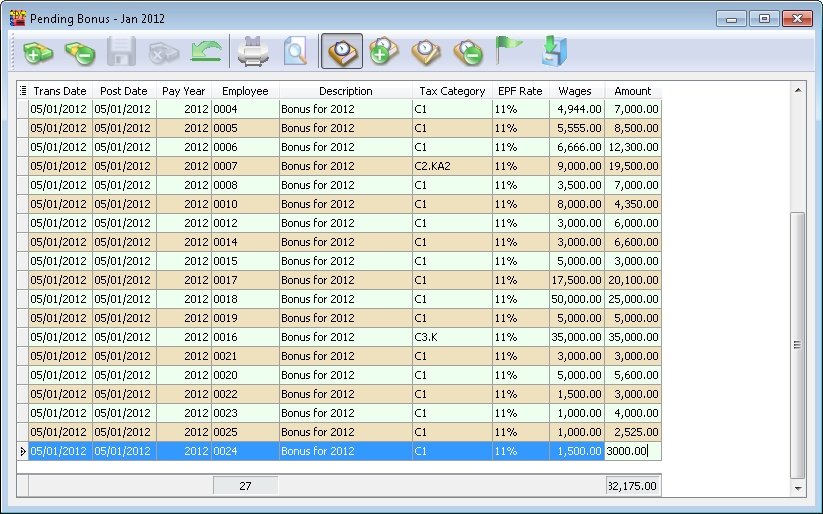
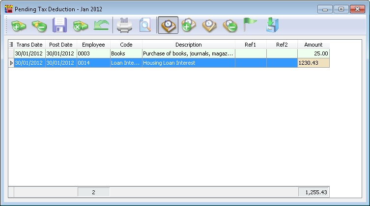

## Create Payroll

### Final Process

Enable to process the Month Pay Salary and Final Pay Salary.

1. Click into **Payroll** and look for **New Payroll**.

   :::tip
   Certain company their payroll cut off date will not in the month end, some of the company will according to the 26th of the month, so you can preset your own company payroll cut off date through the "..." button.
   :::

   

2. Click on the **Process** option.

### Frequency Process

To process mid month salary payroll. The salary payout is based on average % of the Fixed Salary.

Not the last Pay of the Month.

### Ad Hoc Process

To process Mid Month Ad Hoc Payroll

Default this option
- All(PCB,Socso,EPF) Contribution for Fixed Transaction will be 0
- Value will be 0 (Zero) & user need to self enter a value for All/Selected Employee

In this option allow the user to self control the Contribution (default 100%) for Fixed Transaction.

In other word if (eg Bonus with PCB (A) only just set Contribution to 0%)

## Open Payroll

:::info
Once you have created the payroll and you wish to view whatever you have did, then you can make some amendment.
:::

1. Navigate to **Payroll** > **Open Payroll**. Alternatively, access it from the home page by clicking **Open Payroll**

   

2. Select employee, double click your employee name to check on its individual’s amount

   

   :::info
   You can process 2 month end in the same day also. Initially, you can choose to tick those first batch employees.

   While processing the 2nd batch, you can tick the 2nd batch of users.

   Example:

   **BATCH 1**

   

   

   **BATCH 2**

   

   
   :::

## Open Pending Payroll

:::tip
Before you process the month end, you can use open pending payroll to key-in all others add hoc info like extra allowance, overtime, claim etc.
:::

- This is for the user to prepare the transaction (eg Overtime, Deduction) before Processing the Payroll...
- Available Pending Type Transactions

<table>
  <tr>
    <td>Wages</td><td>Allowance</td><td>Tax Deduction</td><td>Overtime</td>
  </tr>
  <tr>
    <td>Deduction</td><td>Advance Paid</td><td>Claims</td><td>Loan</td>
  </tr>
  <tr>
    <td>CP38</td><td>Advance Deduct</td><td>Bonus</td><td>Paid Leave</td>
  </tr>
  <tr>
    <td>Director Fees</td><td>Unpaid Leave</td><td>Tax Benefit</td><td>Commission</td>
  </tr>
</table>

- After all the Pending had enter user may go either below step to for next step except Pending Advance Paid
    - New Payroll | Final Process
    - New_Payroll | Ad Hoc Process
- For Pending Advance Paid must use New_Payroll | Ad Hoc Process then only can use New Payroll | Final Process

### Steps

1. Go to **Payroll** > **Open Pending Payroll**.

    

2. Double Click on the info that you want to input, eg: Overtime.

    

3. Insert the overtime info accordingly

    1. Press on the ➕ button to add new overtime.

        

    2. Insert the info accordingly like employee, overtime code, work unit etc

        

    3. Once update accordingly then save.

        

4. Once finish the update you may process the month end and observe the result.

    

### Pending YYYY

- YYYY represents the Year (e.g. if in 2013 will show as Pending 2013).
- To show the pending in Monthly (with & without Transactions).

### Pending Navigator

Show which Pending Type had transactions in the day view.

### Show all Pending Payroll

To show the pending in Yearly (with Transactions).

## Pending Transactions Types

1. Just click the + button on top of the Screen (The Green + and Money icon) to Insert record(s).

2. After done just Click the Blue Diskette icon on top of the Screen to save the record.

### Pending Wages

This is useful for employees to be paid by the number of days they work (i.e. users can add the day when the selected employee comes to work).

### Pending Overtime

### Pending Paid Leave

### Pending Unpaid Leave

### Pending Claim

### Pending CP38

This is generally towards settlement of outstanding taxes.

### Pending Allowance

### Pending Deduction & Pending Commission

Below Example information is applicable for

- Pending Deduction
- Pending Commission

### Pending Bonus & Pending Director Fees
Below Example information is applicable for

- Pending Bonus
- Pending Director Fees

### Pending Advance Paid, Pending Advance Deduct & Pending Loan

Below Example information is applicable for

- Pending Advance Paid
- Pending Advance Deduct (Only View because it derive from Advance Paid after Ad Hoc Process)
- Pending Commission

### Pending Tax Benefit & Pending Tax Deduction

Below Example information is applicable for

- Pending Tax Benefit
- Pending Tax Deduction

