## Create Payroll

### Final Process

Enable to process the Month Pay Salary and Final Pay Salary.

1. Click into **Payroll** and look for **New Payroll**.

   :::tip
   Certain company their payroll cut off date will not in the month end, some of the company will according to the 26th of the month, so you can preset your own company payroll cut off date through the "..." button.
   :::

   

2. Click on the **Process** option.

### Frequency Process

To process mid month salary payroll. The salary payout is based on average % of the Fixed Salary.

Not the last Pay of the Month.

### Ad Hoc Process

To process Mid Month Ad Hoc Payroll

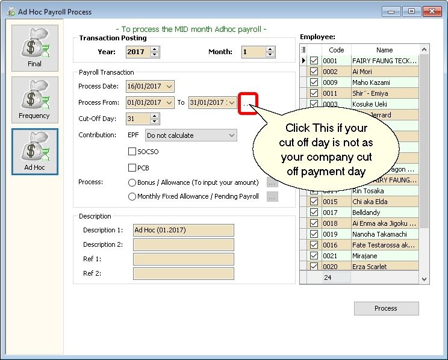

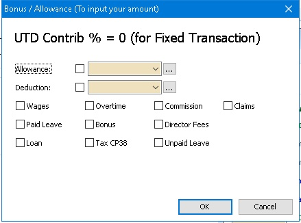

Default this option
- All(PCB,Socso,EPF) Contribution for Fixed Transaction will be 0
- Value will be 0 (Zero) & user need to self enter a value for All/Selected Employee

In this option allow the user to self control the Contribution (default 100%) for Fixed Transaction.

In other word if (eg Bonus with PCB (A) only just set Contribution to 0%)

## Open Payroll

:::info
Once you have created the payroll and you wish to view whatever you have did, then you can make some amendment.
:::

1. Navigate to **Payroll** > **Open Payroll**. Alternatively, access it from the home page by clicking **Open Payroll**

   

2. Select employee, double click your employee name to check on its individual’s amount

   

   :::info
   You can process 2 month end in the same day also. Initially, you can choose to tick those first batch employees.

   While processing the 2nd batch, you can tick the 2nd batch of users.

   Example:

   **BATCH 1**

   

   

   **BATCH 2**

   

   
   :::

## Open Pending Payroll

:::tip
Before you process the month end, you can use open pending payroll to key-in all others add hoc info like extra allowance, overtime, claim etc.
:::

- This is for the user to prepare the transaction (eg Overtime, Deduction) before Processing the Payroll...
- Available Pending Type Transactions

<table>
  <tr>
    <td>Wages</td><td>Allowance</td><td>Tax Deduction</td><td>Overtime</td>
  </tr>
  <tr>
    <td>Deduction</td><td>Advance Paid</td><td>Claims</td><td>Loan</td>
  </tr>
  <tr>
    <td>CP38</td><td>Advance Deduct</td><td>Bonus</td><td>Paid Leave</td>
  </tr>
  <tr>
    <td>Director Fees</td><td>Unpaid Leave</td><td>Tax Benefit</td><td>Commission</td>
  </tr>
</table>

- After all the Pending had enter user may go either below step to for next step except Pending Advance Paid
    - New Payroll | Final Process
    - New_Payroll | Ad Hoc Process
- For Pending Advance Paid must use New_Payroll | Ad Hoc Process then only can use New Payroll | Final Process

### Steps

1. Go to **Payroll** > **Open Pending Payroll**.

    

2. Double Click on the info that you want to input, eg: Overtime.

    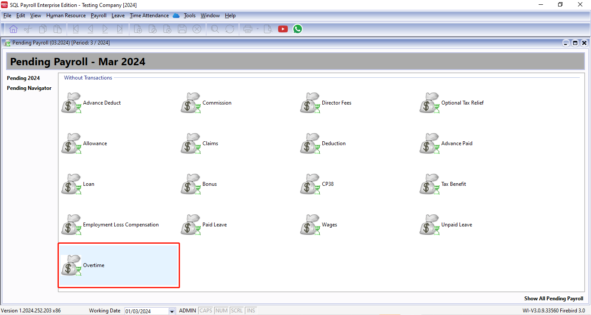

3. Insert the overtime info accordingly

    1. Press on the ➕ button to add new overtime.

        

    2. Insert the info accordingly like employee, overtime code, work unit etc

        

    3. Once update accordingly then save.

        

4. Once finish the update you may process the month end and observe the result.

    

### Pending YYYY

- YYYY represents the Year (e.g. if in 2013 will show as Pending 2013).
- To show the pending in Monthly (with & without Transactions).

### Pending Navigator

Show which Pending Type had transactions in the day view.

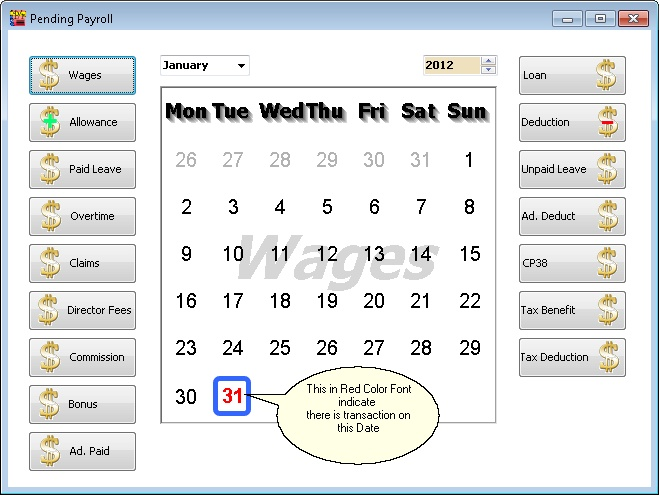

### Show all Pending Payroll

To show the pending in Yearly (with Transactions).

## Pending Transactions Types

1. Just click the + button on top of the Screen (The Green + and Money icon) to Insert record(s).

2. After done just Click the Blue Diskette icon on top of the Screen to save the record.

### Pending Wages

This is useful for employees to be paid by the number of days they work (i.e. users can add the day when the selected employee comes to work).

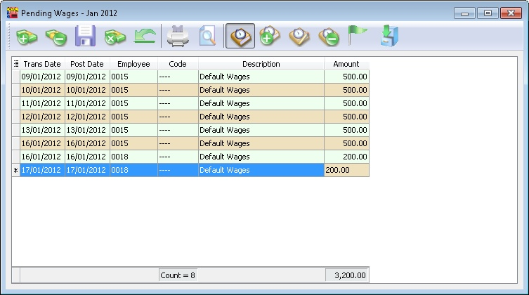

| Field Name | Description | Type / Length / Precision |
|---|---|---|
| Trans Date | Wages transaction date | Date |
| Post Date | Wages posting date | Date |
| Employee | Employee code | Alphanumerical, length 30 |
| Code | Wages type | Alphanumerical, length 20 |
| Description | Wages type description | Alphanumerical, length 160 |
| Amount | Wages amount | Decimal, length 18, precision 2 |

### Pending Overtime

| Field Name | Description | Type / Length / Precision |
|---|---|---|
| Trans Date | Overtime transaction date | Date |
| Post Date | Overtime posting date | Date |
| Employee | Employee code | Alphanumerical, length 30 |
| Code | Overtime type | Alphanumerical, length 20 |
| Description | Overtime type description | Alphanumerical, length 160 |
| Work Unit | It can be in Hours or Day depend what Overtime Type selected and Unit type is set at Maintain Overtime | Decimal, length 18, precision 8 |
| Rate | Overtime rate | Decimal, length 18, precision 8 |
| Day Type | It follow the Post Date to determine the Day Type which is set at Maintain Calender | Alpha, length 1 |
| Work Unit As Time | Overtime entered as time (HH:MM:SS) | Time |

### Pending Paid Leave

| Field Name | Description | Type / Length / Precision |
|---|---|---|
| Trans Date | Paid leave transaction date | Date |
| Post Date | Paid leave posting date | Date |
| Employee | Employee code | Alphanumerical, length 30 |
| Description | Paid leave description | Alphanumerical, length 160 |
| Amount | Paid leave amount | Decimal, length 18, precision 2 |

### Pending Unpaid Leave

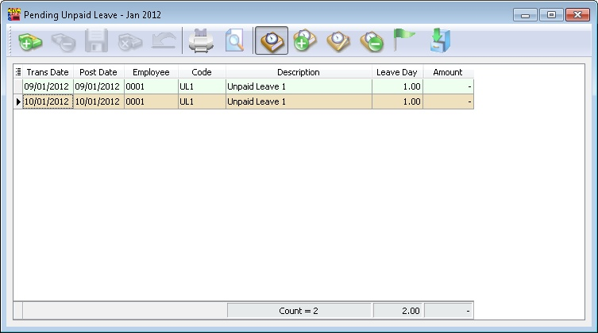

| Field Name | Description | Type / Length / Precision |
|---|---|---|
| Trans Date | Unpaid leave transaction date | Date |
| Post Date | Unpaid leave posting date | Date |
| Employee | Employee code | Alphanumerical, length 30 |
| Code | Unpaid leave type | Alphanumerical, length 20 |
| Description | Unpaid leave type description | Alphanumerical, length 160 |
| Leave Day | Number of unpaid leave days | Decimal, length 18, precision 8 |
| Amount | Unpaid leave amount (Leave blank if want calculated by system) | Decimal, length 18, precision 2 |

### Pending Claim

| Field Name | Description | Type / Length / Precision |
|---|---|---|
| Trans Date | Claim transaction date | Date |
| Post Date | Claim posting date | Date |
| Employee | Employee code | Alphanumerical, length 30 |
| Code | Claim type | Alphanumerical, length 20 |
| Description | Claim type description | Alphanumerical, length 160 |
| Ref1 | Claim reference 1 | Alphanumerical, length 20 |
| Ref2 | Claim reference 2 | Alphanumerical, length 20 |
| Amount | Claim amount | Decimal, length 18, precision 2 |

### Pending CP38

This is generally towards settlement of outstanding taxes.

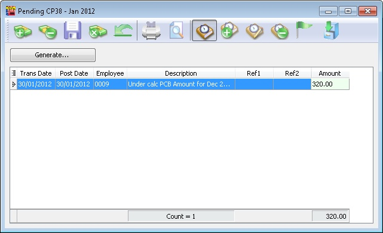

| Field Name | Description | Type / Length / Precision |
|---|---|---|
| Trans Date | CP38 transaction date | Date |
| Post Date | CP38 posting date | Date |
| Employee | Employee code | Alphanumerical, length 30 |
| Description | CP38 description | Alphanumerical, length 160 |
| Ref1 | Reference 1 | Alphanumerical, length 20 |
| Ref2 | Reference 2 | Alphanumerical, length 20 |
| Amount | CP38 amount | Decimal, length 18, precision 2 |
| Generate Button | For Batch Generate CP38 | | 

### Pending Allowance

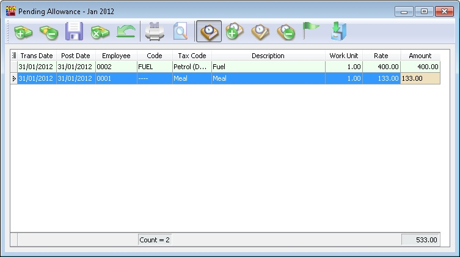

| Field Name | Description | Type / Length / Precision |
|---|---|---|
| Trans Date | Allowance transaction date | Date |
| Post Date | Allowance posting date | Date |
| Employee | Employee code | Alphanumerical, length 30 |
| Code | Allowance type | Alphanumerical, length 20 |
| Tax Code | Tax exemption code | Alphanumerical, length 20 |
| Description | Allowance type description | Alphanumerical, length 160 |
| Work Unit | Allowance unit | Decimal, length 18, precision 8 |
| Rate | Allowance rate | Decimal, length 18, precision 8 |
| Amount | Allowance total amount | Decimal, length 18, precision 2 |

### Pending Deduction & Pending Commission

Below Example information is applicable for

- Pending Deduction
- Pending Commission

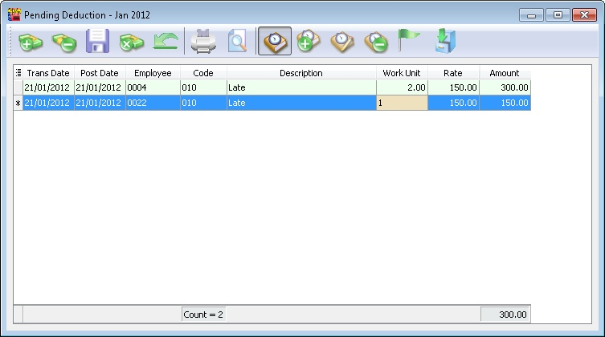

| Field Name | Description | Type / Length / Precision |
|---|---|---|
| Trans Date | Deduction / Commission transaction date | Date |
| Post Date | Deduction / Commission posting date | Date |
| Employee | Employee code | Alphanumerical, length 30 |
| Code | Deduction / Commission type | Alphanumerical, length 20 |
| Description | Deduction / Commission description | Alphanumerical, length 160 |
| Work Unit | Deduction unit | Decimal, length 18, precision 8 |
| Rate | Deduction rate | Decimal, length 18, precision 8 |
| Amount | Deduction total amount | Decimal, length 18, precision 2 |

### Pending Bonus & Pending Director Fees
Below Example information is applicable for

- Pending Bonus
- Pending Director Fees

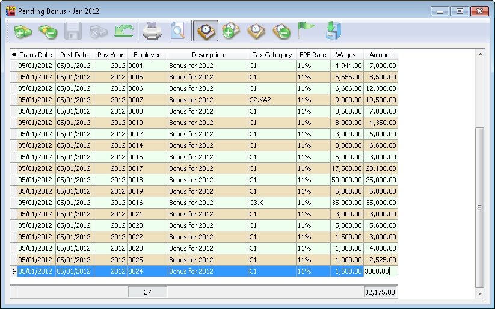

| Field Name | Description | Type / Length / Precision |
|---|---|---|
| Trans Date | Bonus / Director fees transaction date | Date |
| Post Date | Bonus / Director fees posting date | Date |
| Pay Year | Bonus year (Default is same year as Post Date) | Integer |
| Employee | Employee code | Alphanumerical, length 30 |
| Tax Category | Employee tax category | Alphanumerical, length 10 |
| EPF Rate | Bonus EPF rate | Alphanumerical, length 10 |
| Wages | Employee wages amount | Decimal, length 18, precision 2 |
| Amount | Bonus / Director fees amount | Decimal, length 18, precision 2 |

### Pending Advance Paid, Pending Advance Deduct & Pending Loan

Below Example information is applicable for

- Pending Advance Paid
- Pending Advance Deduct (Only View because it derive from Advance Paid after Ad Hoc Process)
- Pending Commission

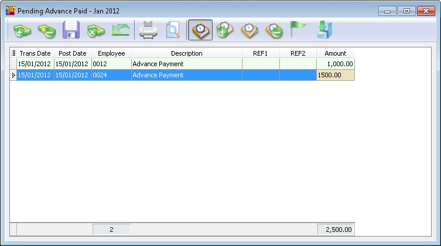

| Field Name | Description | Type / Length / Precision |
|---|---|---|
| Trans Date | Advance / Loan transaction date | Date |
| Post Date | Advance / Loan posting date | Date |
| Employee | Employee code | Alphanumerical, length 30 |
| Description | Description | Alphanumerical, length 160 |
| Ref1 | Reference 1 | Alphanumerical, length 20 |
| Ref2 | Reference 2 | Alphanumerical, length 20 |
| Amount | Advance paid amount | Decimal, length 18, precision 2 |

### Pending Tax Benefit & Pending Tax Deduction

Below Example information is applicable for

- Pending Tax Benefit
- Pending Tax Deduction

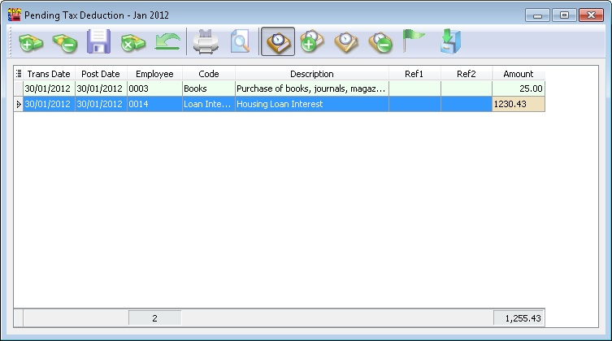

| Field Name | Description | Type / Length / Precision |
|---|---|---|
| Trans Date | Tax deduction / benefit transaction date | Date |
| Post Date | Tax deduction / benefit posting date | Date |
| Employee | Employee code | Alphanumerical, length 30 |
| Code | Tax deduction code | Alphanumerical, length 20 |
| Description | Tax deduction description | Alphanumerical, length 160 |
| Ref1 | Reference 1 | Alphanumerical, length 20 |
| Ref2 | Reference 2 | Alphanumerical, length 20 |
| Amount | Tax deduction description | Decimal, length 18, precision 2 |
