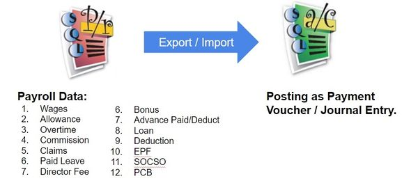
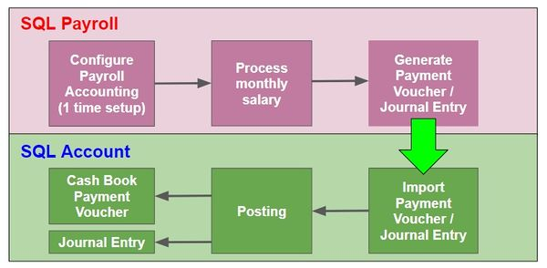
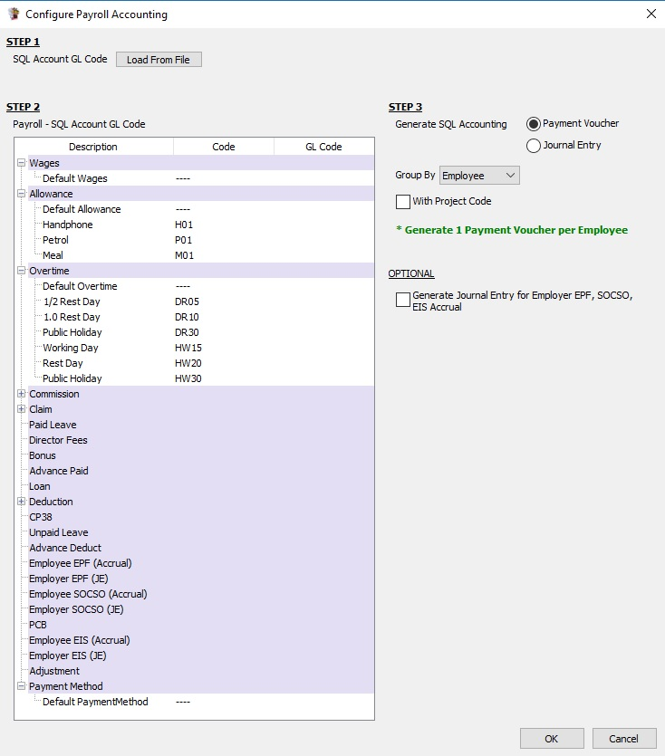
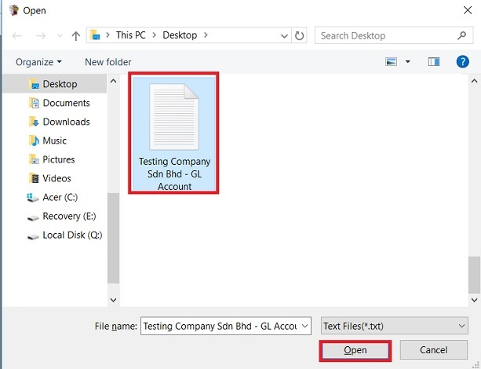
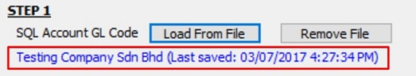
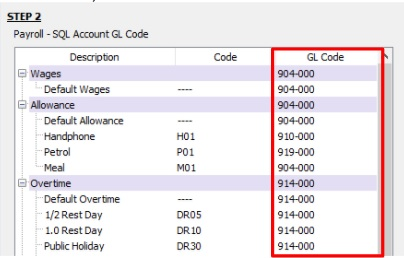

## Introduction

1. To generate the monthly payroll data converted into double entry and get post into SQL Account.
2. It is available in SQL Payroll version 129 and above.
3. It is available to import payroll data in SQL Account version 745 and above.

## Overview of the Process Flow

## Module Require

- Payroll Accounting (SQL Payroll)

## Configure Payroll Accounting (1 time setup)

1. At Generate Payment Voucher / Journal Entry, click on Configure Payroll Accounting.

2. Overview of the Configure Payroll Accounting settings screen.

### Step 1 SQL Account GL Code

1. Click on **Load From File**.

2. Select a SQL Account file (*.txt) and click **Open**.

3. After the SQL Account GL Code has loaded, the company name will be display and ladt saved date and time.

4. Click Remove File button if you wish to load the new chart of account.

### Step 2 GL Account Mapping

1. After load the chart of accounts (in step 1), you are able to lookup and map the GL Account code to wages, allowance, overtime, bonus, etc accordingly.

2. Example of the account mapping:

| Payroll Item              | Account                          | Acc Type |
|---------------------------|----------------------------------|----------|
| Wages                     | Salary                           | P&L      |
| Allowance                 | Allowance, e.g. meal, petrol, parking | P&L  |
| Overtimes                 | Overtimes                        | P&L      |
| Commission                | Sales Commission                 | P&L      |
| Claim                     | Petrol, Toll, other expenses claims | P&L   |
| Paid Leave                | Salary                           | P&L      |
| Director Fees             | Director Fees                    | P&L      |
| Bonus                     | Bonus                            | P&L      |
| Advance Paid              | Salary                           | P&L      |
| Loan                      | Loan                             | B/S      |
| Deduction                 | Salary                           | P&L      |
| CP38                      | Salary                           | P&L      |
| Unpaid Leave              | Salary                           | P&L      |
| Advance Deduct            | Salary                           | P&L      |
| Employee EPF (Accrual)    | EPF Accrual                      | B/S      |
| Employer EPF (JE)         | Employer EPF                     | P&L      |
| Employee SOCSO (Accrual)  | SOCSO Accrual                    | B/S      |
| Employer SOCSO (JE)       | Employer SOCSO                   | P&L      |
| PCB                       | Income Tax (PCB) Accrual         | B/S      |
| Employee EIS (Accrual)    | SOCSO Accrual                    | B/S      |
| Employer EIS (JE)         | Employer EIS / SOCSO             | P&L      |
| Adjustment                | Salary                           | P&L      |
| Payment Method            | Bank Account                     | B/S      |

### Step 3 Posting Method

1. Generate posting entry by Payment Voucher or by Journal Entry.
2. Group by Employee (available in payment voucher), Branch, Department, HR group, or Category.
3. Tick to With Project Code to post the entry with project code.
4. OPTIONAL: Generate Journal Entry for Employer EPF, SOCSO Accrual. (by default is untick). For some company might charge the Employer EPF and SOCSO accrual in next month.

## Generate Payment Voucher / Journal Entry

To generate the Payment Voucher or Journal Entry from SQL Payroll. Click on **Generate**.

1. Login the SQL Account database.
2. Go to File | Data Import (SQL Payroll) | Import Payment Voucher / Journal Entry...

3. Click on Select File from the Payment Voucher/Journal Entry (payroll data) generate from SQL Payroll.
4. Click on Execute.

