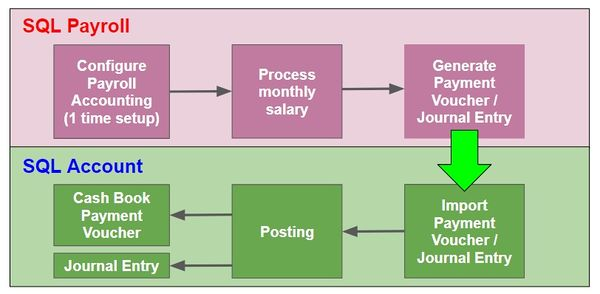
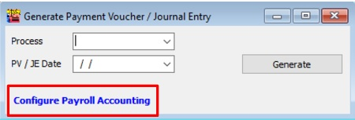

## Introduction

:::success[note]
This is **Additional Module** (Payroll Accounting (SQL Payroll))
:::

1. To generate the monthly payroll data converted into double entry and get post into SQL Account.

2. It is available in **SQL Payroll version 129** and above.

3. It is available to import payroll data in **SQL Account version 745** and above.

## Overview of the Process Flow

## Configure Payroll Accounting (1 time setup)

Go to **Menu : Payroll | Generate Payment Voucher / Journal Entry...**

1. At Generate Payment Voucher / Journal Entry, click on **Configure Payroll Accounting.**

2. Overview of the Configure Payroll Accounting settings screen.

