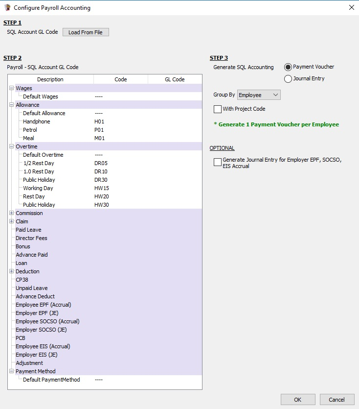
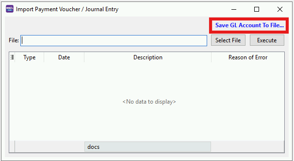
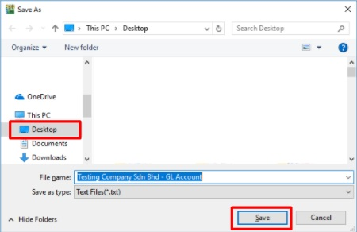
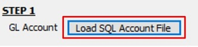
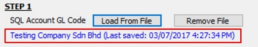
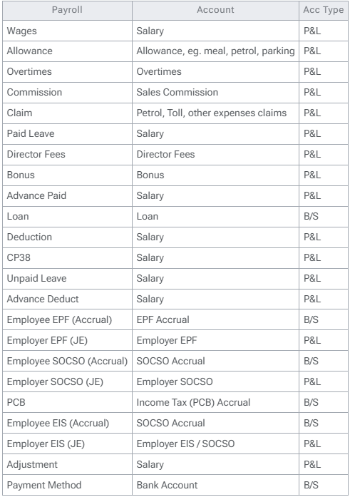
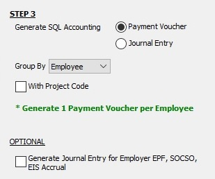
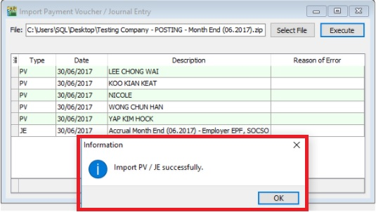

## Introduction

:::success[note]
This is **Additional Module** (Payroll Accounting (SQL Payroll))
:::

1. To generate the monthly payroll data converted into double entry and get post into SQL Account.

2. It is available in **SQL Payroll version 129** and above.

3. It is available to import payroll data in **SQL Account version 745** and above.

## Overview of the Process Flow

## Configure Payroll Accounting (1 time setup)

Go to **Menu : Payroll | Generate Payment Voucher / Journal Entry...**

1. At Generate Payment Voucher / Journal Entry, click on **Configure Payroll Accounting.**

2. Overview of the Configure Payroll Accounting settings screen.

### Step 1: Save GL Account to File (SQL Account)

1. Login the SQL Account database.

2. Go to **File | Import | (SQL Payroll) Import Payment Voucher / Journal Entry | Save GL Account File**

3. Save SQL Account file to Desktop.

### Step 2: SQL Account GL Code

1. Click on **Load From File**.

2. Select a **SQL Account file (*.txt)** and click **Open**.

3. After the SQL Account GL Code has loaded, the company name will be display and ladt saved date and time.

4. Click Remove File button if you wish to load the new chart of account.

### Step 3: GL Account Mapping

1. After load the chart of accounts (in step 2), you are able to lookup and **map the GL Account code** to wages, allowance, overtime, bonus, etc accordingly.

2. Example of the account mapping:

### Step 4: Posting Method

1. Generate posting entry by **Payment Voucher** or by **Journal Entry**.

2. Group by **Employee** (available in payment voucher), **Branch, Department, HR group, or Category**.

3. Tick to **With Project Code** to post the entry with project code.

4. OPTIONAL: Generate Journal Entry for Employer EPF, SOCSO Accrual **(by default is untick)**. For some company might charge the Employer EPF and SOCSO accrual in next month.

## Generate Payment Voucher / Journal Entry

To generate the Payment Voucher or Journal Entry from SQL Payroll. Click on **Generate**.

## Import Payment Voucher / Journal Entry

1. Login the SQL Account database.

2. Go to **File | Import | (SQL Payroll) Import Payment Voucher / Journal Entry...**

3. Click on **Select File** from the Payment Voucher/Journal Entry (payroll data) generate from SQL Payroll.

4. Click on **Execute**.

