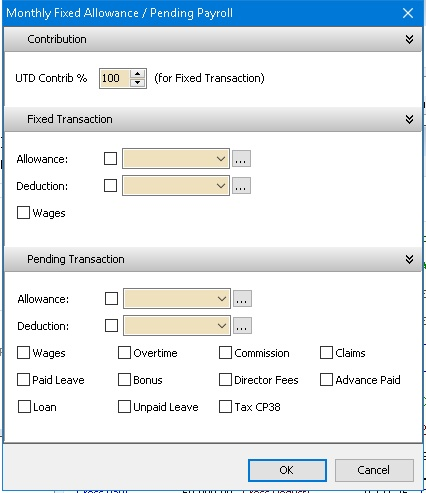
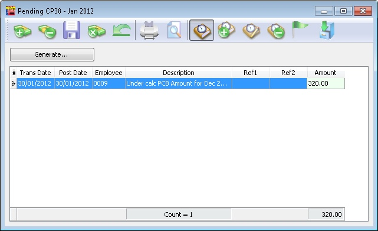
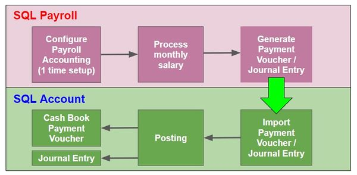
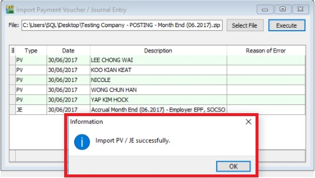

## Create Payroll

### Maintain Employee's Opening Balance

- Maintaining an employee’s opening balance is necessary when the employee joins the company in a month **later than January**.
- The previous PCB amount **must be entered so that the system can correctly calculate** the PCB amount payable each month.

1. Navigate to **Open Payroll**.

    

2. Double click the year in Open Payroll

    

3. Double click the transaction under ‘Opening’

    

4. Select the employee by double clicking on the name

    

5. Key in all the employee’s opening balance information

    

#### Mapping of SQL 'opening' to EA form

#### Special Note for Additional EPF and Additional PCB

- Additional EPF and Additional PCB are used when additional remuneration (e.g., bonus, commission, paid leave) is given.
- In the EA form, normal EPF and additional EPF are grouped into one.
- However, SQL recommends users split the amount for more detailed input.

:::info
Frequency – Used when a company pays salary **twice or more** in **a month**.
:::

### Final Process

This option allows you to process the Monthly Salary and Final Salary.

1. Go to **Payroll** and select **New Payroll**.

    :::tip
    Some companies do not have a month-end payroll cut-off date (e.g., the 26th of the month). You can preset your company's payroll cut-off date using the "..." button.
    :::

    

2. Click on the **Process** option.

### Frequency Process

Used to process mid-month salary payroll. The salary payout is based on an average percentage of the Fixed Salary.

This is not the last pay of the month.

### Ad Hoc Process

Used to process mid-month Ad Hoc Payroll.

**Default Option:**

- All (PCB, SOCSO, EPF) contributions for Fixed Transactions will be 0.
- Values will be 0 (Zero), and the user needs to manually enter a value for all or selected employees.

This option allows the user to control the Contribution (default 100%) for Fixed Transactions.

In other words, if you have a Bonus with PCB (A) only, just set the Contribution to 0%.

## Open Payroll

:::info
Once you have created the payroll, you can view your actions and make amendments if necessary.
:::

1. Navigate to **Payroll** > **Open Payroll**. Alternatively, access it from the home page by clicking **Open Payroll**.

    

2. Select an employee and double-click their name to check individual amounts.

    

    :::info
    You can process two month-ends on the same day. Initially, you can choose to check the first batch of employees.

    When processing the second batch, you can check the second batch of users.

    Example:

    **BATCH 1**

    

    

    **BATCH 2**

    

    
    :::

## Open Pending Payroll

:::tip
Before processing the month-end, you can use Open Pending Payroll to enter all other ad hoc info like extra allowance, overtime, claims, etc.
:::

- This allows the user to prepare transactions (e.g., Overtime, Deduction) before processing the payroll.
- Available Pending Type Transactions:

  - Wages, Allowance, Tax Deduction, Overtime
  - Deduction, Advance Paid, Claims, Loan
  - CP38, Advance Deduct, Bonus, Paid Leave
  - Director Fees, Unpaid Leave, Tax Benefit, Commission

- After entering all pending transactions, the user may proceed to the next step using either:
  - New Payroll > Final Process
  - New Payroll > Ad Hoc Process
- **Note:** For Pending Advance Paid, you must use **New Payroll > Ad Hoc Process** before using **New Payroll > Final Process**.

### Steps

1. Go to **Payroll** > **Open Pending Payroll**.

    

2. Double-click on the info you want to input, e.g., Overtime.

    

3. Insert the overtime info accordingly:

    1. Click the ➕ button to add new overtime.

        

    2. Insert the info accordingly, such as employee, overtime code, work unit, etc.

        

    3. Once updated, click **Save**.

        

4. Once the update is finished, you may process the month-end and observe the result.

    

### Pending YYYY

- YYYY represents the Year (e.g. if in 2013 will show as Pending 2013).
- To show the pending in Monthly (with & without Transactions).

### Pending Navigator

Show which Pending Type had transactions in the day view.

### Show all Pending Payroll

To show the pending in Yearly (with Transactions).

## Pending Transactions Types

1. Click the **+** button at the top of the screen (The Green + and Money icon) to insert record(s).

2. After completion, click the **Blue Diskette** icon at the top of the screen to save the record.

### Pending Wages

This is useful for employees paid by the number of days they work (i.e., users can add the days when the selected employee comes to work).

| Field Name  | Description            | Type / Length / Precision       |
| ----------- | ---------------------- | ------------------------------- |
| Trans Date  | Wages transaction date | Date                            |
| Post Date   | Wages posting date     | Date                            |
| Employee    | Employee code          | Alphanumerical, length 30       |
| Code        | Wages type             | Alphanumerical, length 20       |
| Description | Wages type description | Alphanumerical, length 160      |
| Amount      | Wages amount           | Decimal, length 18, precision 2 |

### Pending Overtime

| Field Name        | Description                                                                                            | Type / Length / Precision       |
| ----------------- | ------------------------------------------------------------------------------------------------------ | ------------------------------- |
| Trans Date        | Overtime transaction date                                                                              | Date                            |
| Post Date         | Overtime posting date                                                                                  | Date                            |
| Employee          | Employee code                                                                                          | Alphanumerical, length 30       |
| Code              | Overtime type                                                                                          | Alphanumerical, length 20       |
| Description       | Overtime type description                                                                              | Alphanumerical, length 160      |
| Work Unit         | It can be in Hours or Day depend what Overtime Type selected and Unit type is set at Maintain Overtime | Decimal, length 18, precision 8 |
| Rate              | Overtime rate                                                                                          | Decimal, length 18, precision 8 |
| Day Type          | It follow the Post Date to determine the Day Type which is set at Maintain Calender                    | Alpha, length 1                 |
| Work Unit As Time | Overtime entered as time (HH:MM:SS)                                                                    | Time                            |

### Pending Paid Leave

| Field Name  | Description                 | Type / Length / Precision       |
| ----------- | --------------------------- | ------------------------------- |
| Trans Date  | Paid leave transaction date | Date                            |
| Post Date   | Paid leave posting date     | Date                            |
| Employee    | Employee code               | Alphanumerical, length 30       |
| Description | Paid leave description      | Alphanumerical, length 160      |
| Amount      | Paid leave amount           | Decimal, length 18, precision 2 |

### Pending Unpaid Leave

| Field Name  | Description                                                    | Type / Length / Precision       |
| ----------- | -------------------------------------------------------------- | ------------------------------- |
| Trans Date  | Unpaid leave transaction date                                  | Date                            |
| Post Date   | Unpaid leave posting date                                      | Date                            |
| Employee    | Employee code                                                  | Alphanumerical, length 30       |
| Code        | Unpaid leave type                                              | Alphanumerical, length 20       |
| Description | Unpaid leave type description                                  | Alphanumerical, length 160      |
| Leave Day   | Number of unpaid leave days                                    | Decimal, length 18, precision 8 |
| Amount      | Unpaid leave amount (Leave blank if want calculated by system) | Decimal, length 18, precision 2 |

### Pending Claim

| Field Name  | Description            | Type / Length / Precision       |
| ----------- | ---------------------- | ------------------------------- |
| Trans Date  | Claim transaction date | Date                            |
| Post Date   | Claim posting date     | Date                            |
| Employee    | Employee code          | Alphanumerical, length 30       |
| Code        | Claim type             | Alphanumerical, length 20       |
| Description | Claim type description | Alphanumerical, length 160      |
| Ref1        | Claim reference 1      | Alphanumerical, length 20       |
| Ref2        | Claim reference 2      | Alphanumerical, length 20       |
| Amount      | Claim amount           | Decimal, length 18, precision 2 |

### Pending CP38

This is generally towards settlement of outstanding taxes.

| Field Name      | Description             | Type / Length / Precision       |
| --------------- | ----------------------- | ------------------------------- |
| Trans Date      | CP38 transaction date   | Date                            |
| Post Date       | CP38 posting date       | Date                            |
| Employee        | Employee code           | Alphanumerical, length 30       |
| Description     | CP38 description        | Alphanumerical, length 160      |
| Ref1            | Reference 1             | Alphanumerical, length 20       |
| Ref2            | Reference 2             | Alphanumerical, length 20       |
| Amount          | CP38 amount             | Decimal, length 18, precision 2 |
| Generate Button | For Batch Generate CP38 |                                 |

### Pending Allowance

| Field Name  | Description                | Type / Length / Precision       |
| ----------- | -------------------------- | ------------------------------- |
| Trans Date  | Allowance transaction date | Date                            |
| Post Date   | Allowance posting date     | Date                            |
| Employee    | Employee code              | Alphanumerical, length 30       |
| Code        | Allowance type             | Alphanumerical, length 20       |
| Tax Code    | Tax exemption code         | Alphanumerical, length 20       |
| Description | Allowance type description | Alphanumerical, length 160      |
| Work Unit   | Allowance unit             | Decimal, length 18, precision 8 |
| Rate        | Allowance rate             | Decimal, length 18, precision 8 |
| Amount      | Allowance total amount     | Decimal, length 18, precision 2 |

### Pending Deduction & Pending Commission

Below Example information is applicable for

- Pending Deduction
- Pending Commission

| Field Name  | Description                             | Type / Length / Precision       |
| ----------- | --------------------------------------- | ------------------------------- |
| Trans Date  | Deduction / Commission transaction date | Date                            |
| Post Date   | Deduction / Commission posting date     | Date                            |
| Employee    | Employee code                           | Alphanumerical, length 30       |
| Code        | Deduction / Commission type             | Alphanumerical, length 20       |
| Description | Deduction / Commission description      | Alphanumerical, length 160      |
| Work Unit   | Deduction unit                          | Decimal, length 18, precision 8 |
| Rate        | Deduction rate                          | Decimal, length 18, precision 8 |
| Amount      | Deduction total amount                  | Decimal, length 18, precision 2 |

### Pending Bonus & Pending Director Fees

Below Example information is applicable for

- Pending Bonus
- Pending Director Fees

| Field Name   | Description                                    | Type / Length / Precision       |
| ------------ | ---------------------------------------------- | ------------------------------- |
| Trans Date   | Bonus / Director fees transaction date         | Date                            |
| Post Date    | Bonus / Director fees posting date             | Date                            |
| Pay Year     | Bonus year (Default is same year as Post Date) | Integer                         |
| Employee     | Employee code                                  | Alphanumerical, length 30       |
| Tax Category | Employee tax category                          | Alphanumerical, length 10       |
| EPF Rate     | Bonus EPF rate                                 | Alphanumerical, length 10       |
| Wages        | Employee wages amount                          | Decimal, length 18, precision 2 |
| Amount       | Bonus / Director fees amount                   | Decimal, length 18, precision 2 |

### Pending Advance Paid, Pending Advance Deduct & Pending Loan

Below Example information is applicable for

- Pending Advance Paid
- Pending Advance Deduct (Only View because it derive from Advance Paid after Ad Hoc Process)
- Pending Commission

| Field Name  | Description                     | Type / Length / Precision       |
| ----------- | ------------------------------- | ------------------------------- |
| Trans Date  | Advance / Loan transaction date | Date                            |
| Post Date   | Advance / Loan posting date     | Date                            |
| Employee    | Employee code                   | Alphanumerical, length 30       |
| Description | Description                     | Alphanumerical, length 160      |
| Ref1        | Reference 1                     | Alphanumerical, length 20       |
| Ref2        | Reference 2                     | Alphanumerical, length 20       |
| Amount      | Advance paid amount             | Decimal, length 18, precision 2 |

### Pending Tax Benefit & Pending Tax Deduction

Below Example information is applicable for

- Pending Tax Benefit
- Pending Tax Deduction

| Field Name  | Description                              | Type / Length / Precision       |
| ----------- | ---------------------------------------- | ------------------------------- |
| Trans Date  | Tax deduction / benefit transaction date | Date                            |
| Post Date   | Tax deduction / benefit posting date     | Date                            |
| Employee    | Employee code                            | Alphanumerical, length 30       |
| Code        | Tax deduction code                       | Alphanumerical, length 20       |
| Description | Tax deduction description                | Alphanumerical, length 160      |
| Ref1        | Reference 1                              | Alphanumerical, length 20       |
| Ref2        | Reference 2                              | Alphanumerical, length 20       |
| Amount      | Tax deduction description                | Decimal, length 18, precision 2 |

## Example of Creating Open Pending Payroll

### Advance Paid

:::info
Employee requests advance salary before month-end.
:::

1. Navigate to **Payroll > Open Pending Payroll**.

2. Select **Advance Paid**.

    

3. **Enter the details accordingly:**

    > **_Trans date_** = Date of advance payment application
    >
    > **_Employee_** = Select the employee
    >
    > **_Amount_** = Amount of advance payment

    

4. Go to **Payroll > New Payroll**.

5. Choose **Ad Hoc**.

6. Set the date when the employee takes the advance payment.

7. Under **Process**, select **Monthly Fixed Allowance / Pending Payroll** (a dialog box will appear as shown below).

8. Check **"Advanced Paid"**.

    

9. Click **Process**.

    

10. Process Month End Payroll as usual; you will find an advance deduction at the month-end.

    

### Bonus

1. Navigate to **Payroll** > **Open Pending Payroll**.

    

2. Click on **Bonus**.

    

3. Next, adjust the bonus for your employee:

    

    1. Click **Add**.
    2. Select your employee.
    3. Enter the amount.
    4. Click **Save**.

4. Go to **Payroll** > **New Payroll** and click on **Ad Hoc**.

    

5. Check **EPF** if you want to deduct EPF, and check **PCB** if you want to deduct PCB.

    

6. Check **Bonus / Allowance** (to input your amount).

    

7. Change the Description (Optional) and check the employee you are rewarding with a bonus.

    

8. Complete the process and check the payslip.

    

### CP38

- CP38 is an **instruction** to deduct salary **issued by LHDN**. This CP38 instruction requires the employer to **make additional deductions in monthly installments** from the taxpayer's salary (other than a Monthly Tax Deduction) towards the settlement of the taxpayer’s income tax arrears.
- The Salary Deduction Order (CP38) for tax payment in installments aims to ease the burden **on the taxpayer**, who would otherwise have to pay the tax arrears in one lump sum under the Income Tax Act 1967.

1. **Open Pending Payroll** and choose **CP38**.

    

2. Click **GENERATE** at the top left of the window.

    

3. Enter the Amount you received from the LHDN Letter. For example, if employee (00001- Lucious) has to pay CP38 in **June (RM450)** and **July (RM550)**, enter these amounts. Click **GENERATE**.

    

4. Click **SAVE**.

    

5. This **pending** task only needs to be completed **once**. It will impact **both the June and July month-end processes**. The following pictures illustrate the end result:

    

## Generate Payment Voucher / Journal Entry

:::success[note]
This is an **Additional Module** (Payroll Accounting (SQL Payroll)).
:::

1. This module generates monthly payroll data converted into double entry and posts it into SQL Account.

2. It is available in **SQL Payroll version 129** and above.

3. It is available to import payroll data in **SQL Account version 745** and above.

    

### Overview of the Process Flow

### Configure Payroll Accounting (One-time Setup)

Go to **Menu: Payroll > Generate Payment Voucher / Journal Entry...**

1. At Generate Payment Voucher / Journal Entry, click on **Configure Payroll Accounting**.

    

2. Overview of the Configure Payroll Accounting settings screen.

    

#### Step 1: Save GL Account to File (SQL Account)

1. Login to the SQL Account database.

2. Go to **File > Import > (SQL Payroll) Import Payment Voucher / Journal Entry > Save GL Account File**.

    

    

3. Save the SQL Account file to the Desktop.

    

#### Step 2: SQL Account GL Code

1. Click on **Load From File**.

    

2. Select a **SQL Account file (\*.txt)** and click **Open**.

    

3. After the SQL Account GL Code has loaded, the company name and the last saved date and time will be displayed.

    

4. Click the **Remove File** button if you wish to load a new chart of accounts.

#### Step 3: GL Account Mapping

1. After loading the chart of accounts (in Step 2), you can lookup and **map the GL Account code** to wages, allowance, overtime, bonus, etc., accordingly.

    

2. Example of account mapping:

    

#### Step 4: Posting Method

1. Generate posting entry by **Payment Voucher** or by **Journal Entry**.

2. Group by **Employee** (available in payment voucher), **Branch, Department, HR Group, or Category**.

3. Check **With Project Code** to post the entry with a project code.

4. **OPTIONAL:** Generate Journal Entry for Employer EPF, SOCSO Accrual **(unchecked by default)**. Some companies may charge the Employer EPF and SOCSO accrual in the next month.

    

### Generate Payment Voucher / Journal Entry (Export)

To generate the Payment Voucher or Journal Entry from SQL Payroll, click on **Generate**.

### Import Payment Voucher / Journal Entry (Import)

1. Login to the SQL Account database.

2. Go to **File > Import > (SQL Payroll) Import Payment Voucher / Journal Entry...**

3. Click on **Select File** and choose the Payment Voucher/Journal Entry (payroll data) generated from SQL Payroll.

    

4. Click on **Execute**.

    
