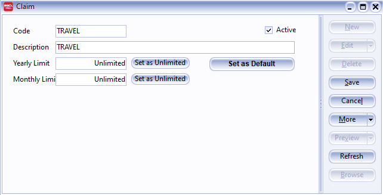
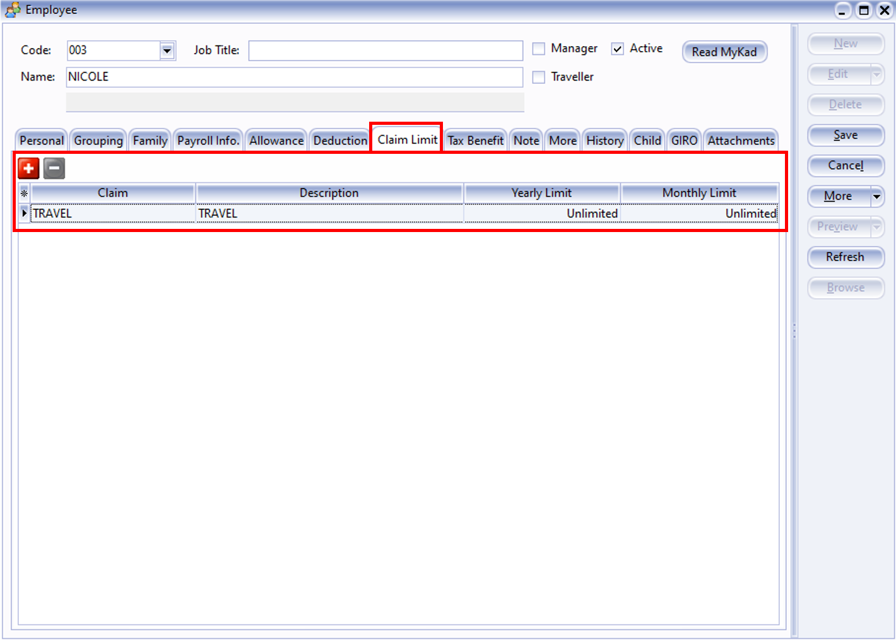

## Introduction

:::info Feature

- Maintain Claim is used to define the types of claims available to employees, as well as set default amounts and limits.
- For example, for travel claims, accommodation expenses, and communication expenses, you can set monthly or per-claim limits, set fixed amounts, or leave them blank for employees to fill in.
- This can impact the reimbursement process, monthly reimbursement review, and payroll calculations.

:::

## Setup

1. Navigate to **Payroll** > **Maintenance** > **Maintain claim**

    

2. Click New to generate a New Claim

    

3. Insert the info that you want to set in maintain claim

    
    
    1. Insert the Code of the Claim that you want to generate.
    2. Insert the Description of the claim.
    3. Insert the Yearly Limit for the claim, eg: RM 2000 for every employee then you can insert the rate of RM 2000 but if there is no limit then you can left it blank as Unlimited by click the 'Set as Unlimited' button.
    4. Insert the Monthly Limit for the claim, eg: RM 200 for every employee then you can insert the rate of RM 200 but if there is no limit then you can left it blank as Unlimited by click the 'Set as Unlimited' button.

4. After create the master file of Claim, then you can add the fixed claim's Yearly Limit and Monthly Limit for certain employee which have the claim.

    

5. Alternatively, you can insert the claim after process month end.

    

    1. Click on the "**Claim**"
    2. CLick on the ➕ to add the employee then fill in the claim
