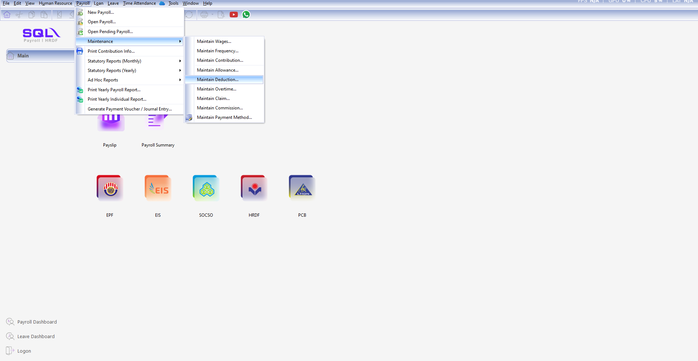
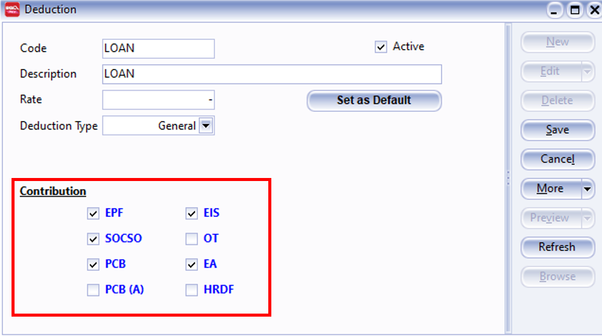
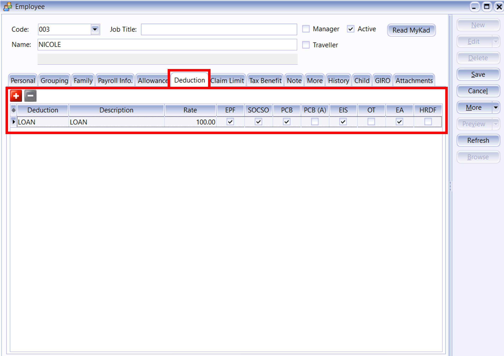

## Introduction

:::info Features

Maintain Deductions is used to configure employee payroll deductions, such as personal loan deductions, company advance deductions, lateness deductions, and restaurant deductions.

Deductions can be fixed amounts or percentages; once configured, they are automatically deducted from payroll.

Deductions may affect net pay, tax calculations, and the inclusion or exclusion of contributions such as EPF/SOCSO. These settings should be based on company policies and regulations.

:::

## Setup

1. Navigate to **Payroll** > **Maintenance** > **Maintain Deduction**

   

2. Click New to generate a New Deduction

   

3. Insert the info that you want to set in maintain deduction

   

   1. Insert the Code of the Deduction that you want to generate.
   2. Insert the Description of the deduction.
   3. Insert the fixed amount for the deduction, eg: Loan deduction is fixed RM 100 for every employee then you can insert the rate of RM 100 but if there is not then you can left it blank.
   4. Select the type of the deduction you want (General / Zakat / Tabung Haji / PTPTN).
   5. Tick or un-tick the contribution of the deduction.

4. After create the master file of Deduction, then you can add the fixed deduction for certain employee which have the deduction monthly

   

5. Alternatively, you can insert the deduction after process month end.

   

   1. Click on the "**Deduction**"
   2. CLick on the ➕ to add the employee then fill in the deduction

6. Deduction feature is same with allowance feature, all the deduction is not compulsory just depend on company policy.
