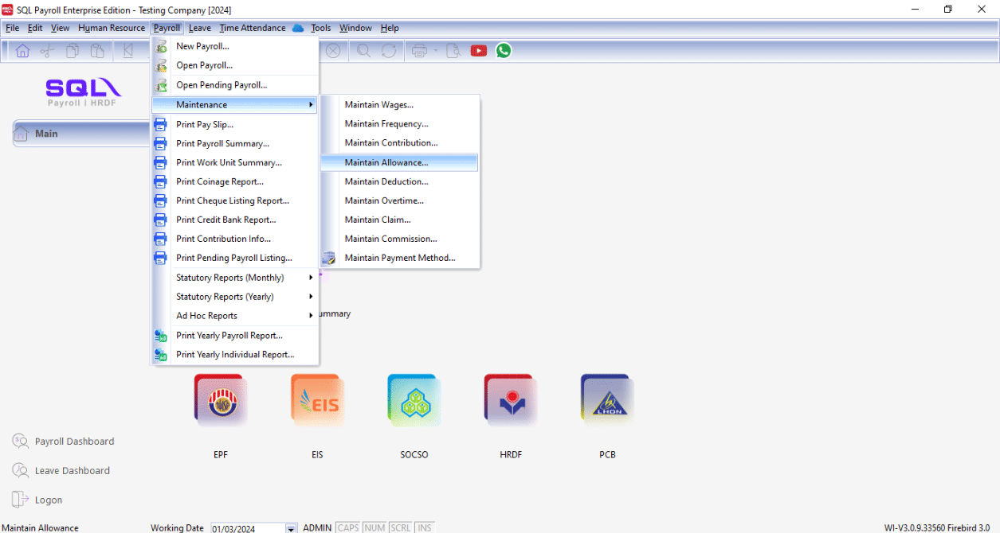
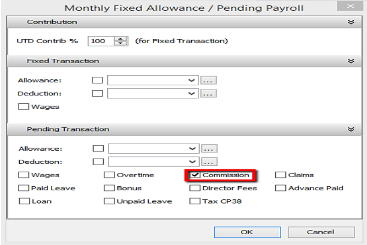

## Maintain Wages

:::info Features

- Allows setting different contributions for Bonus, Director Fee, Pay Leave, and Unpaid Leave.
- Maintain Employee & Employer EPF Rates.
- Maintain working hours and days per month.
- Enables Overtime Calculation based on Maintain Employee settings. It will calculate OT based on the wages amount in Maintain Employee.

:::

- Setting up Maintain Wages helps you categorize the type of wages an employee receives.
- This affects the types of contributions required (EPF/SOCSO/PCB, etc.).
- This is especially useful if you have different types of workers such as permanent workers, contract workers, foreign workers, etc.

1. Navigate to **Payroll** > **Maintenance** > **Maintain Wages**.

    

2. Click **New** to create a new wages type.

    

3. Enter the information and check the required contributions.

    
    

### Common wages setup

| Local Permanent Workers                                                                        | Foreign Workers                                                                |
| ---------------------------------------------------------------------------------------------- | ------------------------------------------------------------------------------ |
|  |  |

## Maintain Frequency

1. Navigate to **Payroll** > **Maintenance** > **Maintain Frequency**.

    

2. Click **New** to preset your contribution.

    

3. Go to **Human Resource** > **Maintain Employee**, select the employee, go to the **Payroll Info** tab, and set the Frequency according to the Maintenance Frequency.

    

4. After saving, you can check the allowance the employee has. In this example, the employee Nicole has a Fixed Allowance of RM 230.

    

5. Next, go to **Payroll** > **New Payroll** > **Frequency**.

    

    1. Select the Frequency you set in Maintenance Frequency (e.g., Half).

    2. The Employee(s) set with this Frequency type in Maintain Employee will show in this column.

    3. Check the Sequence you want to process.

    4. Click **PROCESS**.

6. The following result will be shown in the **HALF MONTH FREQUENCY PAYROLL**.

    

7. When it is time to do month end, click on **Payroll**, look for **New Payroll**, and click on **Final Month End** to process.

    

8. Select the employee (e.g., Nicole) for whom you processed the Frequency. The following is an example result of an employee with processed Frequency.

    - Wages - [2800 (Basic) – 1400 (Frequency) = 1400 ]
    - Allowance - [ 230 (Fixed) – 115 (Frequency) = 115 ]

    

## Maintain Contribution

:::info
Learn how to set the Employee/Employer EPF rate, OT calculation, and Tax calculation following this guide.
:::

- Setting up Maintain Contribution helps you categorize the type of contribution an employee receives.
- This affects the types of contributions required (EPF/SOCSO/PCB, etc.).
- This is especially useful if you have different types of workers such as permanent workers, contract workers, foreign workers, etc.

1. Navigate to **Payroll** > **Maintenance** > **Maintain Contribution**.

    

2. Click **New** to create a new contribution.

    

3. Enter the information and check the required contributions.

### Common contribution setup

| Local Permanent Workers                                                                               | Foreign Workers                                                                       |
| ----------------------------------------------------------------------------------------------------- | ------------------------------------------------------------------------------------- |
|  |  |

### Explanation of terms in Maintain Contribution panel

## Maintain Allowance

:::info Features

- Setting up Maintain Allowance helps you categorize the type of allowance that employees are entitled to.
- This affects the types of contributions required (EPF/SOCSO/PCB, etc.).
- This is especially useful if you have different types of allowances such as Petrol, Handphone, or Meal Allowance based on different company entitlements.

:::

1. Navigate to **Payroll** > **Maintenance** > **Maintain Allowance**.

    

2. Click **New** to create a new allowance.

    

3. Enter the required information in Maintain Allowance.

    

    1. Enter the **Code** of the Allowance you want to generate.
    2. Enter the **Description** of the allowance.
    3. Enter the fixed amount for the allowance. For example, if the Handphone allowance is a fixed RM 300 for every employee, enter RM 300. If there is no fixed amount, leave it blank.
    4. If the allowance is tax-exempt, enter the tax-exempt code.
    5. Check or uncheck the contribution for the allowance.

4. After creating the Allowance master file, you can add the fixed allowance for employees who receive it monthly.

    

5. Alternatively, you can insert the allowance after processing the month end.

    

    1. Click on "**Overtime**".
    2. Click the ➕ icon to add the employee, then fill in the overtime.

6. The Allowance feature works similarly to the Deduction feature; allowances are not compulsory and depend on company policy.

## Maintain Deduction

:::info Features

Maintain Deduction is used to configure employee payroll deductions, such as personal loan deductions, company advance deductions, lateness deductions, and restaurant deductions.

Deductions can be fixed amounts or percentages; once configured, they are automatically deducted from payroll.

Deductions may affect net pay, tax calculations, and the inclusion or exclusion of contributions such as EPF/SOCSO. These settings should be based on company policies and regulations.

:::

1. Navigate to **Payroll** > **Maintenance** > **Maintain Deduction**.

    

2. Click **New** to create a new deduction.

    

3. Enter the required information in Maintain Deduction.

    

    1. Enter the **Code** of the Deduction you want to generate.
    2. Enter the **Description** of the deduction.
    3. Enter the fixed amount for the deduction. For example, if a Loan deduction is a fixed RM 100 for every employee, enter RM 100. If there is no fixed amount, leave it blank.
    4. Select the deduction type (General / Zakat / Tabung Haji / PTPTN).
    5. Check or uncheck the contribution for the deduction.

4. After creating the Deduction master file, you can add the fixed deduction for employees who have this deduction monthly.

    

5. Alternatively, you can insert the deduction after processing the month end.

    

    1. Click on "**Deduction**".
    2. Click the ➕ icon to add the employee, then fill in the deduction.

6. The Deduction feature works similarly to the Allowance feature; deductions are not compulsory and depend on company policy.

## Maintain Overtime

:::info Features

- Setting up Maintain Overtime helps you categorize the type of overtime offered by the company.
- This affects the types of contributions required (EPF/SOCSO/PCB, etc.).
- This setting impacts overtime calculation.

:::

### Processing Overtime After Month End

1. Click **Payroll** > **Maintenance** > **Maintain Overtime**.

    

2. In the list, you can find some default overtime settings. Click **New** to create a custom one.

    

3. Enter the Overtime details as follows:

    

    - Enter the **Code** and **Description** of the overtime you want to generate.
    - Enter the **Rate** of the overtime (e.g., 1.5, 2.0, or 3.0 times the hourly rate).
    - **Unit Type** sets the overtime calculation to hourly or daily.
    - Set the overtime contributions (EPF, SOCSO, PCB, EIS, etc.).

4. When processing payroll at month end, navigate to **Payroll** > **New Payroll**.

    

5. Click **Final**, then click **Process**.

    

6. Click on any employee.

    

7. Click on "**Overtime**".

    

8. Click the ➕ icon to add the required information.

    

9. Click **Code** to select the overtime type.

    

10. Enter the work unit as overtime hours. For example, if Lee Hong Wai worked 2 hours of overtime, enter 2.

    

11. Alternatively, click the button beside Trans Date and check the **Work Unit As Time** column.

    

12. Once the column is visible, you may enter the overtime minutes as well (e.g., 2 hours and 09 mins).
    

### Processing Overtime Before Month End

1. Click **Payroll** > **Open Pending Payroll**.

    

2. Double-click **Overtime**.

    

3. Click the **Append** icon.

    

    

4. Select the employee.

    

5. Select the **Overtime Code**.

    

6. Check to enable **Work Unit As Time**.

    

7. Enter the time. For example, if Lee Chong Wai worked 2 hours and 30 minutes, enter it as shown below.

    

8. Repeat these steps for other overtime records and save when finished.

    

9. During month end processing:

    

    

10. Double-click the employee's name or code.

    

11. Click the blue **Overtime** text.

    

12. The overtime records entered in Pending Payroll will be displayed.

    

### Importing Overtime from Excel to SQL Payroll

1. Prepare a table in Microsoft Excel as shown below:

    

    :::tip

    - **Date**: Trans Date
    - **Employee**: Code of Employee
    - **OT**: Overtime Code created in Maintain Overtime
    - **Unit**: Work Unit (e.g., 2.50 = 2.5 hours)
      :::

2. After creating the table, go to **File**.

    

3. Click **Save As**.

    

4. Select **CSV (Comma delimited)** as the file type.

    

5. Click **Save**.

    

6. Go to **SQL Payroll** > **Payroll** > **Open Pending Payroll**.

    

7. Double-click **Overtime**.

    

8. Click the **Import Data** icon.

    

9. Click the **...** (browse) button to select your data source.

    

10. Select the CSV file to import.

    

11. Click **Next**.

    

12. Set **Import from row** to 1, select **Comma** as the separator, and select **"** as the text delimiter.

    

13. Map the fields for every column.

    

14. Ensure you have mapped all fields: Date, Employee, Code, and WorkUnit.

    

15. Change **Import from row** to **2** and click **Finish**.

    

16. Click **Close** after the data import is complete.

    

17. Click the **Save** icon.

    

## Maintain Claim

:::info Feature

- Maintain Claim is used to define the types of claims available to employees, as well as set default amounts and limits.
- For example, for travel claims, accommodation expenses, and communication expenses, you can set monthly or per-claim limits, set fixed amounts, or leave them blank for employees to fill in.
- This can impact the reimbursement process, monthly reimbursement review, and payroll calculations.

:::

1. Navigate to **Payroll** > **Maintenance** > **Maintain Claim**.

    

2. Click **New** to create a new claim.

    

3. Enter the required information in Maintain Claim.

    

    1. Enter the **Code** of the Claim you want to generate.
    2. Enter the **Description** of the claim.
    3. Enter the **Yearly Limit** for the claim. For example, if the limit is RM 2000 for every employee, enter RM 2000. If there is no limit, leave it blank or click **Set as Unlimited**.
    4. Enter the **Monthly Limit** for the claim. For example, if the limit is RM 200 for every employee, enter RM 200. If there is no limit, leave it blank or click **Set as Unlimited**.

4. After creating the Claim master file, you can add fixed Yearly and Monthly Limits for employees who have this claim.

    

5. Alternatively, you can insert the claim after processing the month end.

    

    1. Click on "**Claim**".
    2. Click the ➕ icon to add the employee, then fill in the claim.

## Maintain Commission

1. Set the commission for the employee.

    - Navigate to **Payroll** > **Maintenance** > **Maintain Commission**.
    - Click **New** to create a new commission rate.

    

2. Open Pending Payroll for Commission.

    - Go to **Payroll** > **Open Pending Payroll** > **Commission**.
    - Enter the employee and amount.

    

3. Process Month End.

    1. Method 1: Final Payroll Process

        - Navigate to **Payroll** > **New Payroll** > **Process**.

        

    2. Method 2: Process Adhoc

        - Check EPF, PCB, and Monthly Fixed Allowance/Pending Payroll.

        

    3. Check **Commission**.

        

4. Double-click the employee who received the commission.

    

5. Check the Commission column.

    

## Maintain Payment Method

- Maintain Payment Method helps you categorize how you want to pay your employees.
- This is useful when you have different types of banks (MBB, HLB, etc.) and payment methods (Cash, Cheque, Transfer).
- Here, you can also set **auto rounding** so that all payouts are rounded to the nearest 5 cents.

  - e.g., Employee total pay = RM1234.**56**
  - After auto rounding, it will become RM1234.**55**

1. Navigate to the Maintain Payment Method panel.

    

2. Click **New** to create a new payment method.

    

3. Enter the required information and click **Save**.

    

    

### Explanation of Auto Rounding

#### Without Auto Rounding

- After month end, **no adjustment** will be shown.
- However, adjustments can be manually changed by clicking the up/down arrow beside it.

#### With Auto Rounding

- After month end, there will be an **auto adjustment** to the nearest 5 cents.

