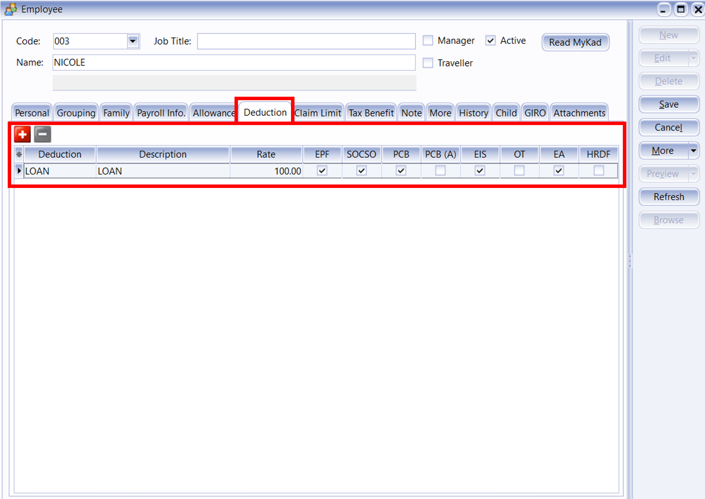

## Maintain Allowance

:::info Features

- Setting up maintain allowance helps you to categorize the type of allowance that employee entitle.
- This would affect the types of contribution that they need to provide (EPF/SOCSO/PCB & etc)
- This is especially useful if you have different types of allowance like Petrol, Handphone, Meal Allowance base on different company different entitlement.

:::

1. Navigate to **Payroll** > **Maintenance** > **Maintain Allowance**

   

2. Click New to generate a New Allowance

   

3. Insert the info that you want to set in maintain allowance

   

   1. Insert the Code of the Allowance that you want to generate.
   2. Insert the Description of the allowance.
   3. Insert the fixed amount for the allowance, eg: Handphone allowance is fixed RM 300 for every employee then you can insert the rate of RM 300 but if there is not then you can left it blank.
   4. If the allowance is tax exempted then you may insert the tax exempted code.
   5. Tick or un-tick the contribution of the allowance.

4. After create the master file of Allowance, then you can add the fixed allowance for certain employee which have the allowance monthly

   

5. Alternatively, you can insert the allowance after process month end.

   

   1. Click on the "**Overtime**"
   2. CLick on the ➕ to add the employee then fill in the overtime

6. Allowance feature is same with deduction feature, all the allowance is not compulsory just depend on company policy.

## Maintain Claim

:::info Feature

- Maintain Claim is used to define the types of claims available to employees, as well as set default amounts and limits.
- For example, for travel claims, accommodation expenses, and communication expenses, you can set monthly or per-claim limits, set fixed amounts, or leave them blank for employees to fill in.
- This can impact the reimbursement process, monthly reimbursement review, and payroll calculations.

:::

1. Navigate to **Payroll** > **Maintenance** > **Maintain claim**

    

2. Click New to generate a New Claim

    

3. Insert the info that you want to set in maintain claim

    
    
    1. Insert the Code of the Claim that you want to generate.
    2. Insert the Description of the claim.
    3. Insert the Yearly Limit for the claim, eg: RM 2000 for every employee then you can insert the rate of RM 2000 but if there is no limit then you can left it blank as Unlimited by click the 'Set as Unlimited' button.
    4. Insert the Monthly Limit for the claim, eg: RM 200 for every employee then you can insert the rate of RM 200 but if there is no limit then you can left it blank as Unlimited by click the 'Set as Unlimited' button.

4. After create the master file of Claim, then you can add the fixed claim's Yearly Limit and Monthly Limit for certain employee which have the claim.

    

5. Alternatively, you can insert the claim after process month end.

    

    1. Click on the "**Claim**"
    2. CLick on the ➕ to add the employee then fill in the claim

## Maintain Commission

1. Set the commission for employee

    - Navigate to **Payroll** > **Maintenance** > **Maintain Commission**
    - Create new for a new commission rate

    

2. Open pending payroll for commission

    - Payroll/Open pending payroll/Commission
    - Insert the employee and amount

    

3. Process month end

    1. Method 1 : Final Payroll Process

        - Navigate to **Payroll** > **New payroll** > **Process**

        

    2. Method 2 : Process Adhoc

       - Tick EPF & PCB & Monthly Fixed Allowance/Pending Payroll

       

    3. Tick Commission

    

4. Double click the employee that you gave commission

    

5. Refer to commission column

    

## Maintain Contribution

:::info
Learn how to set the Employee/Employer EPF rate, OT calculation and Tax calculation following this guide
:::

- Setting up maintain contribution helps you to categorise the type of contribution an employee received
- This would affect the types of contribution that they need to provide (EPF/SOCSO/PCB & etc)
- This is especially useful if you have different types of worker such as permanent worker, contract worker, foreign worker & etc

1. Navigate to **Payroll** > **Maintenance** > **Maintain Contribution**

   

2. Click new to create new contribution

   

3. Key in the info and tick the contribution needed

### Common contribution setup

| Local Permanent Workers                                                              | Foreign Workers                                                      |
| ------------------------------------------------------------------------------------ | -------------------------------------------------------------------- |
|  |  |

### Explanation of terms in Maintain Contribution panel

## Maintain Deduction

:::info Features

Maintain Deductions is used to configure employee payroll deductions, such as personal loan deductions, company advance deductions, lateness deductions, and restaurant deductions.

Deductions can be fixed amounts or percentages; once configured, they are automatically deducted from payroll.

Deductions may affect net pay, tax calculations, and the inclusion or exclusion of contributions such as EPF/SOCSO. These settings should be based on company policies and regulations.

:::

1. Navigate to **Payroll** > **Maintenance** > **Maintain Deduction**

   

2. Click New to generate a New Deduction

   

3. Insert the info that you want to set in maintain deduction

   

   1. Insert the Code of the Deduction that you want to generate.
   2. Insert the Description of the deduction.
   3. Insert the fixed amount for the deduction, eg: Loan deduction is fixed RM 100 for every employee then you can insert the rate of RM 100 but if there is not then you can left it blank.
   4. Select the type of the deduction you want (General / Zakat / Tabung Haji / PTPTN).
   5. Tick or un-tick the contribution of the deduction.

4. After create the master file of Deduction, then you can add the fixed deduction for certain employee which have the deduction monthly

   

5. Alternatively, you can insert the deduction after process month end.

   

   1. Click on the "**Deduction**"
   2. CLick on the ➕ to add the employee then fill in the deduction

6. Deduction feature is same with allowance feature, all the deduction is not compulsory just depend on company policy.

## Maintain Employee's Opening Balance

- Maintain employee’s opening balance is done when the respective employee enter the company in a month **later than January**.
- The previous PCB amount is **needed to key in so that the system can correctly calculate** the PCB amount that’s needed to pay every month.

1. Navigate to the **Open Payroll**

   

2. Double click the year in Open Payroll

   

3. Double click the transaction under ‘Opening’

   

4. Select the employee by double clicking on the name

   

5. Key in all the employee’s opening balance information

   

### Mapping of SQL 'opening' to EA form

### Special note for additional EPF and additional PCB

- Additional EPF and additional PCB are used when additional remuneration (bonus, commission, paid leave) is given.
- In the EA form, normal EPF and additional EPF is group into one.
- However, SQL recommend users to split the amount for a more detail input.

:::info
Frequency – Where one company will pay salary **twice or more times** in **a Month**.
:::

## Maintain Frequency

1. Navigate to **Payroll** > **Maintenance** > **Maintain Frequency**

    

2. Click on **New** to preset your contribution.

    

3. Go to **Human Resource** > **Maintain Employee**, Select the particular Employee and then Go to **Payroll Info Tab** and set the Frequency According to the Maintenance Frequency respectively.

    

4. After save, you can check the allowance the employee is having. In this example, the employee Nicole has an Fixed Allowance of RM 230.

    

5. Next, go to **Payroll** > **New payroll** > **Frequency**

    

    1 Select the Frequency as you Set in Maintenance Frequency (EG: Half).

    2 The Employee/s that u have set as the Frequency type in Maintain Employee will show in this column

    3 Tick the Sequence that u wan to process.

    4 Click PROCESS

6. The following result below will show in the **HALF MONTH FREQUENCY PAYROLL**.

    

7. When it is time to do month end, click on Payroll, look for New Payroll and click on Final Month End to process.

    

8. Select the Employee ( Nicole ) that you’ve process Frequency. The following is an example result of the Employee that had process Frequency.

   - Wages - [2800 (Basic) – 1400 (Frequency) = 1400 ]
   - Allowance - [ 230 (Fixed) – 115 (Frequency) = 115 ]

    

## Maintain Overtime

:::info Features

- Setting up maintain overtime helps you to categorize the type of overtime that company have.
- This would affect the types of contribution that they need to provide (EPF/SOCSO/PCB & etc)
- This setting will bring impact of the calculation of overtime.

:::

### Process Overtime After Month End

1. Click on **Payroll** > **Maintenance** > **Maintain Overtime**

   

2. In the list, you can find some default overtime settings. Click on **New** to generate a custom one

   

3. Key-in Overtime details as below

   

   - Insert the **Code** and **Description** of the overtime that you want to generate.
   - Insert the **Rate** of the overtime, eg : the overtime rate is 1.5 as per overtime amount or double, triple of the overtime amount.
   - **Unit Type** is to set the overtime calculation by hourly or by daily.
     -Set the contribution of overtime with EPF, SOCSO, PCB, EIS etc.

4. After that, when we need to process the payroll at the month end. Navigate to **Payroll** > **New Payroll**

   

5. Click **Final**, and click on **Process**

   

6. Click on any employee

   

7. Click on the "**Overtime**"

   

8. Click on the ➕ to add the info you want

   

9. Click on the "**Code**" to choose the overtime type

   

10. Key in the work unit as overtime hour, for example if Lee hong Wai overtime for 2 hours on that particular day, just key in numbering as 2 will do

    

11. Alternatively, you can click on the button beside Trans Date, and tick the column name Work Unit As Time

    

12. After call out the column of Work Unit As Time, you may key in he overtime minutes also (eg: 2 hours and 09 mins)
    

### Process Overtime Before Month End

1. Click on payroll, open pending payroll.

   

2. Double Click on **Overtime**

   

3. Click on Append icon

   

   

4. Select employee

   

5. Select **Overtime Code**

   

6. Tick and enable the **Work Unit As Time**

   

7. Enter the time in the work unit as time, for example Lee Chong Wai worked overtime for 2hours and 30minutes, key in as shown below

   

8. Repeat the same steps as shown above for the other overtime records and save after all done

   

9. During month end,

   

   

10. Double click on the employee’s name or code

    

11. Click on the blue **Overtime** words

    

12. The overtime records entered in pending payroll will be shown

    

### Import Excel Overtime Format into SQL Payroll

1. Prepare a table in Microsoft Excel as shown in the image below

   

   :::tip

   - **Date**: Trans Date
   - **Employee**: Code of Employee
   - **OT**: Code of Overtime that created in Maintain Overtime
   - **Unit**: Work Unit (count 2.50 = 150 minutes/2 and a half hours)
   :::

2. After done the table, go to file

   

3. Click on Save as

   

4. Select CSV file type

   

5. Click Save

   

6. Go to SQL Payroll > Payroll > Open Pending Payroll...

   

7. Double click on the Overtime

   

8. Click on the Import Data icon

   

9. Click on the … (3 dots button) to select your data source,

   

10. Select the csv file to import

    

11. Click on the Next button

    

12. Import from row 1, select Comma, select " for the text delimiter

    

13. Select the field for every column

    

14. Make sure you have select all the fields for the date, employee, code & workunit.

    

15. Change the Import from row to **2** and click the finish button

    

16. Click on the Close button after done importing the data

    

17. Click on the Save icon

    

## Maintain Payment Method

- Maintain Payment Method helps you to categorise how you want to pay your employee
- This is useful when you have different type of banks (MBB, HLB & etc) and method of paying (Cash, Cheque, Transfer)
- At here, we can also set the **auto rounding** so that all payout is round to the nearest 5 cent

  - eg: Employee total pay = RM1234.**56**
  - After auto rounding, it will become RM1234.**55**

1. Navigate to the maintain payment method panel

   

2. Click new to create new payment method

   

3. Key in the information needed (Click save after configured)

   

   

### Explanation of auto rounding

**Without auto rounding**

- After month end will show **no adjustment**
- However, adjustment can be manually change by clicking the up/down arrow beside it

**With auto rounding**

- After month end will have **auto adjustment** to nearest 5 cents

## Maintain Wages

:::info Features

- Enable to set different other contribution for Bonus, Director Fee, Pay Leave and Unpaid Leave.
- Maintain the Employee & Employer EPF Rate.
- Maintain the working hour and day per month.
- Enable the Overtime Calculation base on Maintain Employee Setting. It will calculate the OT based on Wages amount in Maintain Employee.

:::

- Setting up maintain wages helps you to categorise the type of wages an employee received.
- This would affect the types of contribution that they need to provide (EPF/SOCSO/PCB & etc)
- This is especially useful if you have different types of worker such as
  permanent worker, contract worker, foreign worker & etc

1. Navigate to **Payroll** > **Maintenance** > **Maintain Wages**

   

2. Click new to create new wages type

   

3. Key in the info and tick the contribution needed

   
   

### Common wages setup

| Local Permanent Workers                                                       | Foreign Workers                                               |
| ----------------------------------------------------------------------------- | ------------------------------------------------------------- |
|  |  |
