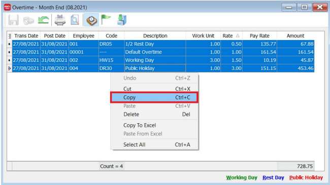
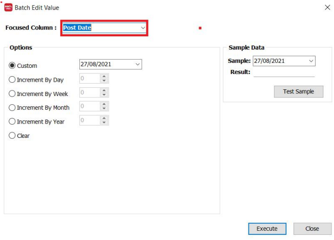
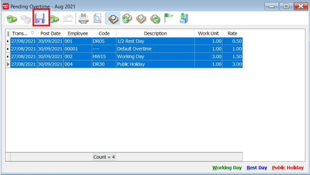

## Setup

:::info
This allow you to repeat the same amount of payment for the next month if you have already keyed in the advance payment, allowance or overtime for one month’s month end payroll
:::

1. Right click on previous month’s payroll > Open > Open Overtime...

   

2. Highlight all the Overtimes by clicking on the entries while pressing down on the SHIFT button.

   

3. Right click and then Copy

   

4. Go to **Payroll** > **Open Pending Payroll** and select Overtime

   

5. Right-click on the white area and select paste

   

6. Select all the entries by clicking on it while pressing down on the SHIFT button. then right- click and select “batch edit value”.

   

7. Change the Column to “Post Date”

   

8. Key in the post date of you next month’s payroll and press Execute.

   

9. Press OK and Close the window.

   

10. You will see that the Post Date has change. Press Save. The changes have been successfully saved once the icon turns grey colour.

    

11. When you process your next month’s payroll. It will capture these values.

    For example, in September 2021’s month end copied from August 2021:

    

12. Repeat the same steps for allowances, and advance payments.
