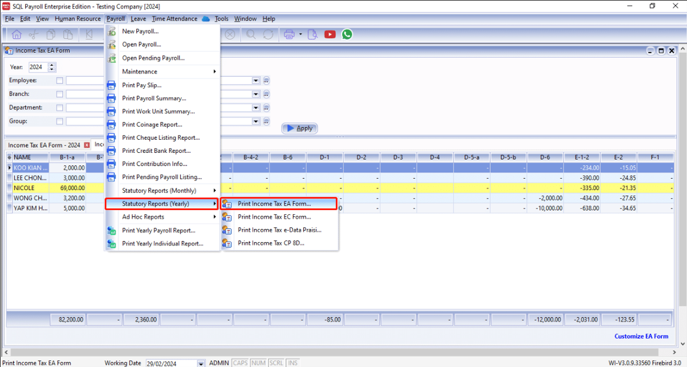
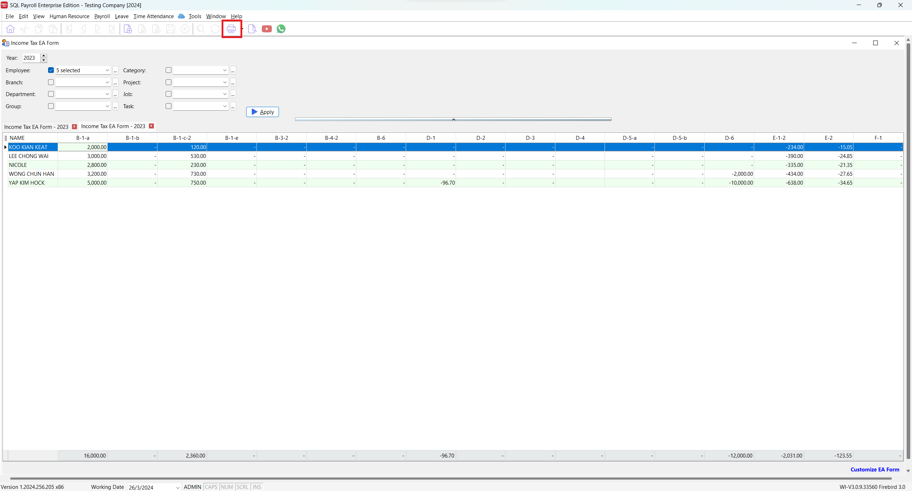
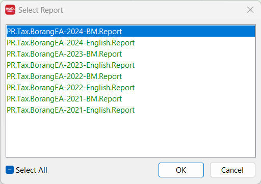
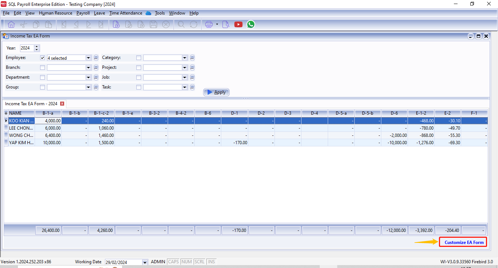
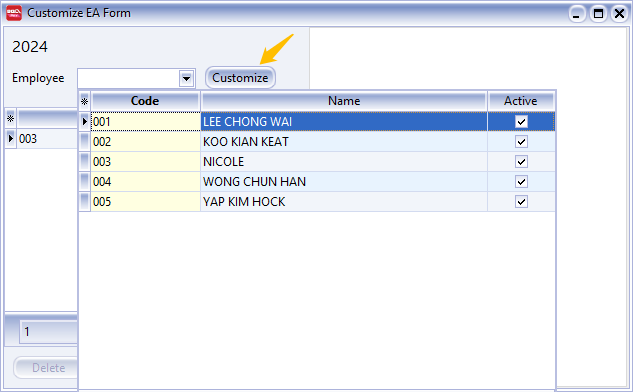

## Print EA Form

1. Let's go to Payroll -> Statutary Reports (Yearly) -> Print Income Tax EA Form..

   

2. Fill in the details in red box and click ▶️**Apply**

   

3. After the above steps, you will see the details of each employees

   :::info[Customization]
   In SQL Payroll, we do support amending employee EA Form details before printing. Find out more [here](#customize-ea-form)  
   :::

4. Click on the **Print** button

   

5. Lastly, select the EA Form report you wish to print

   

## Customize EA Form

:::info
Jump to **step 3** if you are coming from the **Print EA Form** section
:::

1. Let's go to Payroll -> Statutary Reports (Yearly) -> Print Income Tax EA Form..

   

2. fill in the details and click ▶️**Apply**

   

3. Click on the text **Customize EA Form** at your bottom right

   

4. Select the employee to amend and click **Customize**

   

5. Fill in the details you wish to amend and click **Save** ( diskette 💾)

   

6. Amended employee will be highlighted in yellow colour 🟡.

   
