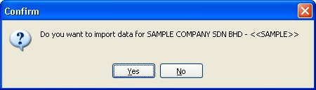

Currently, we support importing data from the following software:

## UBS Payroll

### Type Information / Data Import (UBS)

1. Maintain Branch (branch.dbf)
2. Maintain Category (category.dbf)
3. Maintain Department (dept.dbf)
4. Maintain Project (project.dbf)
5. Maintain Race (race.dbf)
6. Maintain Allowance (awtable.dbf)
7. Maintain Deduction (dedtable.dbf)
8. Maintain Employee (pmast.dbf)

### Requirement (UBS)

1. UBS Payroll Version 9 and above
2. UBS Payroll Data (after restore)
3. SQL Payroll Application
4. Empty Database of SQL Payroll

### Steps (UBS)

If you already have UBS Payroll installed on the same PC, skip to Step 2.

1. Export your USB Payroll file & bring to your PC with SQL Payroll intalled, then extract your UBS Payroll file by using 7zip.

    

2. Create a Empty Database in SQL Payroll

    

    

    

3. Login the Empty Database of SQL Payroll

    

4. Click File > Import Data > UBS Payroll

    

5. Select the the extracted backup folder or UBS Payroll Directory Folder & Click Ok to Start Import

    

6. Click Close to finish import.

    

7. Go Human Resources > Maintain Employee to check all your Employee List imported successfully from UBS Payroll.

    

    

### FAQ (UBS)

1. "Provider cannot be found. It may not be properly install" when trying to import the UBS backup folder.

    - Download and install [Microsoft OLE DB Provider for Visual FoxPro 8.0](https://www.microsoft.com/en-us/download/details.aspx?id=32602).

## AutoCount Payroll

### Type Information/Data Import (AutoCount)

1. Company Profile (PROFILE)
2. Maintain Payment Method (BANK)
3. Maintain Department (DEPT)
4. Maintain Race (RACE)
5. Maintain Allowance (ALLOWANCE)
6. Maintain Deduction (DEDUCTION)
7. Maintain Employee (EMPLOYEE)

### Requirement (AutoCount)

1. Backup of Autocount Payroll with `.P01` file extensio. (e.g. SAMPLE COMPANY SDN BHD [2012] - 20120606.P01)
2. SQL Payroll Application
3. Empty Database of SQL Payroll

### Steps (AutoCount)

1. Login the Empty Database of SQL Payroll
2. Click File > Import Data > AutoCount Payroll

    

3. Select the AutoCount Backup File & Click Open

    

4. Click **Yes** to start the import process

    

5. Click **Close** to finish import.

## Others

### Type Information/Data Import

1. Pending Overtime
2. Pending Deduction
3. Leave Application
4. Pending Wages
5. Pending Unpaid Leave

### Steps

Below example is import Pending Overtime & is applicable for other Attendance System

1. Click File > Import Data > [Select the Time Attendance] (eg ELID, SynGlobal Time Attendance, etc)

    

2. Click the 3 Dot Button to Open

    

    | Field                 | Properties                                                                                   |
    | --------------------- | -------------------------------------------------------------------------------------------- |
    | Data From             | Is the path for the CSV file to be import.                                                   |
    | New Setting...        | Create New Setting for New Import.                                                           |
    | Load Setting...       | Use the saved Setting created/saved on last import from Database.                            |
    | Load From File...     | Use the saved Setting created/saved on last import from External XML File.                   |
    | Manage Setting Button | For Delete the saved Setting created/saved on last import from Database (See below picture). |

    

3. Click Next

    

    

    | Field             | Properties                                             |
    | ----------------- | ------------------------------------------------------ |
    | Description       | Setting Name.                                          |
    | Save button       | Save the current setting for future use.               |
    | From row          | From which row number in the CSV file start to import. |
    | Separator Options | Type of separator in the CSV file.                     |
    | Field             | Which Column To Map and Import.                        |

4. Click Finish button after finish select & Map all the fields.

    

5. Click Ok

    
