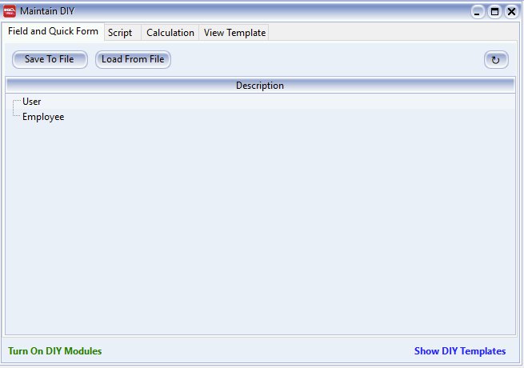
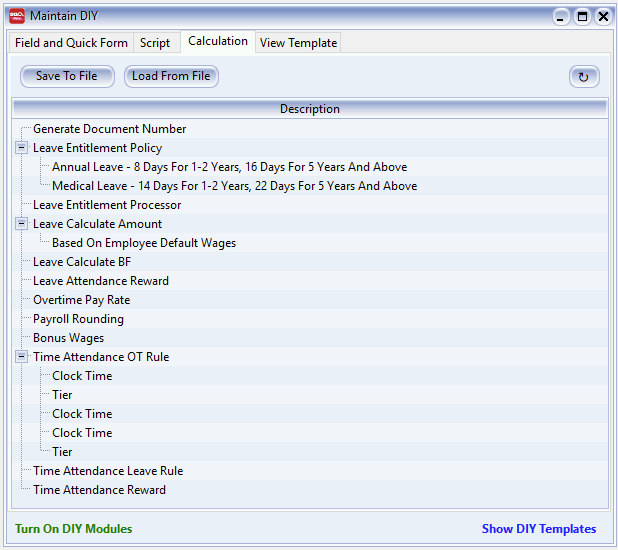
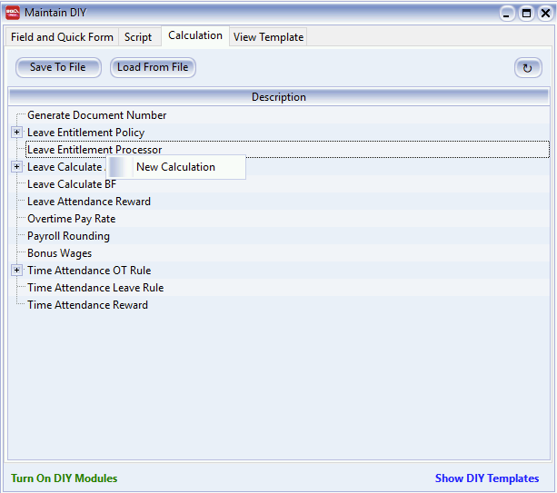
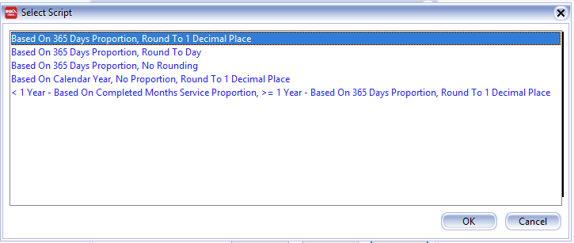
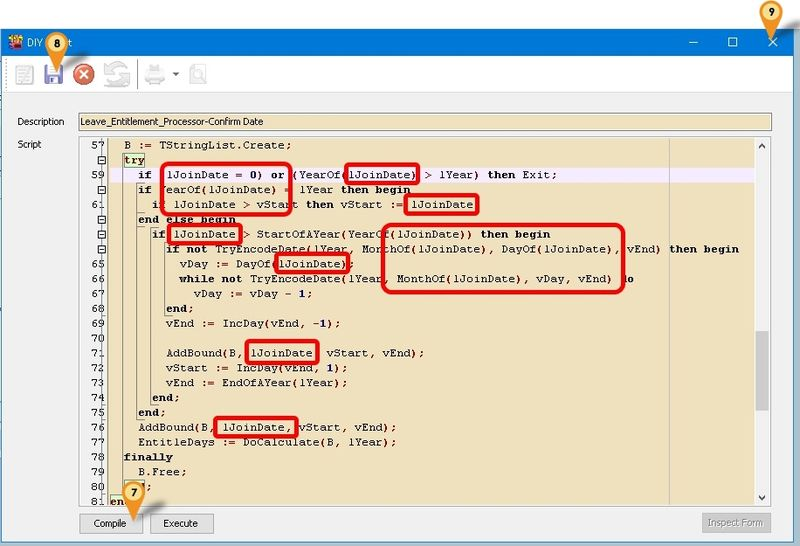
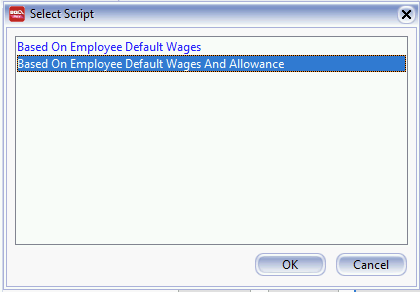
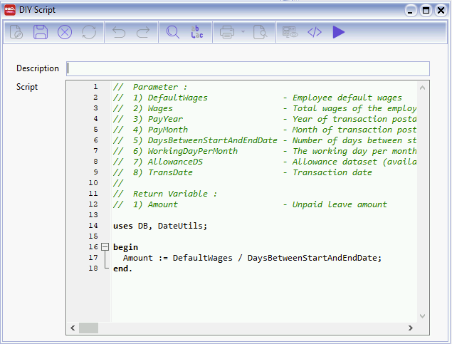
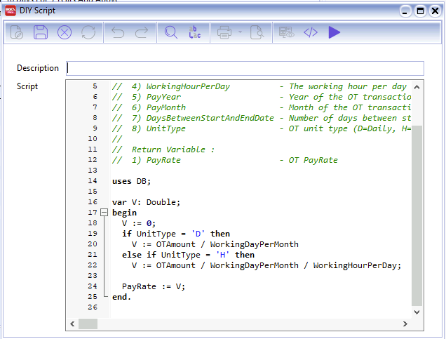

## Introduction

:::success[note]
This is **Additional Module** (DIY Fields & DIY Script Module)
:::

1. The function and description:

    1. **Field and Quick Form**: User can Self Create new User Define Field(s) & Design the Layout
    2. **Script**: Customise the Application
    3. **Calculation**: Override the build in Calculation (SQL Payroll ONLY)
    4. **View Template**: For Advance Form Mode



## Calculation

User can override the build in Calculation/Formula to suite their requirement. The Language use is Pascal.

**Available Calculation Types:**

1. **Generate Document Number**: Manipulate the Next Document Number Format.
2. **Leave Entitlement Policy**: Manipulate yearly Leave Entitlement
3. **Leave Entitlement Processor**: Manipulate Calculation of Year of working
4. **Leave Calculate Amount**: Manipulate the Leave Calculation Amount
5. **Leave Calculate BF**: Calculate how many leave can be Brought Forward if not fully taken
6. **Leave Attendance Reward**: Manipulate Reward for Perfect Attendance.
7. **Overtime Pay Rate**: Manipulate the Overtime Pay rate
8. **Payroll Rounding**: Manipulate the Net Pay Amount
9. **Bonus Wages**: Manipulate Bonus and Incentive Payments.
10. **Time Attendance OT Rule**: Manipulate Overtime Rules based on Attendance.
11. **Time Attendance Leave Rule**: Manipulate Leave Rules based on Attendance.
12. **Time Attendance Reward**: Manipulate Reward Rules based on Attendance.



### Example 1 - Leave Entitlement Processor - Calculate from Confirm Date

Below is Example to change the Leave Entitlement Processor to be calculate from the Confirmation Date.

1. Right Click at **Leave Entitlement Processor** and select **New Calculation**.

    

2. Click **New Button** and select any Formula which suit you & Click OK.

    

3. Enter any **Description** (eg Leave_Entitlement_Processor-Confirm Date) in the Description field (Only Alphanumeric & no spacing).

4. In the **Script** look for the word *lJoinDate* & change it to *lConfirmDate*.



### Example 2 - Leave Calculate Amount - Unpaid Leave Amount Base on Working Day

Below is example to change the Unpaid Leave Amount to base on Working Days in Maintain Contribution.

1. **Right Click** at Leave Calculate Amount and select **New Calculation**.

2. Click **New Button** and select any Formula which suit you & Click OK.

    

3. Enter any **Description** (eg Leave_Calculate_Amt-Unpaid) in the Description field (Only Alphanumeric & no spacing).

4. In the **Script** look for the word *DaysBetweenStartAndEndDate* & change it to *WorkingDayPerMonth* or Copy below script & paste to the Script Section.

    ```pascal
    // Example - Leave Calculate Amount - Based On Employee Default Wages
    uses DB, DateUtils;

    begin
        Amount := DefaultWages / WorkingDayPerMonth;
    end.
    ```

    

5. Click **Compile button** to make sure is **Compile success**.

6. Click **Save** button and click X to Close.

7. Select the Item just created (eg Leave_Calculate_Amt-Unpaid) and click Ok button.

8. Done & **Remember** to set it at **Maintain Leave Group** under the **Amount Column** for UL.

### Example 3 - Limit Overtime Rate

Below is example to set Maximum limit the Overtime Rate.

1. **Right Click** at Overtime Pay Rate and select **New Calculation**.

2. Click **New Button**.

3. Enter any **Description** (eg Overtime_Max_Rate) in the Description field (Only Alphanumeric & no spacing)

4. Copy below script & paste to the Script Section.

    ```pascal
    uses Math, DB;

    var V: Double;
    begin
      V := 0;
      if OTAmount > 1500.00 then
        V :=  10.82 else //(1500/26/8)
        V := (OTAmount / 26 /8);
        
      PayRate := SimpleRoundToEx(V, -2);
    end.
    ```

    

5. Click **Compile button** to make sure is **Compile success**.

6. Click **Save** button and click X to Close.

7. Select the Item just created (eg Overtime_Max_Rate) and click Ok button.

8. Done & **Remember** to set it at **Maintain Overtime**.
