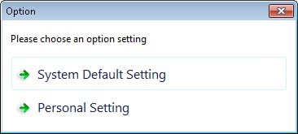
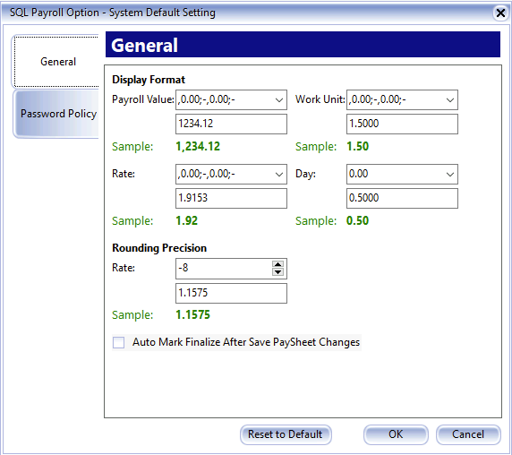
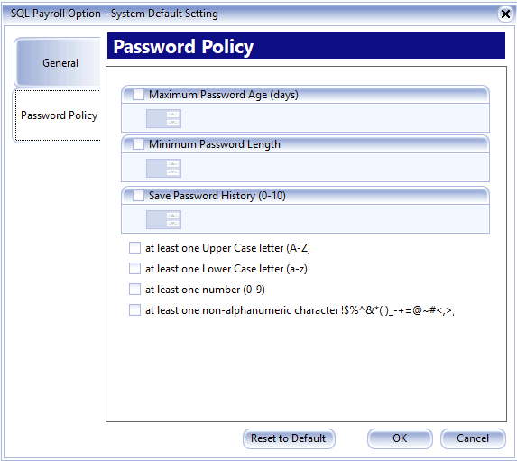
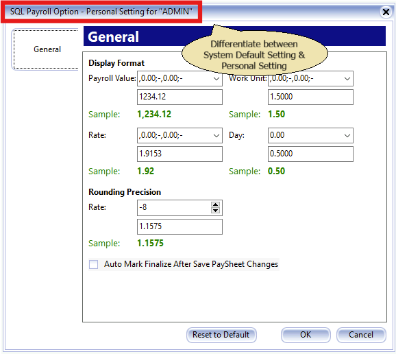

## Introduction

This is the System application settings. It can be set as Global or Personal Setting.

## System Default Setting

This is the setting is set and will apply to all user.

1. Fields name and properties:

    1. **Payroll Value** : Is set to how many decimal point to show Amount Column (Default is 2 Decimal Point).
    2. **Work Unit** : Is to set how many decimal point to show at the Work Unit Column (Default is 2 Decimal Point).
    3. **Rate** : Is to set how many decimal point to show at the Rate Column (Default is 2 Decimal Point).
    4. **Day** : Is to set how many decimal point to show at the Day Column for Leave Application (Default is 2 Decimal Point).
    5. **Rate Rounding Precision** : Is to set how many decimal point to keep for Rate Column (Default is 8 Decimal Point).

2. **Auto Mark Finalize After Save PaySheet Changes.** Tick this option is wanted system to put indicator which employee you had done at PaySheet.

    

3. You can choose the following password requirement:

    1. **Maximum Password Age (days)**: Number of days to expire and change password.
    2. **Minimum Password Length**: Password length cannot less than the minimum.
    3. **Save Password History (0-10)**: Number of password history not allow to re-use
    4. Password combination of
        - At least one Upper Case letter (A-Z)
        - At least one Lower Case letter (a-z)
        - At least one number (0-9)
        - At least one non-alphanumeric character \!\$\%\^\&\*\(\)_\-\+\=\@\~\#\<\,\>\.

## Personal Setting

This is the setting changes is set for the Current Login user.

