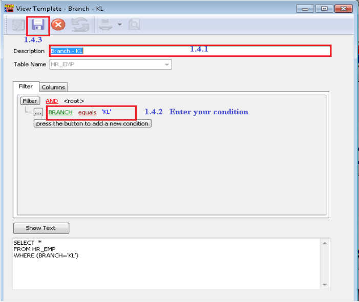

:::info
SQL view module is to lock certain user to view from all employees, in other word only allow handling a group of employee.

If you haven’t register, you may try by turn on SQL View module under :
File > Customize SQL Payroll Module.
:::

## Setup

:::note Example
In this example scenario, the goal is allowing KL User to view/ edit only the employee in KL branch.
:::

1. Navigate to Tools > DIY > Maintain DIY

   1. Go to **View Template** tab

   2. Right Click **Employee** > Select **New View Template**

      

   3. Press **New**

   4. Enter description, condition and save

      

   5. Right click the new created view template > select **User View**

      

   6. Assign user view to this group of employee

      

   7. Logon as KL User.

2. Result:

   - Before:

     

   - After:

     
